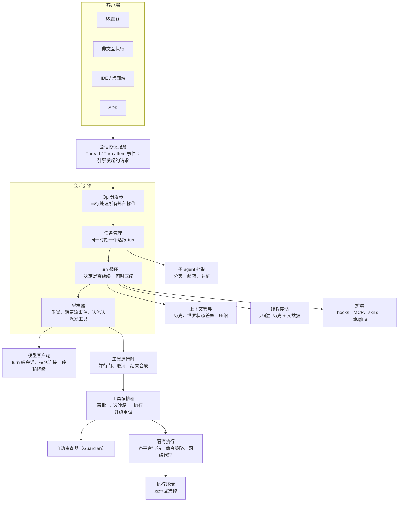
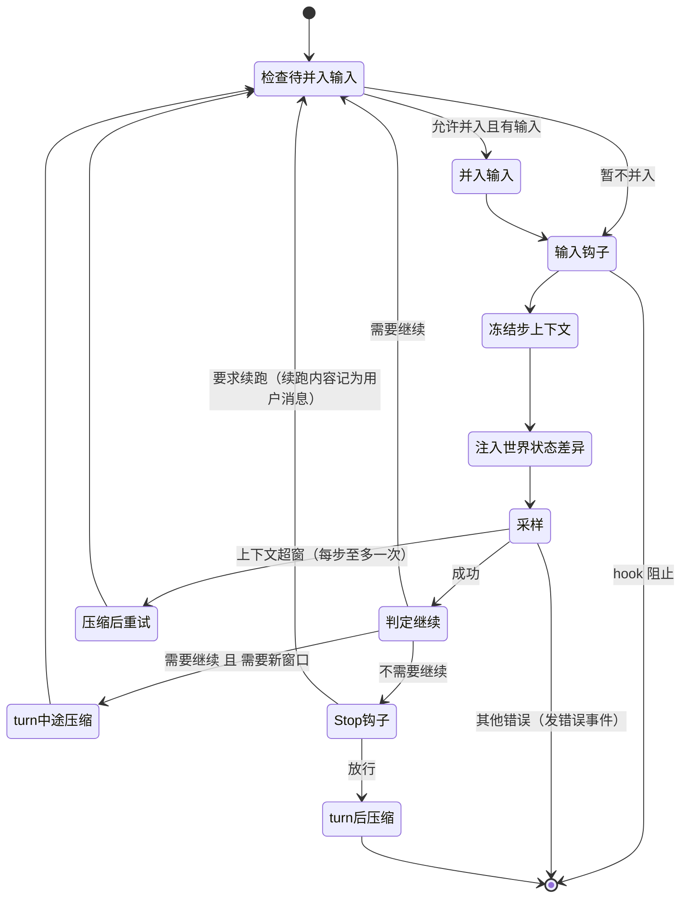
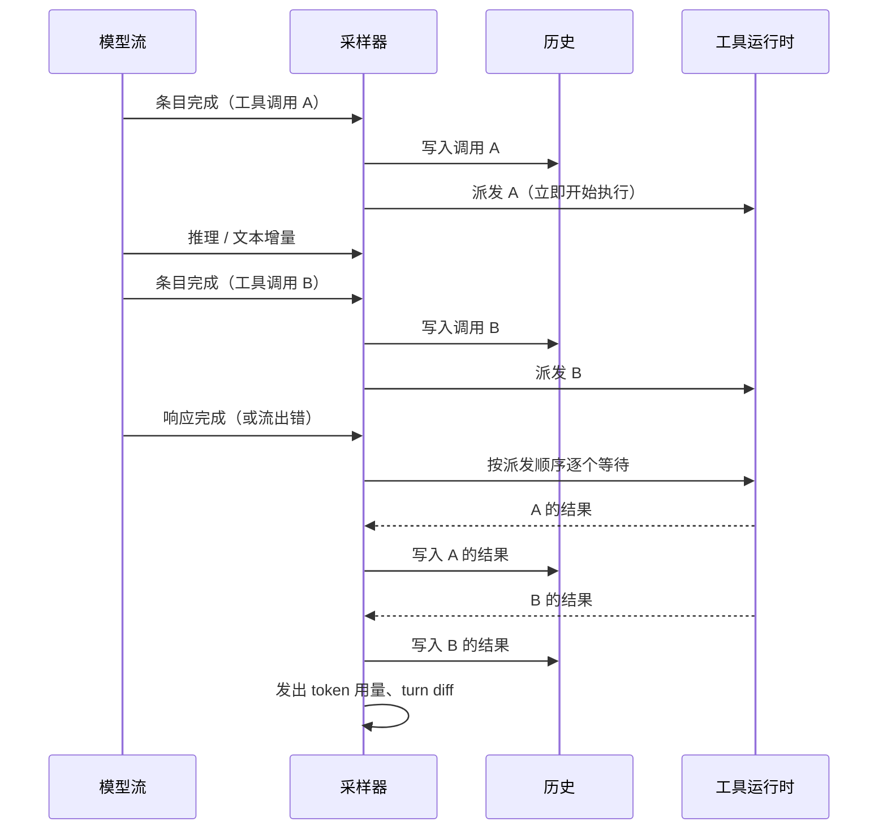

**本系列**：[00 资料索引](/personal-blog/articles/codex-omp-research-index/) · [01 Codex 自带文档总结](/personal-blog/articles/codex-bundled-docs/) · [02 oh-my-pi 自带文档总结](/personal-blog/articles/omp-bundled-docs/) · **03 Codex 架构设计** · [04 oh-my-pi 架构设计](/personal-blog/articles/omp-architecture/) · [05 两者对比与可借鉴点](/personal-blog/articles/codex-vs-omp/) · [06 交互式架构图导览](/personal-blog/articles/codex-omp-diagrams/)

> 源码快照：[openai/codex](https://github.com/openai/codex/tree/44fe510ce3ee61c8ef623adcbf89b901c73ddd61)，HEAD `44fe510c`（2026-09-28）。路径相对 `codex-rs/`，行号以该快照为准。
> 产品层的外部契约（协议、hooks、审批模式、配置）见 [01 Codex 自带文档总结](/personal-blog/articles/codex-bundled-docs/)。
>
> **阅读说明**：本文分两部分。
> - **第一部分：语言无关的架构设计**。只讲概念、组件、状态机、不变量和设计取舍。凡是为了在某种语言或运行时里实现某个功能而写的代码（锁、异步任务、句柄、宏、类型系统技巧等），这里只写它实现的**语义**，不解释语言层面的做法。拿这一部分，用任何语言都能复刻同样的设计。
> - **第二部分：实现映射**。把第一部分的每个概念对应到源码位置，只列位置，供核对。
>
> 第一部分的章节按 arXiv 2609.00006《Harness Engineering》提出的七个子系统组织（D1 Agent Loop、D2 LLM 集成、D3 工具、D4 上下文与记忆、D5 安全与权限、D6 编排、D7 扩展），再加上持久化与可观测。[04 oh-my-pi 架构设计](/personal-blog/articles/omp-architecture/) 用同样的骨架写 oh-my-pi，两篇可以逐节对照。

---

## 第一部分　语言无关的架构设计

### 1. 定位与设计目标

Codex 是一个**协议优先**的 coding agent 引擎。终端 UI、非交互执行、IDE 插件、桌面端、SDK 都是同一套会话协议的客户端，背后跑的是同一个引擎。

从源码和仓库规约里能归纳出五条设计目标，后面几乎每个机制都能追溯到其中一条：

1. **安全默认**：模型产生的每个副作用都要经过“策略判定 → 审批 → 隔离执行”。隔离后端表达不了的策略，直接拒绝执行，不降级为“不隔离”。
2. **长任务不中断**：上下文写满、网络断开、用户中途插话，都不应该让一个多步任务失败。
3. **前缀缓存稳定**：上下文只追加。环境变化以“从现在起 X 变了”的增量说明追加，不改写已发送的内容。系统生成的所有标识都必须是确定的。
4. **只有一套行为**：所有前端共用一个协议和一个引擎，所以行为和测试也只有一份。
5. **核心只做编排**：工具模型、协议类型、配置加载、线程存储、执行环境、沙箱、网络代理、记忆都拆成独立模块，核心只负责把它们串起来。仓库规约里明确写着“抵制往核心模块加代码”。

### 2. 概念模型

| 概念 | 含义 |
|---|---|
| **Thread**（线程） | 一段持久会话，有 ID，可以恢复、分叉。子 agent 也是一个 thread |
| **Turn**（回合） | 由一次用户输入引出的完整工作，直到模型不再需要继续为止。运行中可以被 steer（插话）、中断或替换 |
| **Step**（步） | turn 内的一次模型采样，加上它引出的工具执行 |
| **Item**（条目） | 历史的最小单元：用户消息、助手消息、推理、工具调用、工具结果、压缩摘要等 |
| **Op**（操作） | 外部对引擎的一切请求：输入、中断、审批决定、设置变更、压缩请求等 |
| **Task**（任务） | 承载一个 turn 的执行单元，分普通对话、代码审查、压缩、用户 shell 命令四类 |
| **Pending input**（待并入输入） | turn 运行期间到达的新输入（用户插话、子 agent 发来的消息），等合适的时机再并入历史 |
| **StepContext**（步上下文） | 每一步采样前冻结的一份“请求视图”：模型设置、可用工具、MCP 连接、指令文件、环境 |
| **World State**（世界状态） | 模型需要知道的环境状态，由若干 section 组成，只以差异形式注入 |

对外协议的状态机是 Thread / Turn / Item 三级。每个 Item 都经历 `started → delta* → completed`。审批、向用户提问、MCP 征询、动态工具调用，统一建模为“引擎向客户端发起的请求”，客户端回复后引擎继续。

### 3. 组件视图

> **交互图**：[组件总览：从客户端到执行环境](/personal-blog/diagrams/codex-omp/codex-components.html)（架构图，点击节点可查看源码位置）



| 组件 | 负责 | 不负责 |
|---|---|---|
| 会话协议服务 | 把引擎事件翻译成协议通知；把客户端回复翻译成 Op | 任何业务决策 |
| Op 分发器 | 串行处理所有外部操作，把审批决定送回正在等待的工具 | 不等待 turn 完成 |
| 任务管理 | 开启、替换、中止 turn；把 steer 写入活跃 turn | 不做采样 |
| Turn 循环 | 决定是否继续下一步；三个时机的压缩；Stop hook | 不解析流事件 |
| 采样器 | 单次请求的重试；消费流事件；工具调用一完成就派发 | 不决定 turn 是否结束 |
| 上下文管理 | 历史归一化、世界状态差异、压缩与恢复 | — |
| 工具运行时 | 并发控制、取消、为未完成的调用合成结果 | 不做安全判定 |
| 工具编排器 | 审批、选沙箱、被拒后升级重试 | 不关心工具语义 |
| 线程存储 | 只追加的历史日志 + 可查询的元数据 | — |

有两点值得单独说：

- **终端 UI 和非交互执行也走协议**，只是协议服务嵌在同一进程里，不经过网络。这样“所有前端共用一套行为”不是口号，而是结构上的保证，端到端测试也统一走公开协议。
- 旧的“Codex 作为 MCP server”接入方式已被移除。原因是 MCP 的“一次工具调用”语义承载不了长时间、多步、需要中途审批的会话。

### 4. D1　Agent Loop：四层循环

> **交互图**：[Turn 循环状态机](/personal-blog/diagrams/codex-omp/codex-turn-lifecycle.html)（状态图，点击节点可查看源码位置）

Codex 的 agent loop 不是一个函数，而是四层嵌套的循环。每层的循环单位不同，只管一件事：

| 层 | 循环单位 | 职责 |
|---|---|---|
| ① Op 分发 | 一个 Op | 串行分发所有外部操作 |
| ② 任务 | 一个 turn | 同一时刻只有一个活跃 turn，新 turn 替换旧 turn |
| ③ Turn 循环 | 一步（采样 + 工具执行） | 决定是否继续：有没有工具结果、待并入输入、是否需要压缩、Stop hook 是否要求续跑 |
| ④ 采样 | 一次请求 / 一个流事件 | 重试；消费流事件，边流边派发工具 |

#### 4.1 第一层：Op 分发

所有外部动作都建模为 Op，进入一个串行分发循环。Op 大致分为：

- **输入**：开始或插话、恢复 turn、子 agent 之间的消息；
- **中断**：中断、仅在没有待并入输入时中断、挂起并关闭；
- **审批回执**：命令审批、补丁审批、用户回答、权限请求回复、动态工具回复、MCP 征询回复、对自动审查拒绝的人工放行；
- **设置**：线程设置、turn 设置、重载配置、刷新 MCP；
- **任务**：压缩、审查、执行用户 shell 命令；
- 其他：语音、关闭。

**审批回执也是 Op**，这是这一层最关键的设计。工具在等待审批时，挂起的是那个 turn 的执行，而不是分发器。用户的决定作为 Op 进入分发器，分发器唤醒对应的等待者。如果决定是“中止”，就直接中断 turn；如果是“以后都允许这类命令”，先把这条策略修订持久化，再放行。所以分发器**永远不会阻塞在某个 turn 上**，中断、设置变更随时都能被处理。

#### 4.2 第二层：任务

- **任务接口**只有三件事：报告自己的类型、运行、被中止时做清理（默认什么都不做）。四类任务分别是普通对话、代码审查、压缩、用户 shell 命令。
- **单活跃 turn**：开启新任务之前，先以“被替换”为由中止所有旧任务。登记新 turn 是原子操作，同时把邮箱里积压的消息（例如子 agent 发来的）并入这个 turn 的待并入输入。
- **取消是树状的**：turn 的取消信号向下传给每一步、每个工具调用；子节点可以单独取消而不影响父节点。
- **空闲唤醒**：session 空闲时，如果有标记为“应触发 turn”的排队项或邮件，会自动开一个普通 turn 来处理。

**插话（steer）和新 turn 的分界**：

- 有活跃 turn 时，新输入写入它的待并入输入；没有时，开新 turn。
- 显式插话必须带上“期望的 turn ID”，与当前活跃 turn 不符就拒绝。这是一种乐观并发控制：客户端以为自己在对 turn A 插话，而 A 已经结束、B 已经开始，这条消息不应该误投给 B。
- 检查和写入在同一个临界区里完成，保证原子。
- **审查和压缩类型的 turn 不接受插话**。

#### 4.3 第三层：Turn 循环

##### 进入循环之前

1. **turn 前压缩**，有两种触发：
   - token 用量达到自动压缩阈值；
   - **换模型时先用旧模型压缩**：如果上一个 turn 用的模型和这次的模型“压缩兼容标识”不同，或者新模型窗口更小且当前历史已经超出新模型的上限，就先用**上一个模型**压缩，再切换。原因是新模型可能读不懂旧模型的压缩产物，或者根本装不下现有历史。
2. **准备**：解析本次输入涉及的必需 MCP 服务器和插件；注入 skills 和 plugins；运行 session-start hooks；准备自动审查器；记录世界状态。
3. **创建 turn 级资源**：
   - **改动追踪器**：累计整个 turn 的文件改动，turn 结束时发出一份统一 diff；
   - **模型会话**：turn 内所有请求和重试复用同一个模型会话，从而复用持久连接和路由粘性。

##### 循环体



**① 继续条件只有一条**：

```text
需要继续 = 模型需要继续 ∨ 有待并入输入
```

“模型需要继续”在第四层被置为真的情况有四种：模型发出了工具调用；某个工具请求要把一段话直接回给模型；响应明确声明“本回合未结束”；流被用户输入抢占。“有待并入输入”表示用户在模型工作期间插了话。**两者都为假，turn 才结束**。工具续跑和用户插话因此走同一条路径，不需要两套逻辑。

**② 待并入输入的延迟并入**。有两种情况要“先采样、后并入”：

- turn 刚开始时，要让本次 turn 的输入先被采样一次；
- turn 中途压缩之后，如果模型或工具的续跑还没完成。

否则插话可能落在“工具调用”和“工具结果”之间，或者在压缩前后顺序错乱。

**③ 步上下文冻结**。每一步采样前冻结一份步上下文，内含模型设置、工具路由、MCP 连接、指令文件和环境。**本次请求声明给模型的工具，和随后执行模型工具调用时使用的工具，必须来自同一份快照**。否则 MCP 恰好在两者之间刷新，会出现“模型调用了一个已经不存在的工具”。没有新输入时，直接复用上一步的快照。

**④ 三个时机的压缩**：

| 时机 | 条件 | 压缩后如何注入初始上下文 |
|---|---|---|
| turn 前 | 到达阈值；或换模型需要旧模型先压缩 | 不注入 |
| **turn 中途** | 需要继续，且（模型通过工具请求了新窗口，或到达 token 上限） | 把初始上下文（指令、环境、世界状态）重新注入到最后一条用户消息之前 |
| turn 后 | 配置了 turn 后压缩阈值，且没有待并入输入 | 不注入；失败只记警告，不影响已经完成的 turn |

turn 中途压缩是 Codex 能跑超长任务的关键。模型还在“调用 → 结果 → 再调用”的链条中时就压缩，然后继续下一步，模型从压缩后的上下文接着做。不必担心死循环：只要压缩能把用量降到阈值以下，就不会反复触发。

压缩方式按 provider 能力选择：支持服务端压缩就用服务端，否则本地摘要；开启“token 预算”特性时走另一条“重置上下文窗口”的路径。

**⑤ Stop hook 的“阻止”等于“续跑”**。turn 准备结束时运行 Stop hooks。如果某个 hook 阻止结束并给出续跑内容，就把它记为一条用户消息，标记“处于 Stop hook 续跑中”，回到循环开头。“什么时候算完成”因此可以由外部定义。例外：记忆整理这类**无人值守**的内部会话，如果被 Stop hook 阻止，直接报错，不把托管策略的拒绝喂回一个没人看着的循环。

**⑥ 错误分支**：上下文超窗时（在自动审查预算耗尽的情况下）压缩一次再重试，每步至多一次；turn 被中止时直接向上传递；图片无效时给出专门提示；其他错误发出错误事件后结束 turn，用户可以继续对话。

#### 4.4 第四层：采样

##### 请求级重试

- 每次尝试都新建本次请求的工具运行时。
- **首次请求用传入的输入，重试时重新从历史构建请求**。失败的那次尝试中，已经执行完的工具调用和结果都已写进历史（见下文“收割”），重试请求能看到它们，所以不会重复执行。
- 错误分类：上下文超窗、用量耗尽直接上抛；开启“无限连接重试”时，连接失败会一直重试，退避倍增且有上限，界面显示“正在重连”；**持久连接的重试次数用尽后，降级为普通 HTTPS 请求并清零计数**；正式版里第一次重连不提示用户，减少噪音。
- **抢占**：开启“即时打断”时，用户输入到达会触发步上下文里的抢占信号。重试等待被抢占时，返回“需要继续”，回到第三层去并入新输入。

##### 流事件处理

> **交互图**：[一次采样：边流边派发，按派发顺序收割](/personal-blog/diagrams/codex-omp/codex-sampling-sequence.html)（时序图，点击节点可查看源码位置）

| 流事件 | 处理 |
|---|---|
| 响应创建 | 记录响应 ID |
| 条目开始 | 开始一个条目；如果是工具调用，准备参数增量的消费者，用于实时展示补丁内容 |
| 文本 / 推理增量 | 转发给客户端；助手文本先经流式解析器，剥离给系统消费的隐藏标签，并在计划模式下分离计划内容 |
| 工具参数增量 | 交给参数增量消费者 |
| **条目完成** | 如果是工具调用：**先写入历史，再立即派发**，并标记“需要继续”。如果工具要求直接回复模型：写一条工具结果，标记“需要继续”。如果是普通消息或推理：转为 turn 条目并发出完成事件 |
| 响应完成 | 记录 token 用量；若响应声明“本回合未结束”，强制“需要继续”；退出流循环 |



三条关键规则：

1. **边流边执行**：工具在模型还在输出后续内容时就开始执行。模型先发 `read_file A`、接着思考、再发 `read_file B`，A 可能在 B 的参数还没生成完时就读完了。
2. **无论成功还是出错，都先收割再返回**。收割按派发顺序进行，把每个结果写进历史。所以即使流中途断开，已派发的工具也会跑完并记录结果，**历史里不会留下没有结果的工具调用**。这是“重试时从历史重建请求”能够成立的前提。
3. **进度事件放在收割之后**。像“向用户提问”这类工具会故意挂起 turn，这期间不应该让客户端看到 token 用量等进度事件。

##### 两种打断

1. **用户输入抢占**：流等待被抢占时，如果传输层支持“中断这个响应”，就发中断信号，**然后照常读完这个响应**，再复用连接和历史；如果不支持，就丢弃这个流，返回“需要继续”。
2. **邮箱抢占**：子 agent 发来消息时，如果刚完成的条目是一段说明性消息或一段推理（不是工具调用），就结束本次响应，返回“需要继续”，让下一次请求带上这封邮件。**工具调用永远不会被这种方式截断**。可以通过特性开关改为“等下一次请求再投递”。

### 5. D3　工具与执行

#### 5.1 并行门

- 每个工具声明自己**能否与其他工具并行**。
- 调度语义就是读写锁：能并行的工具共享通行，互不阻塞；不能并行的工具独占通行，要等之前所有工具结束，也会挡住之后的工具。
- **计时从拿到通行权那一刻开始**。等待通行的时间计入“派发等待”，不计入工具耗时，这样遥测里的工具耗时是真实的执行时间。
- **执行与调用方同生命周期**：调用方放弃等待时，执行会被终止，不会留下游离的后台执行。

#### 5.2 取消与结果合成

取消到来时：如果工具已经到达终态或恰好完成，就用真实结果；否则终止执行，并**合成一个结果**：“用户在 X 秒后中止”。命令执行类工具合成的结果与正常命令输出同格式（“耗时 X 秒 / 用户中止”），模型更容易理解发生了什么。

#### 5.3 工具暴露：不是每个工具每次都发给模型

- 工具有六种暴露级别：直接暴露、延迟暴露、仅对模型延迟、仅对模型直接、仅在代码模式可用、隐藏。
- **延迟暴露**的工具不进入每次请求的工具列表，模型通过一个基于 BM25 的“工具搜索”工具按需发现。开启工具搜索时，MCP 工具默认是延迟暴露。
- **schema 预算**：插件带来的 MCP 工具，单个 schema 不超过 8 KB、总计不超过 64 KB，超出的注册为隐藏。
- **确定性命名**：MCP 工具名是 `mcp__<服务器>__<工具>`，上限 128 字符。撞名时按原始身份排序，并追加一个 12 位的内容哈希后缀。结果是确定的，服务器重连的先后顺序不会改变工具名，工具列表因此可以被缓存。

#### 5.4 补丁工具

- 补丁工具是**带文法约束的自由格式工具**：模型输出的不是 JSON 参数，而是符合一份补丁文法的文本，引擎用增量解析器边流边解析。
- 模型即使通过 shell 调用 `apply_patch`，也会被拦截到补丁路径，走同样的审批和校验。
- 上下文行匹配**逐级放宽**：精确匹配 → 忽略行尾空白 → 忽略两端空白 → 把 Unicode 破折号、引号、空格归一后匹配。

### 6. D5　安全与权限

> **交互图**：[工具编排：审批 → 沙箱 → 执行 → 被拒后升级](/personal-blog/diagrams/codex-omp/codex-tool-orchestrator.html)（流程图，点击节点可查看源码位置）

#### 6.1 编排流程：审批 → 选沙箱 → 执行 → 被拒升级

1. **审批**：根据审批策略、命令策略规则、本会话已批准的记录，决定要不要询问用户（或自动审查器）。
2. **选沙箱**：按平台和权限配置选择首次尝试的隔离方式。
3. **执行**。
4. **被隔离层拒绝时**，依次判断：
   - 拒绝来自网络策略，但拿不到网络审批上下文 → 失败；
   - 工具不支持“失败后升级” → 失败；
   - 当前审批策略不允许脱离沙箱重试 → 失败，保留原始输出并给出简洁的拒绝说明（按需审批模式下，网络审批是例外，可以弹一次）；
   - 否则构造拒绝原因（“访问 X 被策略阻止”，或从输出中提取），**用升级后的隔离级别重试**。之前批准过的，直接重试，不再询问。
   - **例外**：严格自动审查模式下，审查器的批准只覆盖“在沙箱内执行”这一次，脱离沙箱重试必须重新审查。
5. **网络审批可以延迟**：命令先跑起来，真正访问网络时再处理审批。

#### 6.2 审批缓存

一次调用可能对应多个审批键。例如补丁的审批键是“环境 + 文件路径”，粒度到单个文件。**只有所有键都已被“本会话内允许”时，才跳过询问**。

#### 6.3 自动审查器（Guardian）

- 审查在与主循环隔离的执行上下文中运行，超时 90 秒，最多尝试 3 次；历史被重置时审查取消。
- 审查会话有自己的缓存键（`guardian:<父线程 ID>`）。审查器池维护一个“主干”审查会话；并发审查时从主干分叉，“选择保持串行，并发审查分叉已提交的上下文”。
- **熔断**：同一 turn 内连续拒绝 3 次，或最近 50 次中拒绝 10 次，就中断 turn；网络安全类策略下两个阈值都是 1。防止模型被拒后换着花样反复试探。
- 失败语义：审查器构建失败、解析失败、超时，一律按拒绝处理（fail closed）。

#### 6.4 隔离执行

- **多平台后端，一个规范权限模型**：macOS、Linux、Windows 各有自己的隔离后端，但都从同一份规范化的权限配置翻译而来。**某个后端表达不了的策略，直接拒绝执行，不降级**。
- **单一可执行体扮演多个角色**：同一个程序按启动名或第一个参数，分别充当 Linux 沙箱辅助程序、虚拟的 `apply_patch` 命令、命令执行包装器、Windows 沙箱包装器。沙箱内的 shell 调用 `apply_patch`，实际上是回调 Codex 自己。
- **逐次执行询问**：经过定制的 shell 在每次执行子程序前询问引擎“放行 / 升级 / 拒绝”，审批粒度可以细到脚本里的单个子命令。
- **远程执行环境**：进程和文件操作可以通过 RPC 发到远程执行服务，agent 和执行环境可以不在同一台机器上。

#### 6.5 安全小细节

- **仓库里的 `.env` 不能改 Codex 自己的设置**：加载 `.env` 时丢弃所有 `CODEX_` 前缀的变量。
- **指令文件的回退文件名拒绝路径语法**：在 Windows 上，解析网络路径即使只读元数据也可能发送凭据。
- **核心库不直接写标准输出**，所有输出都走事件，避免绕过协议的旁路输出。

### 7. D4　上下文与记忆

#### 7.1 只追加

仓库规约规定：不改写历史；每个注入片段有界（单项不超过 1 万 token）且类型化；不随意重置模型会话。

#### 7.2 世界状态差异注入

每步采样前，只有**世界状态发生变化时**才追加一条差异说明；设置变更也以同样方式注入。模型看到的是“从现在起 X 变了”，而不是一段重写过的 system prompt，前缀缓存因此不失效。设计要点：

- 世界状态由约 15 个 **section** 组成：模型指令、权限、环境、指令文件、协作模式、工具、插件、skills 等。每个 section 有稳定的 ID、可序列化的快照，以及“相对于上一次快照如何渲染差异”的能力。上一次快照有三种状态：**不存在**、**未知**（例如刚恢复）、**已知**。扩展也能贡献 section。
- 世界状态由**与执行工具相同的那份步上下文**构建，和上一次快照做 JSON Merge Patch（RFC 7386），只渲染变化的 section。
- **输出顺序确定**：patch 先列删除项，再列变更项；快照剔除空值字段，因为在 merge patch 里空值表示删除。
- **先入历史，后持久化**：patch 在它描述的内容已经写入历史之后才持久化。崩溃恢复时不会出现“记录说注入过、历史里却没有”。
- 指令文件在会话中途变化时，注入“这些指令替换之前提供的全部内容”或“之前的指令不再适用”，而不是改写历史。
- 有预算的 section（例如 skills 目录）在一次预算分配内只能缩小，并按相同分桶重新渲染，保证下一步采样时已经发送过的文本被逐字复现。

#### 7.3 所有“生成的”标识都确定

- 给孤立工具调用补的“已中止”结果，其 ID 用确定性的命名空间哈希生成。源码注释说得很直白：改变这个值会改变模型可见的 ID，并使前缀缓存失效。
- MCP 撞名后缀同理（见 5.3）。

#### 7.4 压缩也要保前缀

- 本地压缩请求本身超窗时，**从最旧的条目开始删**，以保住前缀缓存。
- 服务端压缩发送的请求与普通 turn **形状完全相同**（相同的工具、相同的指令），只在末尾追加一个“压缩触发”条目，因此能复用这个 turn 已有的缓存前缀。

#### 7.5 其他细节

- **内部会话共享缓存亲和**：审查器等内部会话的缓存键是 `<来源>:<父线程 ID>`，与父线程共享缓存亲和。
- **推理强度覆盖记在已接受输入之后**：历史被截断时两者会一起删掉，不会留下孤立的覆盖记录。

#### 7.6 记忆

跨会话记忆的整理（第二阶段）本身就是一个**子 agent**：不需要审批、不能联网、只能写本地、不能再委派，以 git diff 作为增量输入。用 agent 维护 agent 的知识。

### 8. D2　LLM 集成

- 只对接 Responses 风格的接口。
- **turn 级模型会话**：一个 turn 内的所有请求和重试共用一个会话，复用持久连接和路由粘性。
- **持久连接上的增量续传**：只发送“上一个响应 ID + 新输入”；恢复会话、分叉历史或连接断开时，才回退为全量发送。遥测会区分增量和全量两种模式。
- **传输降级**：持久连接重试耗尽后降级到普通 HTTPS（见 4.4）。

### 9. D6　编排：子 agent

- **子 agent 就是“新 thread + 一层配置覆盖”**。父 turn 的实时安全覆盖总会重新施加到子 agent 上。子 agent 之间的消息经邮箱投递，也就是第四层的“邮箱抢占”。
- **分叉**：可以带完整历史，也可以只带最近 N 个 turn。分叉前先把父线程的待写日志刷到磁盘（记录只是排队写入，不刷就可能丢）。继承来的用户消息打上“继承”标记，恢复时不会被当作本地用户的授权；父线程的助手消息被丢弃。
- **驻留上限与驱逐**：同时驻留的子 agent 数量有上限，满了就驱逐最久未用的空闲子 agent。每个线程有一道“驻留门”：排队中的 agent 间消息持有共享通行，驱逐需要独占通行，**拿不到就跳过这个候选**。所以**有未投递消息的 agent 永远不会被驱逐**。驱逐一旦提交关闭就不可撤销，并且会再次用实例身份（而不是 ID）确认，避免误关刚以同一 ID 重新加载的线程。
- **委托会话**（例如审查器）：审批策略固定为“从不请求审批”；继承父会话的命令策略、环境、MCP、skills，但禁用多 agent。

### 10. D7　扩展

- **hooks 挂点**：会话开始、用户输入提交、工具调用前、工具调用后、Stop。hook 可以是外部命令，也可以是 MCP 工具。
- **失败语义刻意不对称**：工具前后的护栏类 hook 出错时放行（fail open）；审批路径出错时拒绝（fail closed）。官方文档的原话是“把工具 hook 当作有用的护栏，而不是完整的强制边界”。
- **Stop hook 可以续跑**（见 4.3 ⑤）。
- skills、plugins、MCP 都通过世界状态 section 和工具暴露级别接入，不直接改写 system prompt。

### 11. 持久化与可观测

#### 11.1 持久化

- **历史与元数据分离**：历史是只追加的日志，元数据是可查询的存储，且元数据只有一个写入口。存储后端可替换。
- **旧格式必须能回放**：“能从旧日志恢复会话”被列为破坏性变更的检查项。
- **单写者，写成功才出队**：所有写请求进入一个有界队列，由唯一的写入者处理；待写条目**只在写入成功后**才移除，I/O 出错时重新打开文件重试。
- **先落盘，再通知**：中断 turn 时，先写入“已中断”标记并刷盘，再发出“turn 已中止”事件，因为有些客户端收到事件后会同步重读日志。清理活跃 turn 时，用实例身份确认还是同一个 turn，避免误清掉刚启动的新 turn。
- **旧日志压缩**：后台压缩旧日志，**解压校验通过后**才替换原文件。
- **恢复算法**：先从新到旧反向扫描，处理回滚并选出最近一个可用的压缩检查点；再从检查点的替换历史正向重建；最后回放世界状态（最后一个完整快照，加上其后每个 merge patch）。

#### 11.2 可观测

- **先观察，后解释**：热路径只写有序的原始事件，离线再把它们归约成“推理调用 / 工具调用 / 代码单元 / 终端操作 / 交互边”的语义图。追踪失败永远不影响会话。
- 工具计时区分“等待并行门”和“实际执行”；首 token 时间、首条消息时间、工具阻塞时长、压缩时长都有独立计时。

### 12. 测试工程：把缓存稳定性写成契约

- 所有集成测试编进同一个测试程序。测试程序启动时先做“按启动名分派角色”，所以测试程序本身就能充当沙箱辅助程序和补丁命令。
- 模拟的模型服务提供流事件构造器；按顺序挂载的模拟响应会严格校验请求次数，多发或少发都会失败。
- **上下文快照测试**：把捕获的请求渲染成可读文本，按“窗口”分组：**当一个请求不再是前一个请求的延伸，或者请求设置发生变化时，开启新窗口**。样板内容折叠成占位标签。快照直接检查的就是 **prompt 前缀是否稳定**。例如 turn 中途压缩的快照清楚地显示，请求从第 3 项开始分叉为压缩摘要。

### 13. 不变量汇总

| # | 不变量 | 靠什么保证 |
|---|---|---|
| 1 | 每个工具调用在历史里都有且只有一个结果 | 先写调用再派发；无论成败都先收割再返回；取消时合成结果；孤立调用补确定性 ID 的结果 |
| 2 | 声明给模型的工具 = 实际执行用的工具 | 步上下文冻结 |
| 3 | 插话不会落在工具调用和结果之间 | 待并入输入延迟并入 |
| 4 | 已发送的前缀不被改写 | 只追加；世界状态差异注入；确定性 ID 与命名；压缩保前缀 |
| 5 | 重试不重复执行工具 | 重试从历史重建请求，而历史里已有完成的调用和结果 |
| 6 | 客户端看到的事件与磁盘一致 | 先落盘再通知；先入历史再持久化 patch |
| 7 | 策略表达不了就不执行 | 隔离后端拒绝而非降级 |
| 8 | 有未投递消息的子 agent 不会被驱逐 | 驻留门 |

### 14. 巧妙之处汇总

| # | 设计 | 解决的问题 |
|---|---|---|
| 1 | 工具调用条目一完成就派发，流结束后按序收割 | 工具执行与模型生成重叠，多工具响应的总时长更短 |
| 2 | 出错也先收割再返回，重试从历史重建请求 | 历史里没有孤儿调用，重试不重复执行 |
| 3 | 并行门用读写锁语义，并把等门时间和执行时间分开计 | 并行工具并发、改状态的工具独占，遥测不失真 |
| 4 | 取消时合成与正常输出同格式的“已中止”结果 | 执行不泄漏，模型能理解工具为什么没有结果 |
| 5 | 继续条件只有“模型需要继续 ∨ 有待并入输入” | 工具续跑与用户插话走同一条路径 |
| 6 | 待并入输入延迟并入 | 插话不会破坏调用与结果的配对 |
| 7 | 步上下文冻结 | 声明的工具与执行的工具一致 |
| 8 | turn 中途压缩并重新注入初始上下文 | 长工具链不会因为上下文写满而中断 |
| 9 | 换模型前用旧模型压缩 | 新模型读得懂、装得下 |
| 10 | 被隔离层拒绝后升级重试，复用审批记录；严格审查模式例外 | 少打扰用户，又不绕过更严格的审查 |
| 11 | 持久连接重试耗尽后降级 HTTPS | 网络环境差时仍能完成请求 |
| 12 | 世界状态 section + merge patch + 确定顺序 + 先入历史后持久化 | 只注入变化，且崩溃恢复一致 |
| 13 | 合成 ID、工具名后缀都用确定性哈希 | 任何“生成的”标识都不破坏缓存 |
| 14 | Stop hook 的阻止实现为续跑 | “完成条件”可以由外部定义 |
| 15 | 所有前端都走协议，本地前端也在进程内走协议 | 行为和测试只有一套 |
| 16 | 延迟暴露 + BM25 工具搜索 + schema 预算 | 大工具目录不占每次请求的上下文 |
| 17 | 审查器熔断（连续 3 次 / 50 次中 10 次） | 模型被拒后不会反复试探 |
| 18 | 驻留门：有未投递消息就不驱逐 | 子 agent 驱逐不丢消息 |
| 19 | 审批回执也是 Op | 分发器永不阻塞，中断随时有效 |
| 20 | 上下文快照测试按“前缀窗口”分组 | 把缓存稳定性变成可回归的测试契约 |

---

## 第二部分　实现映射

只列位置，不展开实现。

### A. Agent Loop

| 概念 | 源码位置 |
|---|---|
| Op 分发循环 | `core/src/session/handlers.rs:420 submission_loop`（420-694） |
| 审批回执唤醒等待者 | `core/src/session/handlers.rs:174 exec_approval` |
| 任务接口、开启与替换 | `core/src/tasks/mod.rs:179 SessionTask`、`:271 spawn_task` |
| 空闲唤醒 | `core/src/tasks/mod.rs:437 maybe_start_turn_for_pending_work` |
| 插话 / 新 turn 分界 | `core/src/session/turn_input.rs:276 start_or_steer`、`:521 steer`、`:632 steer_input` |
| Turn 循环 | `core/src/session/turn.rs:163 run_turn`（163-820） |
| 继续条件 | `turn.rs:564` |
| 延迟并入 | `turn.rs:417-428` |
| 步上下文冻结 | `turn.rs:459-495` |
| turn 前压缩 / 换模型压缩 | `turn.rs:1278 run_pre_sampling_compact`、`:1346 maybe_run_previous_model_inline_compact` |
| turn 中途压缩 | `turn.rs:599-645` |
| Stop hook 续跑 | `turn.rs:647-695`（无人值守例外 `:656-665`） |
| turn 后压缩 | `turn.rs:710-738` |
| 压缩方式分派 | `turn.rs:1451 run_auto_compact` |
| 请求级重试 | `turn.rs:1592 run_sampling_request`；错误分类 `core/src/responses_retry.rs:52` |
| 抢占信号 | `core/src/session/input_queue.rs:221 watch_user_input` |
| 流事件循环 | `turn.rs:2499 try_run_sampling_request`（2499-3152） |
| 条目完成与派发 | `core/src/stream_events_utils.rs:315 handle_output_item_done` |
| 收割 | `turn.rs:2446 drain_in_flight`；调用点 `:3120-3125`；进度事件时机 `:3128-3133` |
| 用户抢占 / 邮箱抢占 | `turn.rs:2610-2628` / `:2723-2774` |

### B. 工具、安全、执行

| 概念 | 源码位置 |
|---|---|
| 并行门、取消、合成结果 | `core/src/tools/parallel.rs`（取消 `:247-282`，合成文案 `:343-345`） |
| 编排流程与升级重试 | `core/src/tools/orchestrator.rs`（拒绝处理 `:328-420`，严格审查例外 `:417-421`） |
| 审批缓存 | `core/src/tools/sandboxing.rs:40-117` |
| 自动审查器 | `core/src/guardian/`、`ext/guardian-reviewer/`；熔断 `ext/guardian-reviewer/src/circuit_breaker.rs:3-7` |
| 工具暴露级别、工具搜索 | `core/src/tools/handlers/tool_search.rs`；schema 预算 `core/src/mcp_tool_exposure.rs:18-19` |
| MCP 确定性命名 | `codex-mcp/src/tools.rs:197-262` |
| 补丁匹配逐级放宽 | `apply-patch/src/seek_sequence.rs:76-114` |
| 单一可执行体多角色、`.env` 过滤 | `arg0/src/lib.rs`（`.env` 过滤 `:302-328`） |
| 指令文件回退名校验 | `core/src/agents_md.rs:281-290` |
| 平台隔离后端 | `sandboxing/`、`linux-sandbox/`、`windows-sandbox-rs/`、`mxc-sandbox/`、`execpolicy/`、`shell-escalation/`、`network-proxy/`、`exec-server/` |

### C. 上下文、持久化、编排、测试

| 概念 | 源码位置 |
|---|---|
| 世界状态记录 | `turn.rs:505`；`session/mod.rs:3679-3717` |
| section 接口与差异渲染 | `core/src/context/world_state/mod.rs:207-260`；确定顺序 `:313-331` |
| 指令文件变更 | `context/world_state/agents_md.rs` |
| 有预算的 section | `ext/skills/src/world_state_catalogs.rs` |
| 确定性合成 ID | `core/src/context_manager/normalize.rs:18` |
| 压缩保前缀 | `core/src/compact.rs:313`；`compact_remote_v2_attempt.rs` |
| 缓存亲和键 | `core/src/client.rs:575-587` |
| 推理强度覆盖顺序 | `turn.rs:509-511` |
| 日志写入者 | `rollout/src/recorder.rs` |
| 先落盘再通知 | `core/src/tasks/mod.rs:920-1020` |
| 旧日志压缩 | `rollout/src/compression.rs` |
| 恢复算法 | `core/src/session/rollout_reconstruction.rs` |
| 子 agent 驻留 | `core/src/agent/control/residency.rs:100-216` |
| 委托会话 | `core/src/codex_delegate.rs` |
| 追踪 | `rollout-trace/` |
| 上下文快照测试 | `core/tests/common/context_snapshot.rs`、`core/tests/suite/snapshots/` |

### D. 源码阅读路线

1. `core/src/session/turn.rs`：`run_turn`（163）→ `run_sampling_request`（1592）→ `try_run_sampling_request`（2499）→ `drain_in_flight`（2446）。
2. `core/src/stream_events_utils.rs:315`。
3. `core/src/tools/parallel.rs`、`orchestrator.rs`、`router.rs`。
4. `core/src/session/handlers.rs:420`、`core/src/tasks/mod.rs`、`session/turn_input.rs`、`session/input_queue.rs`。
5. `core/src/responses_retry.rs`、`core/src/compact*.rs`。
6. `app-server/`（协议）、`app-server-client/`（进程内嵌入）、`thread-store/`。
7. 配合 [01 Codex 自带文档总结](/personal-blog/articles/codex-bundled-docs/) 里的 hooks 表和审批门控顺序图一起看。
