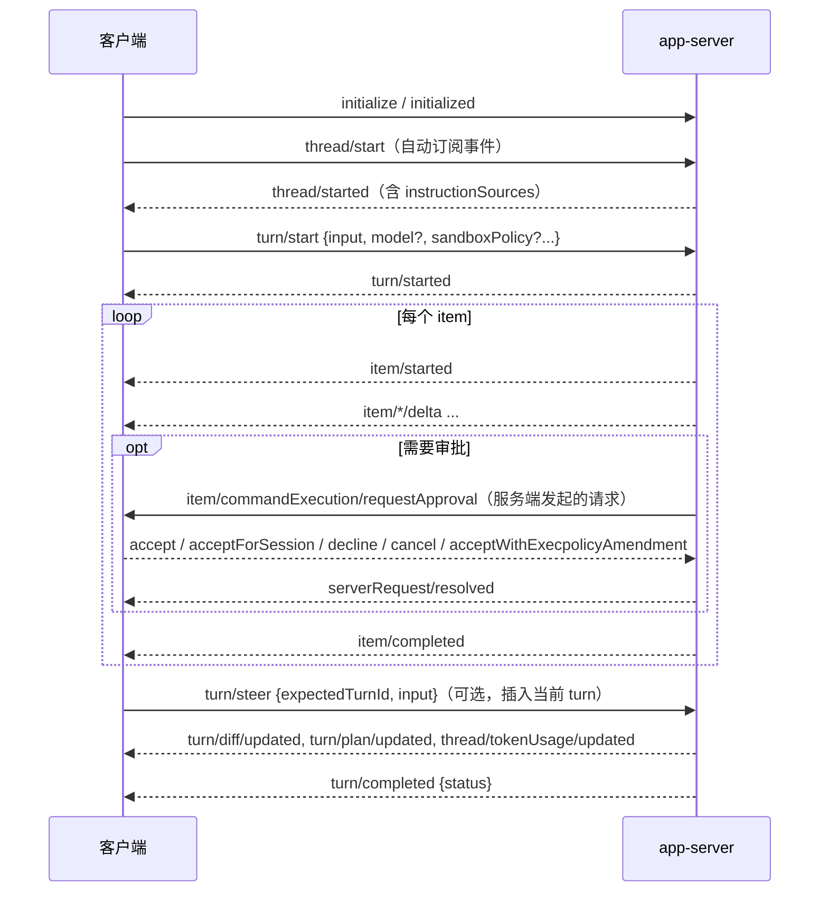
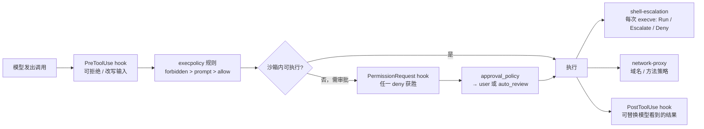

**本系列**：[00 资料索引](/personal-blog/articles/codex-omp-research-index/) · **01 Codex 自带文档总结** · [02 oh-my-pi 自带文档总结](/personal-blog/articles/omp-bundled-docs/) · [03 Codex 架构设计](/personal-blog/articles/codex-architecture/) · [04 oh-my-pi 架构设计](/personal-blog/articles/omp-architecture/) · [05 两者对比与可借鉴点](/personal-blog/articles/codex-vs-omp/) · [06 交互式架构图导览](/personal-blog/articles/codex-omp-diagrams/)

> 源码快照：[openai/codex](https://github.com/openai/codex/tree/44fe510ce3ee61c8ef623adcbf89b901c73ddd61)，HEAD `44fe510c`（2026-09-28）。在线文档于 2026-09-28 下载。

## 0. 结论先行

- **Codex 没有全局架构文档，也没有可视化架构图。** 知识分散在两处：仓库里各 crate 的开发者 README（面向贡献者，写的是契约和边界情况），以及官方在线文档（面向用户，写的是产品行为语义）。
- 仓库自带的 `docs/*.md` 基本是百字节级的外链占位页，内容都在在线文档里。`AGENTS.md` 也明确规定“不要把通用产品文档加入 `docs/`”。
- **agent loop 内部实现（`run_turn` 的循环条件、流式期间提前派发工具、并行工具读写锁、turn 中途压缩等）在任何文档里都没有描述**，只能读源码，见 [03 Codex 架构设计](/personal-blog/articles/codex-architecture/)。文档能告诉你的是 loop 的**外部契约**：协议状态机、hook 挂载点、审批门控顺序、上下文预算。

## 1. 文档构成与获取方式

| 来源 | 位置 | 性质 | 调研时的本地副本 |
|---|---|---|---|
| 官方在线文档 | `learn.chatgpt.com/docs/<slug>`（`developers.openai.com/codex/*` 已 308 重定向到这里） | 产品行为、配置、协议 | `codex-online-docs/`，文件名把 `/` 换成 `__` |
| 在线文档索引 | `https://learn.chatgpt.com/llms.txt` | 所有页面的列表；每页 URL 后加 `.md` 即可取 Markdown | `codex-online-docs/llms.txt` |
| 聚合手册 | `codex-manual.md` | 全部文档拼接，约 2.4 MB | 同上，只适合 grep |
| crate README | `codex-rs/**/README.md` | 贡献者视角的契约、约束、边界情况 | 仓库原位 |
| 仓库规则 | 根目录 `AGENTS.md` | 代码与上下文工程规范 | 仓库原位 |

### 推荐阅读顺序

1. 在线 `app-server.md`：Thread / Turn / Item 协议是理解整个系统的钥匙。
2. 在线 `hooks.md`：12 个事件恰好标出了 loop 的每个关键节点。
3. 在线 `agent-approvals-security.md` + 仓库 `execpolicy`、`linux-sandbox`、`network-proxy`、`shell-escalation` 的 README：安全体系。
4. 仓库 `AGENTS.md`：上下文工程规则（只追加、有界、缓存友好）。
5. 仓库 `rollout-trace/README.md`：运行时对象模型，比协议更接近内部实现。
6. 仓库 `exec-server`、`thread-store`、`memories`、`codex-api`/`codex-client`/`http-client` 的 README。

**注意**：`codex-rs/app-server/README.md`（31 KB）不是协议总览，而是约 30 个独立专题小节（Guardian 熔断、gateway OAuth、线程附件、网络策略、用户验证……），连常规的命令/补丁审批方法都没列。协议全貌要看在线的 `app-server.md`，或者用 `codex app-server generate-ts` 生成 schema。

---

## 2. 核心心智模型：Thread → Turn → Item

这是在线 `app-server.md`、`glossary.md` 和 SDK 文档共同确立的模型，也是 agent loop 对外暴露的状态机。

- **Thread**：一段持久化会话。历史存为 rollout JSONL，元数据存 SQLite。
- **Turn**：一次用户请求及随后 agent 的全部工作。以 `completed`、`interrupted` 或 `failed` 结束。
- **Item**：输入或输出的单元，类型有 `userMessage`、`agentMessage`（`phase` 区分 `commentary` 和 `final_answer`）、`reasoning`、`plan`、`commandExecution`、`fileChange`、`mcpToolCall`、`dynamicToolCall`、`collabToolCall`、`webSearch`、`imageView`、`contextCompaction`、进出 review 模式等。每个 item 都是 `item/started` → 若干 delta → `item/completed`，**`item/completed` 是权威状态**。



从协议能推出的 loop 调度规则：

1. **每个 thread 同时只有一个活跃 turn**。新输入要么 `turn/steer`（必须带匹配的 `expectedTurnId`，不产生新 `turn/started`）插进当前 turn，要么等它结束。客户端提供的 `toolOutput`、`thread/shellCommand` 在有活跃 turn 时都会排进去。
2. **turn 级覆盖会粘住**：`turn/start` 上的 model、effort、cwd、sandboxPolicy、personality 会成为后续 turn 的默认值，只有 `outputSchema` 只对当前 turn 生效。
3. **交互被统一建模成“服务端 → 客户端的请求”**：审批、`requestUserInput`、MCP elicitation、动态工具调用（`item/tool/call`）。loop 在对应 item 上挂起等待；turn 结束或中断时，挂起的请求统一清理并发 `serverRequest/resolved`。
4. **压缩也是普通的 turn/item 流**：`thread/compact/start` 立即返回，进度以 `contextCompaction` item 流出。
5. `thread/fork` 基于存储的历史分叉，不能 fork 进行中的 turn；`thread/rollback` 已删除，改用 `thread/revert`。

**统一内核，多种外壳**：交互式 TUI、IDE 扩展、桌面端、远程 TUI（`codex --remote ws://…`）都走 app-server；TUI 和 `codex exec` 通过 `app-server-client` **在进程内**嵌入它（typed channel，但保留 JSON-RPC 语义）；Python SDK 直接驱动本地 app-server；`codex exec --json` 输出的是同一套事件的 snake_case 点号版本（`item.completed` 对应 `item/completed`）。旧的“Codex 作为 MCP server”形态已被移除，官方说法是 MCP 的 tool call 语义承载不了长时、多步、需要交互审批的会话。

---

## 3. 安全体系：三个正交维度 + 多层门控

### 3.1 沙箱 × 审批 × 审查者

| 维度 | 取值 | 回答的问题 |
|---|---|---|
| `sandbox_mode` | `read-only` / `workspace-write` / `danger-full-access` | 命令**技术上**能做什么 |
| `approval_policy` | `on-request` / `never` / `{granular = {...}}`（`untrusted` 已退役，`on-failure` 已弃用） | **何时**停下来问 |
| `approvals_reviewer` | `user` / `auto_review` | **谁**来批 |

- 三者正交：**换审查者不扩大沙箱**。UI 上的 Ask for approval / Approve for me / Full access 只是三元组的预设。
- `Auto` = `workspace-write` + `on-request`；`--yolo` = 既无沙箱也无审批。
- workspace-write 下 `.git`（含 `gitdir:` 指向的目录）、`.agents`、`.codex` 永远只读，所以 `git commit` 可能需要审批。
- **Auto-review（Guardian）**：把需要审批的请求交给一个 reviewer agent，审查数据外泄、凭证探测、持久削弱安全、破坏性操作。构建失败、解析失败、超时都 **fail closed**。拒绝次数达到上限可以熔断（`circuit_break_action = "strict"` 时 turn 以 `tooManyDenials` 结束）。默认策略在 `codex-rs/core/src/guardian/policy.md`。
- **Permission profile**（Beta）：命名的“文件系统 + 网络”组合策略，可继承（不能继承 `:danger-full-access`），更具体的路径优先，同路径 `deny > write > read`。**与旧的 `sandbox_mode` 互斥**，配置解析阶段二选一。

### 3.2 工具调用的完整门控顺序（多份文档拼合）



各层要点：

- **execpolicy**（`execpolicy/README.md` + 在线 `rules`）：Starlark 写的 `prefix_rule(pattern, decision, justification, match, not_match)`。`match` / `not_match` 是加载时执行的内联单测。对 `bash -lc "a && b | c"` 这类**纯线性链**，用 tree-sitter 拆开分别判定取最严；含重定向、`$(...)`、变量、通配、控制流时整体保守匹配。TUI 里的“总是允许”、审批时的 `acceptWithExecpolicyAmendment` 会**直接写回规则文件**，形成“审批 → 策略”的学习闭环。
- **shell-escalation**：给 zsh 打补丁（`EXEC_WRAPPER`），拦截沙箱 shell 里的**每一次 `execve`**，通过共享 fd 问服务端：`Run`（沙箱内跑）、`Escalate`（把 fd 转交服务端在沙箱外执行并回传退出码）、`Deny`。审批粒度因此能细到脚本里的单个子命令。
- **OS 沙箱**：macOS 用 Seatbelt；Linux 默认 bubblewrap + seccomp（`--ro-bind / /`，可写根 `--bind`，受保护子路径重新只读，按路径特异性排序；PATH 里没有 `bwrap` 时回退到内置副本），legacy Landlock 因无法隔离 Unix socket 已被拒绝；Windows 有 elevated / unelevated restricted token，另有 MXC 后端。所有后端**共享同一个规范权限 profile，表达不了的策略直接拒绝执行，不降级**。
- **network-proxy**：OS 沙箱断网，只放行到本地代理（HTTP `127.0.0.1:3128`，SOCKS5 `127.0.0.1:8081`）；代理做域名 allow/deny（deny 优先）和方法级策略（`limited` 模式只允许 GET/HEAD/OPTIONS，HTTPS 需要内存 CA 做 MITM）。`NetworkPolicyDecider` 能把“用户已批准 `curl *`”映射成网络放行。注意代理**只管沙箱内命令**，web search、MCP、模型请求都不经过它。
- **进程加固**（`process-hardening`）：`#[ctor]` 在 main 之前禁 core dump、禁 ptrace、清 `LD_PRELOAD` / `DYLD_*`。
- **凭证隔离**（`responses-api-proxy`）：只转发 `POST /v1/responses` 并注入 key 的严格代理；key 从 stdin 读进栈缓冲、校验后 `zeroize`、`mlock`。GitHub Action 就用它让 agent 进程拿不到 key。

---

## 4. Hooks：12 个事件就是 loop 的挂载点地图

| 事件 | 相对 loop 的位置 | 能做什么 |
|---|---|---|
| `SessionStart` | 启动、恢复、清空，**以及每次压缩后的下一次模型请求前** | 注入 developer context；`continue:false` 结束 turn |
| `UserPromptSubmit` | 用户 prompt 发送前 | 注入上下文；阻止该 prompt |
| `PreToolUse` | 工具执行前 | 拒绝；`updatedInput` 改写输入；加上下文 |
| `PermissionRequest` | 即将弹审批时 | 直接 allow 或 deny（任一 deny 获胜） |
| `PostToolUse` | 工具产出结果后 | 不能撤销副作用，但能**用反馈替换工具结果** |
| `PreCompact` / `PostCompact` | 压缩前后 | `continue:false` 中止 |
| `SubagentStart` / `SubagentStop` | 子 agent 启停 | 给子 agent 注入上下文；让子 agent 再跑一轮 |
| `Stop` | 主 turn 准备停止时 | `decision:"block"` **不是拒绝而是续跑**：`reason` 作为新的用户 prompt 继续执行；`stop_hook_active` 防死循环 |
| `Interrupt` | 用户中断活跃 turn | 只能返回 `systemMessage`，1–3 秒限时 |
| `SessionEnd` | 会话关闭 | 仅记录 |

几条对实现者有用的规则：

- **失败语义刻意不对称**：`PreToolUse` 非法输出、MCP hook 出错都 fail open（工具照常执行）；`PermissionRequest` 的保留字段 fail closed。文档原话是“把 tool hook 当作有用的护栏，而不是完整的强制边界”。
- 同一事件的多个 hook **并发启动**，决策聚合为“任一 deny 获胜”“`continue:false` 优先”。
- **async hook** 不阻塞、不能阻断或改写；输出在“下一个安全点”（当前模型请求和工具调用都完成后）交给下一次模型请求，**不会自己开新 turn**。每会话最多 8 个并发。
- 模型可见的 hook 输出默认约 2,500 tokens，超出部分落盘，模型只看首尾预览和文件路径。
- hook 信任绑定在**定义的哈希**上，定义一变就要重新审阅；项目 hook 只在项目被信任时加载。
- 托管工具（如 WebSearch）不经过 hook。

---

## 5. 上下文工程

### 5.1 仓库 `AGENTS.md` 里的硬规则（贡献者必须遵守）

- 模型上下文**只追加、不重写历史**；避免频繁变动导致 prompt cache 失效。
- 每个注入片段必须有界，单项不超过 10K tokens；超过 1K tokens 的新注入项标为 P0 人工复审。
- 所有注入片段都定义在 `core/context`，实现 `ContextualUserFragment` trait。
- 不要随意调 `reset_client_session`，由增量检查决定能否复用上一次请求（配合 WebSocket 增量续传）。
- “抵制往 `codex-core` 加代码”：core 已经臃肿，新概念放到其他 crate。模块目标 500 行以内，超过 800 行拆分。

### 5.2 各类注入的预算与降级

| 注入物 | 时机 | 预算 | 超预算时 |
|---|---|---|---|
| AGENTS.md 链 | 每次运行构建一次，放进首个 turn | `project_doc_max_bytes` 默认 32 KiB | 按拼接顺序截断，所以根目录文件过大会挤掉深层指导 |
| Skills 目录（name + description + 路径） | 会话开始 | 上下文窗口的 2%（窗口未知时 8,000 字符） | 先缩短描述，再省略条目并告警 |
| Skill 正文 | 选中后 | — | 按需 `read` |
| Hook 输出 | 各事件 | 约 2,500 tokens | 落盘 + 首尾预览 |
| 工具输出 | 写入历史时 | `tool_output_token_limit`；MCP 可按工具设 `output_token_limit` | 截断 |
| Memories | 会话开始注入 developer 指令 | — | — |

**AGENTS.md 发现规则**：全局取 `$CODEX_HOME` 下第一个非空的 `AGENTS.override.md` 或 `AGENTS.md`；项目从 Git 根**向下**走到 cwd，每级最多取一个文件（`AGENTS.override.md` → `AGENTS.md` → `project_doc_fallback_filenames`）；根到叶用空行拼接，**越靠后优先级越高**，没有语义合并。

### 5.3 压缩

- 触发：`model_auto_compact_token_limit`，计量范围 `total`（完整活跃上下文）或 `body_after_prefix`（只算压缩前缀之后新增的部分）；也可手动触发。
- 两种实现：`remote`（服务端压缩）和 `local`（本地摘要），见指标 `task.compact{type}`。
- 压缩后 `SessionStart(source=compact)` 在下一次模型请求**之前**运行，turn 中途的自动压缩也会把 hook 上下文交给紧接着的续跑请求（这从侧面证实了 turn 中途压缩的存在）。
- 实验性的 `features.context_management.experimental_mode`：不再反复压成一段摘要，改用 notes + 可搜索历史。

---

## 6. 子 agent 与多 agent

- 子 agent = **一个新 thread + 一层额外配置**。工具：`spawn_agent`、`send_input`、`resume_agent`、`wait_agent`、`close_agent`（在线文档）；`rollout-trace` README 里的 multi_agent_v2 还有 `followup_task`、`send_message`。
- 自定义 agent 是 `.codex/agents/*.toml`，**作为派生会话的配置层加载**，所以能写任何 config 键。
- 模型解析：spawn 显式值 → `[agents]` 默认 → 父 agent。
- **父 turn 的实时安全覆盖（比如会话中 `/permissions` 收紧）总会重新施加到子 agent**，子 agent 无法放宽。
- 审批跨线程冒泡到同一 UI；非交互场景下需要新审批的动作直接失败并回传父 agent。
- 并发上限 `max_concurrent_threads_per_session` 只计子线程。
- `sourceKinds` 里有 `subAgentReview`、`subAgentCompact`，说明 review 和压缩也可能以子 agent 形式运行；记忆合并同样用受限子 agent 完成。子 agent 是一个**通用的内部执行原语**。
- 本地 Codex 只在用户明确要求或 AGENTS.md / skill 指示时才派生子 agent。

---

## 7. 长任务：Goal mode

- `/goal` 的文本**同时是第一条 prompt 和完成判据**；持久化在 thread 上，带 `tokenBudget`、`tokensUsed`、`timeUsedSeconds`（`thread/goal/set|get|clear`）。
- `features.goals` 默认开启，描述为“persisted goals and automatic continuation”：一次输入后可以跨多个 turn 自动续跑，直到判定完成或用尽预算。
- Goal 不扩大权限，需要决策时暂停。
- 与 `Stop` hook 的续跑是两条并行机制：一个内建，一个外挂。

---

## 8. 持久化、记忆与可观测性

**持久化**（`thread-store/README.md`）：

- `ThreadStore` trait 把历史写入（`append_items`，只追加）和元数据写入（`update_thread_metadata`，唯一的元数据写 API）分开。
- 本地实现：历史写 rollout JSONL，元数据写 SQLite；后端可插拔，支持仓库外的远程实现。
- `LiveThread` 负责活动会话；`ThreadManager` 统一路由已加载线程和冷线程。
- **从旧 rollout 恢复会话**被列为破坏性变更检查面之一，旧格式必须能回放。

**记忆**（`memories/README.md`）：离线两阶段流水线，不在 turn 关键路径上。

1. Phase 1：从 state DB 认领符合条件的 rollout（交互来源、足够空闲、未被占用），并行调模型抽取 `raw_memory` 和 `rollout_summary`，脱敏写回。
2. Phase 2：取全局锁，选 top-N 输出，同步到 `~/.codex/memories/`。**这个目录本身是一个 git 基线仓库**，写出 `phase2_workspace_diff.md` 后，派生一个无审批、无网络、仅本地写、禁止再委派的**子 agent** 来合并出 `MEMORY.md`，成功后重置 git 基线。是否需要运行由 git 工作区是否脏决定。
3. 模型输出里的 `<oai-mem-citation>` 由 `utils/stream-parser` 在流式层跨 chunk 剥离（README 原话：“这段代码很复杂，Codex 没能写出来”）。

**可观测性**：

- `otel`：默认关闭。事件有 `codex.api_request`、`codex.sse_event`、`codex.websocket_*`、`codex.tool_decision`、`codex.tool_result`、`codex.guardian_assessment` 等；指标有 `turn.e2e_duration_ms`、`turn.ttft.duration_ms`、`turn.tool.call`、`task.compact` 等。`codex.websocket.continuation` 揭示了**WebSocket 增量续传**：正常只发上一个 response ID + 新输入，首请求、恢复/分叉历史、连接关闭时才回退全量；还有 `generate=false` 的 warmup 请求。
- `rollout-trace`：可选的本地诊断包（设 `CODEX_ROLLOUT_TRACE_ROOT` 才写，不上传）。原则是“先观察，后解释”：热路径只写有序原始事件和 payload 引用，离线 reducer 构建语义图。归约对象有 `InferenceCall`、`Compaction`、`ToolCall`、`CodeCell`（code mode 中模型写的 JS `exec` cell，内部可嵌套工具调用）、`TerminalOperation`、`InteractionEdge`（子 agent 的 spawn/task/result/close 边）。它严格区分“模型可见的对话”和“运行时证据”。追踪失败永远不能让会话失败。

---

## 9. 模型调用栈与执行环境

**模型调用四层栈**（`http-client`、`codex-client`、`codex-api` 的 README）：

```
codex-http-client   唯一允许直接用 reqwest 的 crate：代理策略（系统 / PAC / 环境变量）、按路由池化（最多 16 个）、
                    自行跟随重定向并在跨源时剥离敏感头、自定义 CA
  → codex-client    与 API 无关的 RetryPolicy、SSE 分帧 + 空闲超时、请求遥测
  → codex-api       ResponsesApiRequest {model, instructions, input, tools, parallel_tool_calls}
                    → ResponseStream<ResponseEvent>
  → codex-core      只处理 ResponseEvent 流
```

线协议固定是 OpenAI Responses API（自定义 provider 的 `wire_api` 只支持 `responses`），默认 `request_max_retries = 4`、`stream_max_retries = 5`、`stream_idle_timeout_ms = 300000`。

**exec-server**（文档最完整的一份 README）：把进程和文件系统操作抽象成 JSON-RPC 服务（`process/start|read|write|terminate`、`fs/*`，通知 `process/output`（带 `seq`）、`process/exited`（带 `sandboxDenied`）），传输可以是本地 WebSocket、经 rendezvous 的 Noise relay，或 AWS SigV4 直连。**agent 大脑和执行环境因此可以在不同机器、不同 OS 上**；测试套件用 `build_with_auto_env()` 让 app-server 和 exec-server 跑在不同 OS（包括 Wine 下的 Windows exec-server）。

**单一二进制多角色**：`arg0 == codex-linux-sandbox` 时充当 Linux 沙箱 helper，`arg1 == --codex-run-as-apply-patch` 时模拟虚拟 `apply_patch` CLI，减少分发物。

---

## 10. 配置与信任

- 优先级（在线文档）：CLI flags / `-c` → 项目 `.codex/config.toml`（越靠近 cwd 越优先）→ `--profile` → 用户 `~/.codex/config.toml` → 云托管默认 → 系统 `/etc/codex/config.toml` → 内置默认。`config/loader/README.md` 给出的内部层次更细，最顶上还有 MDM 和文件形式的 `managed_config.toml`，并提供按键的来源追踪和按层的版本指纹（乐观并发写入）。
- **信任门控**：项目 `.codex/` 下的 config、hooks、rules、MCP 只在项目被信任时加载。
- **项目配置不能覆盖的键**：`openai_base_url`、`model_provider(s)`、`notify`、`otel`、`profile(s)` 等。恶意仓库因此无法改写凭证去向、provider 或遥测。
- `requirements.toml` 是托管强制层，能限定允许的审批策略、沙箱模式、permission profile，pin 功能开关，下发 `prefix_rule`。
- 一个容易踩的默认值：`shell_environment_policy.ignore_default_excludes` 默认 `true`，即**不会**自动过滤名字含 `KEY` / `SECRET` / `TOKEN` 的环境变量。

---

## 11. 文档没覆盖、必须读源码的部分

| 问题 | 文档状态 | 源码位置（详见文档 03） |
|---|---|---|
| turn 内部的采样—工具循环何时继续、何时停 | 未描述 | `core/src/session/turn.rs::run_turn` |
| 工具是否在模型流式输出期间就开始执行 | 未描述 | `stream_events_utils.rs::handle_output_item_done` |
| 并行工具调用如何互斥 | 只有 `parallel_tool_calls` 字段名 | `core/src/tools/parallel.rs`（`RwLock<()>` 读写门） |
| 沙箱被拒后的升级重试 | 只有 `sandboxDenied` 字段 | `core/src/tools/orchestrator.rs` |
| turn 中途压缩的触发条件 | 只从 `SessionStart(compact)` 的描述侧面体现 | `turn.rs` 中的 `should_roll_over` |
| steer 输入如何进入正在运行的 turn | 只有协议语义 | `core/src/session/turn_input.rs` |
| 流错误重试和 WebSocket 会话复用 | 只有配置键和指标 | `turn.rs::run_sampling_request`、`ModelClientSession` |

