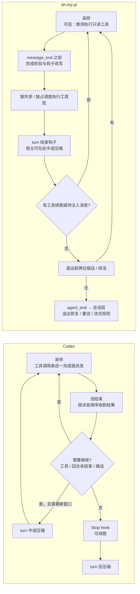

> 依据 [Codex 架构设计](/personal-blog/articles/codex-architecture/) 和 [oh-my-pi 架构设计](/personal-blog/articles/omp-architecture/) 的第一部分（语言无关的架构设计）。快照：Codex `44fe510c`，oh-my-pi `df731d51`。
> 本文只比较设计语义，不比较两种语言各自的实现手段。源码位置见 [Codex 架构设计](/personal-blog/articles/codex-architecture/) 和 [oh-my-pi 架构设计](/personal-blog/articles/omp-architecture/) 的第二部分。

## 0. 核心结论

1. **两者的 loop 骨架几乎一样**：采样 → 收集工具调用 → 执行 → 只要有工具结果或有新的用户输入就继续。区别在于“继续条件”的写法和各自处理的边界情况。
2. **Codex 的难点在安全和协议**：审批、隔离执行、被拒后升级重试、自动审查、会话协议状态机；loop 本身相对克制。**oh-my-pi 的难点在模型兼容和交互体验**：它要适配几十家 provider 和各种不守规矩的模型（格式泄漏、文本内工具调用、回合结束信号里夹带工具调用），还要让插话尽可能即时又不丢消息。
3. 两者在几个关键问题上独立得出了**同构的解法**：读写锁语义的工具并行、为每条中断路径合成配对的工具结果、只追加的上下文、压缩作为 loop 内的一等事件。这些可以视为 coding agent 的“行业共识”。

---

## 1. Loop 结构对照

| 维度 | Codex | oh-my-pi |
|---|---|---|
| 分层 | Op 分发 → 任务 → Turn 循环 → 采样 | 会话层 → Agent → Agent Loop |
| 继续条件 | 模型需要继续 ∨ 有待并入输入 | 内层：还有工具续跑 ∨ 有待注入消息；外层退出前再查插话、旁白、续话 |
| 状态归属 | 会话持有一切，loop 直接读写 | loop 无状态，配置每次调用前重读；Agent 把事件归约成状态 |
| 对外输出 | 协议事件（Thread / Turn / Item） | 10 种事件组成的事件流 |
| 取消模型 | 取消信号树状下传；工具执行与调用方同生命周期 | 多个取消来源分开管理：外部取消、可中断工具的硬中止、所有工具都能收到的协作式软信号 |
| 模型接入 | 只对接 Responses 风格接口 | 统一流事件，适配几十家 provider，外加 11 种文本内工具调用方言 |

**一个结构性差异**：两者都能在工具链进行中压缩，但挂载方式不同。Codex 把压缩写在 loop **内部**（turn 前、turn 中途、turn 后三处）。oh-my-pi 的 loop 本身不认识压缩：它在每个 turn 结束时等待宿主的钩子，会话层在钩子里判断阈值、执行压缩，再原地替换 loop 正在使用的消息序列；溢出和 length 截断的恢复则放在运行结束之后，用“不加新消息继续”接着跑。前者让 loop 更自足，后者让 loop 更纯粹、更容易测试，把策略留给上层。

---

## 2. 关键问题的两种解法

### 2.1 工具并行

| | Codex | oh-my-pi |
|---|---|---|
| 声明方式 | 工具声明能否并行 | 工具声明“共享”或“独占”，也可以根据参数动态判断 |
| 调度语义 | 读写锁：可并行的共享通行，不可并行的独占通行 | 读写锁：独占调用等之前全部调用结束，共享调用只等最近一个独占调用 |
| 判断出错时 | — | 按独占处理 |
| 结果顺序 | 按派发顺序收割 | 按调用顺序产出；最后一次尾部清扫补“跳过”结果 |
| 计时 | 等待通行的时间与执行时间分开计 | — |

语义相同。oh-my-pi 多了**按参数动态决定**，例如 bash 执行只读命令时可以标为共享。

### 2.2 边流边执行

| | Codex | oh-my-pi |
|---|---|---|
| 时机 | 每个工具调用条目一完成就派发，**所有工具**都这样 | 默认等整条消息结束；实验特性（默认关闭）才会在单个调用参数完成时推测执行 |
| 范围 | 所有工具，走完整的审批与隔离流程 | 只推测**只读文件访问**类调用，最多 2 个并发 |
| 一致性 | 先把调用写入历史再派发；工具前钩子在派发流程内运行 | 定稿后用规范化参数指纹对账：参数没变就复用，变了（例如被钩子改写）就丢弃 |

oh-my-pi 更保守的原因：它允许“工具调用前”钩子**在 `message_end` 之前改写参数**，并把改写后的参数作为唯一事实写进历史。流中提前执行的调用可能用的是改写前的参数，所以要对账。Codex 先把调用写进历史再派发，工具前钩子在派发流程里才运行；按代码顺序推断，钩子改写的输入只影响实际执行，不回写模型看到的调用，因此它可以放心立即派发。

### 2.3 用户在 agent 工作时插话

| | Codex | oh-my-pi |
|---|---|---|
| 入口 | 插话必须带“期望的 turn ID”，写入活跃 turn 的待并入输入 | 插话（打断式）/ 续话（非打断式）两个队列 |
| 何时生效 | 下一次采样前并入；开启“即时打断”时可以抢占正在进行的流 | turn 边界注入；支持的 provider 可以在流中注入 |
| 对工具的影响 | 不打断工具 | 可中断工具（纯等待类）被硬中止；其他工具收到协作式软信号，自己决定是否让路（例如 bash 转后台） |
| 不丢消息 | 待并入输入延迟并入，保证不插进调用和结果之间 | 出队 ≠ 送达：投递记账，运行结束时把未送达的消息放回队首 |
| 不接受插话 | 审查和压缩类型的 turn | — |

oh-my-pi 在这方面投入明显更多，可能是因为它的终端交互更依赖“边做边改”。最值得借鉴的是**投递记账**：区分“从队列取出”和“真正进入记录”，中断时后者没发生，就还回队列。

### 2.4 中断与配对不变量

两者都把“每个工具调用必须有且只有一个结果”当作硬约束：

- Codex：取消时合成“用户在 X 秒后中止”（命令类工具用与正常输出同格式的文案）；流出错时先收割已派发的工具再返回，历史里不留孤儿调用；补给孤立调用的结果用确定性 ID。
- oh-my-pi：七条路径都会合成结果（流错误、length 截断、软性要求未满足、批内中断、Agent 中断恢复、会话重放、服务端已执行的调用），并打合成标记，让界面区分“没执行”和“执行失败”。

### 2.5 上下文与缓存

| | Codex | oh-my-pi |
|---|---|---|
| 原则 | 仓库规约规定只追加、有界、不改写历史 | 冻结前缀 + 只追加日志 |
| 环境变化 | 世界状态按 section 做 merge patch，只注入**差异** | 被撤掉的工具按字节原样重新声明 |
| 传输层 | 持久连接上只发“上一个响应 ID + 新输入” | 依赖各 provider 自己的缓存机制；软性必需工具先提醒后强制，避免改工具选择 |
| 大工具目录 | 延迟暴露 + BM25 工具搜索 + schema 预算 | 虚拟设备把 MCP / 扩展工具移出顶层列表；MCP 慢服务器先以延迟工具暴露 |
| 生成的标识 | 合成 ID、工具名后缀都用确定性哈希 | — |

### 2.6 压缩

| | Codex | oh-my-pi |
|---|---|---|
| 触发 | turn 前、**turn 中途**、turn 后；换模型前用旧模型压缩 | 运行结束后（溢出 / length / 阈值）；**turn 中途**经 turn 结束钩子（默认开，子代理强制开）；后台推测压缩；都先尝试升级到更大窗口的模型 |
| 方法 | 服务端压缩或本地摘要；压缩请求与普通请求同形状以复用缓存 | 方法链：远程 → 快照压缩（历史渲染成图片）→ 交接文档 → 摇落（大输出换成引用）→ 软摘要 |
| 压缩后 | 把初始上下文重新注入到最后一条用户消息之前 | 会话树上记一个压缩节点，重放时从这里开始 |

### 2.7 重试

- Codex：请求级重试（默认 5 次）；连接失败可以无限重试；持久连接重试耗尽后降级到 HTTPS。重试从历史重建请求。
- oh-my-pi：只在还没流出“不可重放的输出”（可见文本或工具调用）时才重试；指数退避加抖动，上限 8 秒；支持凭证轮换和模型回退。上下文溢出不走重试，交给压缩。

### 2.8 安全

| | Codex | oh-my-pi |
|---|---|---|
| 隔离 | 各平台操作系统级沙箱，共享一个规范权限模型；表达不了就拒绝执行 | 没有操作系统级沙箱；子代理靠工作区隔离（文件系统快照 / worktree） |
| 审批 | 策略规则 + 会话内审批记录 + 自动审查器；被拒后升级重试 | 工具等级（读 / 写 / 执行）+ 工具策略 + 用户策略；默认完全放行 |
| 防试探 | 审查器熔断 | bash 危险模式强制提示 |
| 其他 | `.env` 不能改引擎自身设置 | 密钥混淆：模型看不到明文 |

### 2.9 扩展点

| 需求 | Codex | oh-my-pi |
|---|---|---|
| 工具前后拦截 | 工具调用前 / 后 hook（外部命令或 MCP 工具） | 工具调用前 / 后钩子，扩展是进程内模块 |
| 外部定义“完成” | Stop hook 的阻止 = 续跑；目标模式 | 续话队列；软性必需工具 |
| 流式拦截坏模式 | — | **流式规则**：流中命中 → 中止 → 截掉半截消息 → 注入规则 → 重来 |
| hook 失败语义 | 工具护栏 fail open，审批路径 fail closed | 扩展工具处理器超时或出错一律 fail closed |

---

## 3. 各自独有、值得借鉴的设计

### 从 Codex 借鉴

1. **把 turn 中途压缩写进 loop 主体**，并在压缩后重新注入初始上下文。对长任务至关重要（oh-my-pi 也有，但通过钩子实现）。
2. **换模型前用旧模型压缩**：切到更小窗口或压缩格式不兼容的模型时，让旧模型先压缩。
3. **步上下文冻结**：每次请求固定一份“声明的工具 = 可执行的工具”视图，避免 MCP 在两者之间刷新导致不一致。
4. **被隔离层拒绝 → 升级重试 + 审批记录复用**：先在沙箱里试，被拒再升级，已批准的不重复问；严格审查模式例外。
5. **“总是允许”写回策略规则**：审批变成可测试的声明式策略。
6. **协议先行、本地前端也走协议**：所有前端共用一个会话协议，行为和测试只有一套。
7. **“先观察，后解释”的追踪**：热路径只写有序原始事件，语义图离线构建。
8. **世界状态差异注入**：每个上下文来源是一个带稳定 ID 的 section，每步做 merge patch，只渲染变化部分；合成 ID 用确定性哈希。oh-my-pi 靠“静态内容在前、易变内容在尾”保缓存，Codex 则把“只追加差异”做成了通用机制。
9. **把缓存稳定性写成测试**：上下文快照测试按“前缀窗口”分组，请求前缀一旦意外变化，快照就会失败。
10. **延迟暴露工具**：大工具目录用延迟暴露 + BM25 工具搜索按需发现，并给插件工具 schema 设预算。
11. **审批回执也是一种操作**：分发器永不阻塞在某个 turn 上，中断随时有效。

### 从 oh-my-pi 借鉴

1. **loop 无状态，配置每次调用前重读**：运行中切模型、改推理强度、换凭证，下一次调用自然生效。
2. **钩子改写早于 `message_end`**：历史、持久化、执行、重放看到同一份参数。
3. **可中断 / 不可中断工具 + 协作式软信号**：插话及时，又不杀掉有副作用的工具。
4. **投递记账**：出队 ≠ 送达，中断时零丢失。
5. **Hashline 编辑**：文件快照标签 + 原始行号 + diff 修复 + 已见行校验。省 token，没有“字符串未找到”循环，并发修改也能自动修复锚点。
6. **流式规则**：在生成阶段拦截并“倒带”，比事后纠正便宜。
7. **文本内工具调用方言 + 伪造结果检测**：让原生工具调用差的模型也能用。
8. **合成结果打标记**：界面和遥测能区分“没执行”和“执行失败”。
9. **只追加的会话树 + 固定大小标题槽**：分支是移动指针，重命名是原地覆写，配置变更也是树上的节点。

---

## 4. 如果要自己实现一个 coding agent loop

按优先级排的一份清单，每条都能在两个项目里找到对应实现（源码位置见 [Codex 架构设计](/personal-blog/articles/codex-architecture/) 和 [oh-my-pi 架构设计](/personal-blog/articles/omp-architecture/) 的第二部分）：

1. **先定不变量**：每个工具调用必须恰好有一个结果；所有中断路径都要合成结果。
2. **继续条件写成一句**：“有工具结果 ∨ 有待处理的用户输入”。其余都是这条规则的例外处理。
3. **工具并行用读写锁语义**：默认串行，显式声明可并行；判断出错时退回串行。
4. **上下文只追加**：环境变化注入差异，不重写 system prompt；把“缓存会不会失效”作为设计评审项。
5. **插话要有投递确认**：中断时未送达的放回队列。
6. **压缩是 loop 内的事件**，至少支持 turn 中途压缩：可以直接写进 loop（Codex），也可以给宿主一个 turn 边界钩子，让宿主替换 loop 正在用的上下文（oh-my-pi）。
7. **重试只在可重放时进行**，并从持久化的历史重建请求。
8. **hook 的失败语义按路径区分**：安全路径 fail closed，护栏路径可以 fail open，并写进文档。
9. **对外暴露事件流而不是回调**：界面、持久化、遥测都是订阅者，订阅者出错不影响 loop。
10. **给 prompt 前缀写快照测试**：把“这次改动有没有让缓存失效”从评审直觉变成可回归的断言。
