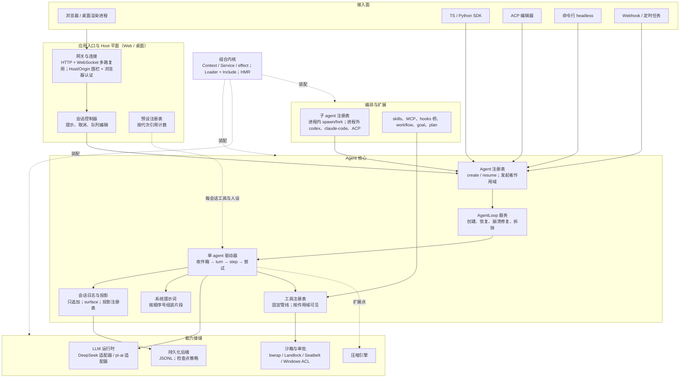

> 源码快照：deepseek-ai/deepseek-harness，tag `dsh-v0.2.0-rc.1`，commit `4878cdab`（2026-09-28）。路径相对仓库根目录，行号以该快照为准。
> 官方文档说了什么、哪里与源码不一致，见 [DeepSeek Harness 自带文档总结](/personal-blog/articles/dsh-bundled-docs/)。
>
> **阅读说明**：本文分两部分，结构与 [Codex 架构设计](/personal-blog/articles/codex-architecture/)、[oh-my-pi 架构设计](/personal-blog/articles/omp-architecture/) 相同，可以逐节对照。
> - **第一部分：语言无关的架构设计**。只讲概念、组件、状态机、不变量和设计取舍。为了在 TypeScript / Node 里实现某个功能而写的代码（异步上下文存储、Promise 竞速、声明合并等），这里只写它实现的**语义**。
> - **第二部分：实现映射**。把第一部分的概念对应到源码位置，只列位置，供核对。
>
> 第一部分的章节按 arXiv 2609.00006《Harness Engineering》的七个子系统组织（D1 Agent Loop、D2 LLM 集成、D3 工具、D4 上下文与记忆、D5 安全与权限、D6 编排、D7 扩展）。dsh 多了一个其他 harness 没有的核心层——**组合内核**，所以放在 D1 之前单独讲。

---

## 第一部分　语言无关的架构设计

### 1. 定位与设计目标

dsh 是一个**全插件化的 agent 运行时**。它没有写死的主程序：CLI、Web、桌面端、SDK、ACP 编辑器接入，都是同一个插件内核按不同配置装出来的一棵"插件树"。连 agent loop 本身也是一个插件（`agent-loop`），理论上可以整体替换。

从源码和仓库规约里能归纳出五条设计目标：

1. **一切皆插件，且一切可撤销**：每个能力都是插件树上的一"行"。插件注册的每一样东西（工具、提示词片段、事件监听、服务）都和一个清理动作绑定，卸载或禁用这一行时逆序撤销。热重载、插件开关、子 agent 隔离都建立在这条约束上。
2. **会话日志是唯一真源**：会话是一条只追加的事件日志。排队的输入、turn 编号、重试计数、审批记录、计划模式开关都是日志的"投影"。每一次模型请求都从日志重新推导，并有不变量检查在请求发出前核对"请求 == 日志推导结果"。
3. **loop 极简，策略外置**：loop 里没有重试、没有压缩、没有步数上限、没有预算。这些都由插件挂在四个扩展点上决定。
4. **前缀缓存稳定，并与服务端协同**：系统提示词、工具列表、环境信息的变化都以"追加"表达；DeepSeek 服务端配合支持"历史中途更新系统提示词""对话中途增删工具"两个扩展语义。
5. **fail-closed**：并发判定出错按独占处理，审批没有应答者按拒绝处理，沙箱后端不可用就不执行，审查器出错就拒绝。

### 2. 概念模型

| 概念 | 含义 |
|---|---|
| **Context / Service** | 插件内核的两个基本单位。Context 是插件运行的上下文，Service 是挂在 Context 上、按名字访问的能力（例如 `llm`、`tools`、`sessions`） |
| **effect** | 一次"注册 + 对应清理"的配对。插件卸载时所有 effect 逆序清理 |
| **行（Row / Entry）** | 插件树上的一个节点，对应一个插件包加一份配置 |
| **Bundle / Profile / Patch** | Bundle 是贡献一层配置补丁的 npm 包；Profile 是有序的 bundle 列表加用户补丁；Patch 是对行的插入或覆盖 |
| **Seam（能力接缝）** | 一个服务抽象加若干可替换实现。统一为"定义 / 提供者 / 消费者"三角色，例如压缩引擎、LLM 适配器、沙箱后端 |
| **Agent** | 一个会话的驱动者，同一时刻最多有一个活动 |
| **Session（会话日志）** | 只追加的事件序列，seq 从 0 连续编号 |
| **Surface（可见面）** | 日志中会投影成模型消息的那部分事件（系统、开发者、用户、助手消息和工具结果），支持"替换一段"语义（用于压缩） |
| **Projection（投影）** | 对日志的折叠函数，得到收件箱、turn 边界、重试计数、计划模式等派生状态 |
| **Turn（回合）** | 由一条输入引出的完整工作，以 `turn/start` 和 `turn/end` 两个事件为边界 |
| **Step（步）** | turn 内的一次模型请求，加上它引出的全部工具执行 |
| **Attempt（尝试）** | step 内的一次请求尝试。失败重试时同一 step 有多次尝试 |
| **Inbox（收件箱）** | 两条持久队列：`next-turn`（每条开一个新 turn）和 `next-step`（在下一个 step 边界整批并入） |
| **Scope（作用域）** | 每个 agent 一个。通过它注册的工具、提示词片段、监听只对该 agent 可见；父作用域能观察所有后代的事件 |
| **扩展点** | 事件的三种分发语义：**通知**（不能影响流程）、**瀑布**（每个监听者可以改写结果或短路）、**串行**（按序等待每个监听者） |
| **Preset（预设）** | 一组"每会话"的工具与人设组合（standard、code、cordis、minimal、ptc）。媒体所说的 "Creator 模式"在源码中叫 `cordis` |

### 3. 组件视图

> **交互图**：[组件总览：入口 → 注册表 → AgentLoop → 驱动器](/personal-blog/diagrams/dsh/dsh-components.html)（架构图，点击节点可查看源码位置）



| 组件 | 负责 | 不负责 |
|---|---|---|
| 组合内核 | 读取 profile、叠加补丁、装配插件树、热重载 | 任何 agent 语义 |
| Agent 注册表 | 按会话 id 登记活跃 agent；委托工厂创建或恢复；提供"当前是哪个 agent 在执行"的作用域 | 不驱动 turn |
| AgentLoop 服务 | 创建、恢复（含崩溃修复）、发布、有序拆除 | 不参与每次输入 |
| 单 agent 驱动器 | 收件箱、turn 与 step 循环、请求构造、流消费、工具调度 | 不做重试、压缩、审批决策 |
| 会话日志 | 同步追加、校验、通知观察者；推导模型消息 | 不做 I/O（由持久化后端异步落盘） |
| 工具注册表 | 固定的执行管线、并发分类、按作用域的可见性 | 不决定沙箱模式（由工具体内部决定） |
| 预设注册表 | 为每个会话挂载一套工具与人设，按代次隔离热更新 | 不影响已开会话 |

**所有协议驱动都是"agent 工厂的适配器"**：SDK 服务器、ACP、Webhook、定时任务、命令行 headless、子 agent，最终都调用同一个"创建 / 恢复 agent"接口，然后调 agent 的 `followup / steer / cancel`。没有哪个入口绕开主循环。

**部署形态**：

| 形态 | 进程拓扑 | 传输 |
|---|---|---|
| 命令行 headless | 单进程，完成后退出 | 终端 |
| Web | 单个 Host 进程 + 浏览器 | `POST /api/<ns>/<method>` + WebSocket 多路复用 |
| 桌面 | 桌面主进程 fork 出 Host 进程，渲染进程加载同一个 Web 前端 | 进程间消息 + HTTP / WebSocket |
| SDK | SDK 作为父进程拉起 `dsh --profile sdk` 子进程；要求版本严格一致 | 换行分隔的 JSON-RPC over stdio |
| ACP | 编辑器拉起 `dsh --profile acp` | ACP over stdio；每会话按请求挂载 MCP |

### 4. 组合内核：一切皆插件

这一层是 dsh 与 Codex、oh-my-pi 差异最大的地方。它来自 Cordis 框架（dsh 以源码形式内置了 4.0.0-rc.7，并记录了 18 处本地修改）。

#### 4.1 三条基本约束

1. **能力都是服务**：插件通过名字依赖服务（声明 `inject`），服务就绪前插件不启动；服务重启时依赖它的插件跟着重启。
2. **注册都是 effect**：注册工具、挂监听、提供服务，都同时登记清理动作。插件的生命周期是一个状态机（加载中 → 运行 → 卸载中 → 已卸载），卸载时逆序执行所有清理。
3. **根配置为空**：根配置是空列表，所有行都来自补丁层。

#### 4.2 Profile → Bundle → Patch

> **交互图**：[组合与装配：五层补丁 → 行表 → Loader → 服务与预设](/personal-blog/diagrams/dsh/dsh-composition.html)（数据流图，点击节点可查看源码位置）

```text
Profile（有序 bundle 列表 + 用户补丁）
  ├─ bundle: dsh-base          → 贡献 94 行（LLM、工具、会话、沙箱、审批、遥测……）
  ├─ bundle: dsh-web-app       → 再贡献 85 行（网关、UI 行；把每会话的行迁到预设）
  └─ 用户补丁
叠加顺序：bundle 层（按列表顺序）→ profile 补丁 → 用户 home 补丁 → 命令行 --patch → 遥测关闭补丁
```

- 补丁行有两种：插入一行，或按 id 覆盖一行。覆盖是**字段整体替换**，配置不做深合并；插入的行立刻建索引，后面的层可以再覆盖它。
- 配置值可以写成延迟求值的表达式（例如读环境变量），在装配时计算。
- bundle 解析失败或声明的 dsh 版本不兼容时，这个 bundle 被跳过并结构化上报；profile 自身出错则直接失败。

各 profile 的差别只在于 bundle 组合和"入口行"（接管进程生命周期的那一行）：`web / headless / sdk / acp` 都是 base 加一个应用 bundle；`sdk-minimal` 自成一棵完整的树（无沙箱、无子 agent、无 skill）。另有四个默认不启用的可选 bundle：agent-team、语音输入、自动审查（auto-review）、定时任务（schedule）。

#### 4.3 两个平面（Web / 桌面）

- **Host 平面**长期存活：网关、会话控制器、各种注册表、共享服务（LLM、沙箱策略等）。
- **Agent 平面**是每会话的工具与人设，由预设注册表在隔离的子上下文里挂载。Web bundle 把 base 里"每会话"的行在根上关掉，改由预设提供。

预设注册表**按代次引用计数**：预设定义一变，就激活一个新代次；已开的会话继续持有旧代次，引用归零才回收。子 agent 加入父 agent 的**同一代次**。所以热重载永远不会让一个正在进行的会话中途换工具。

#### 4.4 热重载

- 只有 Web / 桌面开启了文件监视；headless、SDK、ACP 显式关闭，改配置要重启。
- 监视 profile 补丁、用户补丁和 profile 清单（只在 bundle 列表变化时触发）。所有刷新串行执行。
- 粒度是"行"：新增的行创建，删除的行卸载；如果一行只改了标记为"易变"（volatile）的配置字段，**原地生效不重挂**；其他变化会让这一行重启，依赖它的服务一起重启。
- 热重载不改写会话历史，只影响**之后**请求的前缀。

### 5. D1　Agent Loop

#### 5.1 分层

从"一条输入"到"模型调用"经过这几层，每层的循环单位不同：

| 层 | 单位 | 职责 | 状态 |
|---|---|---|---|
| ① 入口 | 一次外部请求 | 把请求转成用户消息，调 `followup / steer / cancel` | 无 |
| ② Agent 注册表 | 一个会话 id | 取得 agent（必要时创建或恢复）；同 id 冲突检测 | 注册表 |
| ③ AgentLoop 服务 | 一个 agent 的生命周期 | 创建、恢复、崩溃修复、拆除 | 拆除清单 |
| ④ 驱动器 | 一段连续活动 | 状态机 空闲 / 维护 / 运行；连续跑完所有排队的 turn | 进程内瞬态 |
| ⑤ Turn | 一个 step | 开 turn、跑 step 循环、判定停止、关 turn | 局部变量 |
| ⑥ Step | 一次请求尝试 | 准入、请求构造、采样、失败上报、工具调度 | 局部变量 |
| ⑦ 工具调度 | 一个工具调用 | 分组、并发、按模型顺序提交 | 单次调度 |

**持久状态只有会话日志**。驱动器只持有进程内的瞬态：当前阶段、取消句柄、若干增量缓存。

dsh 没有 Codex 那样独立的"任务"层：驱动器的"一段活动"就是"循环执行 turn，直到收件箱空"。

#### 5.2 输入与收件箱

所有输入走同一个入口：`send(消息, 目标队列, 是否唤醒)`。三个便捷方法只是三种组合：

| 方法 | 目标 | 唤醒 | 语义 |
|---|---|---|---|
| `followup` | next-turn | 是 | 每条**独占一个 turn**，不合并 |
| `steer`（插话） | next-step | 是 | 在**下一个 step 边界**整批并入当前 turn |
| `inject`（注入） | next-step | 否 | 等别的输入唤醒，或等运行中的下一个 step |

- **收件箱本身是日志**：每次变更追加一条 `agent/inbox/spliced` 事件，队列状态由投影折叠得到，并按消息 id 去重。排队项因此可持久化、重启后仍在、可以被远程编辑、删除或改成插话。
- 首个 step 同时认领"全部插话 + 一条 followup"，插话在前。
- 工具结果附带的"附加上下文"（hooks 的补充说明、重复调用提醒、新发现的 AGENTS.md 等）也进 next-step。
- **认领即消费**：turn 被取消时，已认领的消息不归还收件箱。这和 oh-my-pi"出队不等于送达、结束时放回队首"的做法不同。

**插话不打断正在进行的工作**：运行中 `steer` 的消息，最早在当前 step（模型请求加全部工具执行）结束后才生效。如果当前 step 本来可以结束 turn，但 next-step 里有插话，turn 不关闭，继续下一个 step。

**取消后的唤醒闩锁**：如果当前活动已经被取消但还没收敛（或者正在做维护任务），此时到达的唤醒式输入一律改投 next-turn，并记下"需要唤醒"；驱动器回到空闲时再重放唤醒。这样"刚点了停止又马上发一条新消息"不会丢，也不会混进被取消的 turn。

#### 5.3 驱动器状态机

| 阶段 | 对外状态 | 进入 | 离开 |
|---|---|---|---|
| 空闲 | idle | 初始；活动结束 | 收到唤醒式输入 → 运行；维护请求 → 维护 |
| 维护 | idle | 空闲时收到维护请求（创建初始化、手动压缩） | 维护结束 → 空闲；期间有唤醒且收件箱非空 → 立即运行 |
| 运行 | running | 空闲时收到唤醒式输入 | 收件箱空 → 空闲；期间有唤醒闩锁 → 再次运行 |

维护阶段独占：手动压缩期间来的输入会被闩住，压缩完成后再跑。

#### 5.4 Turn 与 Step 状态机

> **交互图**：[turn / step 状态机](/personal-blog/diagrams/dsh/dsh-turn-lifecycle.html)（状态图，点击节点可查看源码位置）

> **交互图**：[一次 step：先落日志再推导请求，流结束后才调度工具](/personal-blog/diagrams/dsh/dsh-step-sequence.html)（时序图，点击节点可查看源码位置）

| # | 状态 | 做什么 | 转移 |
|---|---|---|---|
| S0 | 开 turn | 同步追加 `turn/start` | → S1 |
| S1 | Step 准入 | 认领收件箱；组装系统提示词；生成运行时上下文快照；运行"step 前"瀑布扩展点 | 被拒 → S9（blocked）；首个 step 且没有任何消息 → S9（completed，不调模型）；否则 → S2 |
| S2 | 开 step | 追加 `step/start` | → S3 |
| S3 | 请求准备 | 运行"请求配置"瀑布；绑定模型与能力；按需提交系统提示词、本 step 的用户消息（**只在第一次尝试**）、请求头与工具增删消息；从日志推导并冻结请求 | → S4 |
| S4 | 采样 | 流式消费；每块检查取消；分片只作为进程内帧广播 | 取消 → 保留已显示的前缀，→ S8；正常结束 → S6；以错误结束 → S5 |
| S5 | 请求失败 | 追加 `assistant/attempt`；运行"请求出错"瀑布 | 有插件要求重试 → 回 S3（同一 step）；否则 → S8（error） |
| S6 | 结算 | 追加 `assistant/message` | 输出被截断 → S8（max-tokens）；没有工具调用 → S8（completed）；有 → S7 |
| S7 | 工具执行 | 流结束之后按模型顺序调度 | 某个结果声明"结束本 turn" → completed；否则需要下一个 step |
| S8 | 关 step | step 抛错时先为未回答的工具调用补结果；**总是**追加 `step/end` | 已取消 → S9（aborted）；出错 → S9（error）；本可结束但 next-step 非空 → S1；本可结束且 next-step 空 → 运行"turn 即将结束"串行扩展点，监听者插话则 → S1，否则 → S9；需要下一步 → S1 |
| S9 | 关 turn | 追加 `turn/end{原因}` | 正常关闭且收件箱仍有待处理 → S0（新 turn）；否则驱动器退出 → 空闲 |

结束原因是结构化的：`completed`、`aborted{user | parent | hook | disposed}`、`blocked`、`error{失败详情}`、`max-tokens`，以及只在恢复时合成的 `interrupted`、只在 fork 种子里合成的 `forked`。`max-tokens` 是"粘滞"的：后续 step 正常完成也不会降级。

**一个容易忽略的细节**：blocked、空首 step、error、aborted 这四条路径都不检查收件箱，剩余排队项会等下一次唤醒。只有正常关闭的 turn 会接着跑下一个排队的 turn。

#### 5.5 继续与停止条件

| 类别 | 条件 | 结果 |
|---|---|---|
| 继续（下一 step） | 模型有工具调用，且没有结果声明"结束本 turn" | 下一 step |
| 继续（下一 step） | 本可结束，但 next-step 非空（插话、工具附加上下文、"turn 即将结束"监听者插话） | 下一 step |
| 继续（同一 step） | 请求以错误结束，且"请求出错"监听者返回重试 | 重新准备请求 |
| 继续（下一 turn） | turn 正常关闭，收件箱仍有待处理 | 新 turn |
| 停止 | 无工具调用，或某个结果声明"结束本 turn"，且"turn 即将结束"之后 next-step 仍空 | completed |
| 停止 | 输出被截断（截断消息里的工具调用整批丢弃） | max-tokens |
| 停止 | "step 前"扩展点拒绝（例如 hooks 的 UserPromptSubmit 拒绝） | blocked |
| 停止 | 取消（第一个取消原因胜出） | aborted |
| 停止 | 请求失败无人重试；中间件抛错；无可用模型；调度器内部失败；日志追加校验失败 | error |
| — | **步数上限** | **不存在** |
| — | **token / 费用预算** | loop 内不存在，只能由插件通过"step 前拒绝"、取消或"结束本 turn"实现 |

#### 5.6 四个扩展点：控制流以数据表达

loop 的所有策略决策都交给插件，loop 本身只负责"执行结果"：

| 扩展点 | 语义 | 默认实现的用途 |
|---|---|---|
| step 前（瀑布） | 拒绝本 step，或改写进入的消息 | 持久化检查点、压缩压力检查、hooks 的 UserPromptSubmit、AGENTS.md 注入、计划模式状态 |
| 请求配置（瀑布） | 替换本次请求的配置 | 模型选择 |
| 请求出错（瀑布） | 返回"重试"或不处理 | 重试插件、上下文溢出压缩、图片超预算卸载 |
| turn 即将结束（串行） | 监听者可以插话让 turn 继续 | hooks 的 Stop（阻止即续跑）、目标驱动 |

"turn 即将结束"的契约写明**由数据决定、监听者顺序不能改变结果**：监听者只能往 next-step 里放消息，loop 看的是"next-step 是否为空"。

#### 5.7 中断与工具调用配对

"每个工具调用都有配对结果"是整个系统的核心不变量。dsh 用多层防线保证它，而且共享同一套恢复算法：

| 中断发生在 | 处理 |
|---|---|
| step 准入后、请求前 | 已认领消息不回滚，直接关 step、关 turn |
| 流式输出中 | 只保留非空的文本和推理块，**丢弃半截或完整的工具调用**；有内容则写"被中断的助手消息"，让下一次请求看到用户已经看到的前缀 |
| 助手消息已落、工具未开始 | 为每个调用合成"调用 + 结果（派发前已中止）"配对 |
| 工具执行中 | 停止启动新调用；**等已启动的调用跑完**并按序提交真实结果；剩余的合成配对 |
| step 内任何抛错 | 根据**已提交的事件**算出未回答的调用：已写过调用事件的给"结果未知，勿盲目重试"，没写过的给"未启动" |
| 进程崩溃 | 恢复时用同一套算法补结果，再补 `step/end` 和 `turn/end{interrupted}` |

另外，日志的不变量检查规定工具结果必须对应本 step 已有的工具调用。截断和中断两种情况则干脆不让工具调用进入模型可见历史，从源头上避免了不配对。

#### 5.8 恢复

1. 先取得这个会话 id 的**写所有权**（排除并发恢复）。
2. 冷读已提交的日志。持久化层只保证"物理上有效的前缀"（撕裂的尾部被截掉），语义修复归 agent 层。
3. 生成收尾事件：补工具结果、关 step、`turn/end{interrupted}`，**先持久化**再用。
4. 以"日志 + 收尾事件"为种子重建会话，再追加一条"恢复边界"标记。
5. 首次请求的请求头原因记为 `resume`；turn 编号从投影续上。

结论：**未完成的 turn 不会被重新执行**。模型在下一次请求里看到带说明的合成错误结果，自己判断是否重试。恢复后收件箱里残留的消息也不会自动唤醒，要等下一次唤醒式输入。

#### 5.9 并发

- **同一会话同一时刻只有一个 turn**。没有显式锁，靠单线程事件循环 + 阶段状态机 + 收件箱实现"单写者"。
- **会话内唯一的并发是 step 内的工具并行**。
- 日志追加禁止重入：观察者回调里再追加会直接报错。
- 多个 agent 可以在同一进程里同时运行，互不加锁。子 agent 是独立的 agent 加独立的会话，父取消时由子 agent 插件以 `parent` 原因取消它。

### 6. D3　工具与执行

#### 6.1 统一管线

> **交互图**：[工具执行管线：审批只管提权，沙箱在工具体内部](/personal-blog/diagrams/dsh/dsh-tool-pipeline.html)（流程图，点击节点可查看源码位置）

内置工具、MCP 工具、代码执行里的子调用，全部经过同一个注册表、同一条管线：

```text
写 tool/call 事件
 → 参数快照并冻结（无损 JSON；之后任何阶段都不能改写参数）
 → 执行前（瀑布）：allow / deny / ask / cancel；ask 转审批服务
 → 单调守卫：只能拒绝，不能放行
 → 执行包装（瀑布）：检查点落盘、超时换取消信号……
 → 工具体：第一步才做参数 schema 校验；shell 类工具在这里选沙箱、按需申请提权
 → 输出规范化：按输出 schema 校验，再用纯函数渲染成给模型的内容
 → 执行后（瀑布）：accept（可替换内容）/ block；大输出落盘、hooks 的 PostToolUse、重复调用提醒
 → 最终变换 → 冻结 → 结果通知（只读观察）
 → 写 tool/result 事件（指回对应的 tool/call）；附加上下文进 next-step
```

两个值得注意的顺序：

- **参数校验在工具体内部**，晚于执行前钩子和审批。所以 hooks 和审批看到的是**未校验**的参数；MCP 工具在 harness 端完全不校验输入，交给 MCP server。
- **执行前钩子不能改写参数**。参数被冻结，日志、审计、UI 和执行看到的是同一份。Claude Code hooks 的 `updatedInput` 因此被忽略，只记警告。

#### 6.2 工具的定义

- 每个工具必须声明**输出 schema 和渲染函数**：工具体返回一个规范值，注册表校验后再渲染成模型可见内容。回放时 UI 能重建，但规范值不持久化。
- 注册返回一个精确的撤销动作，绑定到注册者的生命周期。
- 可见性按作用域分层：在 agent 作用域注册的工具只对该 agent 可见，并遮蔽同名的全局工具；`restrict({allow, deny})` 只对"继承来的"工具求交集，不影响本作用域自己注册的工具（子 agent 回报用的结构化输出工具因此不会被过滤掉）。
- 给模型的 schema 用白名单投影（名字、描述、参数、是否延迟加载），执行和展示回调不会泄漏进请求。
- 工具列表按名字字典序排列（可配置顺序），保证逐字节稳定。

#### 6.3 并行调度

- **判定**：每个工具可以按参数声明 `isConcurrencySafe(args)`，**只有返回严格的 true 才并行**；未声明、抛异常、返回其他值一律按独占处理。当前内置工具里声明并行的只有 read、read_image、web_search、web_fetch、subagent 和三个会话查询工具，而且都返回常量；bash、write、edit、grep、glob、MCP 工具都是独占。
- **时机**：模型流**结束之后**才开始调度，不是边流边执行。换来的是"先有完整助手消息，后有工具调用事件"的简单日志顺序。
- **算法**：按模型顺序遍历。独占调用单独成组（屏障）；并行调用组成一个**有界滚动池**（默认上限 10，可热更新）；每个调用启动前**重新分类**，所以运行中注册表的变化会影响尚未启动的调用；遇到独占调用就停止扩池。
- **哪部分真正并行**：执行前钩子、审批、守卫都**按模型顺序串行**，只有执行包装和工具体重叠。结果也按模型顺序提交：只推进连续已完成的队头，执行后钩子、写回、附加上下文都按序进行。
- 语义与"公平读写锁"同构，区别是屏障覆盖到**提交完成**（包括执行后钩子），不只是执行完成。

#### 6.4 取消与超时

- 整个 step 共用一个取消信号。执行包装可以替换信号（例如加超时），但注册表调用工具体前会把**调用方原本的信号重新融合进去**，包装层切不断用户取消。
- 子进程收到取消时，对整个进程组先发终止信号、宽限期后强杀（Windows 杀进程树）。
- 注册表从不丢弃已启动的工具：一定等它静止再给结果。
- 取消后的结果：未启动 → "派发前已中止"；已启动且本来成功 → 改写为"已中止"；已启动且工具自己报错 → 保留工具的错误。
- 超时有三层：工具级超时（在执行包装层，到期返回超时错误）；shell 执行器超时（base 设为 60 秒，组合了后台任务时**超时的前台命令转为后台任务继续跑**，返回任务 id）；代码执行程序超时（包含嵌套调用和审批等待）。
- **审批没有超时**，只会被取消。

#### 6.5 结果与错误呈现

- 所有抛错统一变成文本 `Error: <message>`，结构化的错误名和错误码写进结果元数据。
- 工具失败**不结束 turn**，模型看到错误后自行修正。
- shell 的非零退出码、超时、被沙箱拒绝都是**普通结果加标记**，不是错误；只有基础设施故障（启动失败、中止、沙箱 runner 故障）才是错误。

#### 6.6 代码执行式调用（PTC）

PTC 是 Programmatic Tool Calling：模型不直接调工具，而是写一段程序，由程序通过生成的 SDK 调用工具。

- 在 PTC 呈现模式下，模型只看到一个 `run_code` 工具，外加一段根据可见工具 schema 生成的 TypeScript / Python 声明。模型直接调用其他工具名会在策略管线**之前**就被拒绝，避免"声明一个表面、执行另一个表面"。
- 程序里的每次工具调用都**重新进入完整管线**：执行前钩子、守卫、审批、执行后钩子全部生效，按原生并发规则调度。
- 每次运行启动一个全新的子进程：清空父进程环境变量、用与 shell 相同的沙箱包装，有堆、输出、并发调用上限。
- base 挂载了运行时，但默认呈现模式是原生；Web 端有一个 `ptc` 预设。

### 7. D5　安全与权限

#### 7.1 两个独立旋钮 + 预设

1. **沙箱模式**：`read-only / workspace-write / danger-full-access`，**只管文件写**。
2. **审批策略**：`ask / never`。`never` 不询问任何人，所有请求直接拒绝。

预设把两个旋钮打包：`workspace-write`（+ ask）、`danger-full-access`（+ never）、base 额外加的 `read-only`（+ ask），以及保留名 `custom`（组合匹配不到预设时的派生值）和实验性的 `auto`（完全访问 + 由 LLM 审查员逐次放行）。

**默认值要区分"包默认"和"产品默认"**：沙箱策略插件自身默认 `read-only`、审批默认 `ask`；命令行 base 覆盖为 `workspace-write + ask`，并可用未文档化的环境变量 `DSH_PERMISSION_MODE` 覆盖。

#### 7.2 审批只针对"提权"

这是 dsh 与 Codex 最大的哲学差异：

- **没有规则引擎**：不存在按工具、路径或命令前缀的 allow / deny 规则，也没有命令白名单或危险命令检测。
- 在默认的 `workspace-write + ask` 下，工作区内的写入和任意命令**直接执行，不询问**；越出工作区的写会被沙箱挡住。
- 真正触发审批的只有两条路径：
  1. **模型主动申请提权**：带上 `sandbox_permissions`（目标模式）和 `justification` 调用 bash、pwsh、write、edit、run_code。目标必须**严格更宽**，否则直接报参数错误。这是最常见的路径。
  2. 执行前钩子返回 `ask`：目前只有 Claude Code 方言的 PreToolUse hook 和实验性自动审查会这样做。
- **只有"允许一次"**：审批结果是闭合的四值（允许一次 / 拒绝 / 取消 / 不可用），没有"总是允许"，也没有审批缓存，同样的提权下次还要再问。能持久化的只有会话级旋钮（沙箱模式、审批策略、预设三类事件）。
- 审批服务要求处在一个打开的 turn 内（审计事件必须落在可回放的边界里）；先写 `approval/asked`，再判定：已取消 → 取消；策略为 never → 拒绝（在分发给应答者**之前**判断，任何应答者都绕不过）；没有应答者 → 不可用；最后写 `approval/decided`。
- 拒绝的文案刻意区分"用户说不"和"没有审批通道"。提权被拒的文案要求模型"停下来解释，不要绕路"。

#### 7.3 沙箱

| 平台 | 后端 | 完整性 |
|---|---|---|
| Linux | bwrap（根目录只读绑定，工作区和 /tmp 可写，隔离 pid 命名空间），不可用时回退 Landlock | bwrap 完整；Landlock 视内核 ABI 版本 |
| macOS | Seatbelt：默认允许，禁止文件写，只放行可写根目录 | 完整 |
| Windows | 受限令牌 + 低完整性级别 + 每工作区 SID 的 ACL | **部分**（硬链接、读取不受限） |
| 自定义 | 运维方提供的 runner 命令 | 由运维方声明 |

- 可写根目录固定为"会话工作目录 + /tmp + 系统临时目录"，**不能配置额外路径**。
- **读取和网络都不限制**（bwrap 不隔离网络，Seatbelt 默认允许）。web 工具的目的地限制是另一套机制（匿名抓取只接受公网 HTTP(S)）。
- **后端不可用就不执行**，绝不静默降级为无沙箱执行。
- **被沙箱拦截后不自动升级重试**：结果里附一段提示，告诉模型可以带 `sandbox_permissions` 把**同一条命令**重试一次；是否重试由模型决定，重试要重新审批。没有熔断，重复调用提醒只注入提示不拦截。
- 进程内还有一层文件写围栏：write、edit 在可信代码里做 realpath 包含检查，系统调用前再规范化一次缩小竞态窗口；注释明确说这是"约束，不是安全边界"。
- 进程外文件写还有"先读后改"策略：edit 前必须读过；write 未读过只能新建，读过则按版本做比较并交换。

#### 7.4 hooks

两层：

1. **原生扩展点**（插件直接挂监听，强类型）：执行前、执行包装、执行后、结果观察、文件写意图、审批应答、step 前、turn 即将结束等。
2. **外部命令 hooks**：兼容未修改的 Claude Code 和 Codex `hooks.json`，桥接到原生扩展点。

| 方言 | 挂点 | PreToolUse | PostToolUse |
|---|---|---|---|
| Claude Code | SessionStart、UserPromptSubmit、PreToolUse、PostToolUse、Stop、SubagentStart、SubagentStop | deny → 拒绝；ask → 审批；allow → **交给下一个监听者**（不能强制放行）；`updatedInput` 不生效 | block → 结果变为错误反馈；additionalContext → 附加上下文 |
| Codex | SessionStart、UserPromptSubmit、PreToolUse、PostToolUse、Stop | 只支持 deny | 同上 |

- 同一挂点内按配置顺序串行执行，合并规则 `deny > ask > allow`。
- `continue: false` 目前只记录不生效；Stop hook 的阻止实现为插话续跑，没有循环保护（源码里都留了 TODO）。
- hooks 配置在进程启动时读一次，需要在补丁里显式配置一行，没有自动发现。
- 一个可能的坑：hook 命令运行时没有传入会话的沙箱策略，会回退到**部署默认模式**，而不是会话当前模式（推测：会话切到完全访问后 hook 仍受限）。

#### 7.5 其他防护

- **子进程环境清洗**：名字匹配 KEY / PASSWORD / SECRET / TOKEN 或以 `DSH_` 开头的变量不传给子进程。工具输出和模型上下文**不做**秘密脱敏。
- **只有根 agent 能向人提问**；子 agent 调用提问工具直接报错，避免永远阻塞。
- **子 agent 的审批策略固定为 never**，只能在父级已授予的沙箱范围内运行。
- **计划模式不是安全机制**：它只是日志里的一个状态加一段提示词引导，不拦截任何工具；`exit_plan_mode` 工具始终注册，切换计划模式只改提示词片段、不改工具列表（保护缓存）。真正的限制只来自沙箱和审批。
- **Web 访问控制**：Host / Origin 围栏 + 浏览器认证（进程启动令牌交换 cookie）。据 open-harness.net 的分析，首发版本只有 Origin 围栏（安全披露 #853），当前版本已经有认证。
- 审计：审批、hooks 调用、预设切换都写入会话日志。

### 8. D4　上下文与记忆

#### 8.1 日志、surface 与投影

- 日志里的事件分两类：**surface 事件**（系统消息、开发者消息、用户消息、助手消息、工具结果，共 5 类）会投影成模型消息；其余全部**只进日志**：turn / step 边界、工具调用事件（调用的真正载体是助手消息里的调用块）、失败尝试、请求头、重试、压缩过程、审批、hooks……
- surface 事件带一个操作：追加，或"替换 surface 上的一段"（按 surface 位置而不是 seq 计算）。压缩、工具结果裁剪都用替换表达，**原文仍留在日志里**，只是被遮蔽，可以回放和审计。
- 推导模型消息时按 surface 节点顺序投影，尾部增长只算新增部分；发生替换时整体重建。
- 替换有约束：替换一个工具结果只能改内容；系统提示词头节点的改写有专门规则。

#### 8.2 系统提示词：第 0 号节点 + 历史中途追加

- 各插件按名字和**集中分配的顺序号**注册提示词片段（身份在最前，工具说明在中段，结构化输出、人设后缀在末尾）。片段随插件的生命周期注册和撤销；片段可以是函数，组装时动态求值；最后还有一个可以替换组装结果的瀑布扩展点。
- **每个 step 重新组装**，不做缓存；同一 step 内的重试复用组装结果。
- 渲染后的提示词**不走请求的 system 字段**，而是作为 surface **第 0 号节点**写进日志。
- 如果模型声明支持"历史中途更新系统提示词"：提示词不变时什么都不写；变了就在历史**末尾追加**一条新的系统消息，服务端把最新的系统消息当作有效提示词。**已发送的前缀不失效**。
- 不支持时（或开始了一个新的"请求序列"，例如压缩之后）：归并回头节点，前缀缓存从头失效。
- 易变信息（沙箱模式、审批策略、子 agent 委派说明等）**不进系统提示词**，而是合并成一条"运行时上下文快照"用户消息，只在变化时追加。模型切换通知同样以用户消息追加。

#### 8.3 工具增删也只追加

请求头记录完整工具表；运行中的工具增删写成一条开发者消息，内容是"新增工具 / 移除工具"块。在支持的模型上序列化为 DeepSeek 的对话中途工具变更语义（配合延迟加载），**不改写前缀里的工具数组**。只声明"只支持新增"的模型会丢掉移除块、在声明里删掉不再活跃的工具；什么都没声明的模型收到完整工具列表。

#### 8.4 压缩

压缩引擎是一个能力接缝，默认实现有三个触发点：

| 触发 | 时机 | 行为 |
|---|---|---|
| 压力 | 每个 step 的"step 前"扩展点里，构造请求之前（因此也覆盖了 turn 的第一个 step） | 超过阈值就压缩；失败只记日志，turn 继续 |
| 上下文溢出 | "请求出错"扩展点，错误码为上下文超长 | 强制压缩；确认 surface 真的被替换了才返回重试；有次数上限 |
| 手动 | 空闲时的维护阶段 | 独占，期间输入被闩住 |

**没有 turn 结束后的自动压缩**。

阈值：`min(窗口 × 0.8, 窗口 − 本次输出上限 − 65536)`。以 DeepSeek 默认的 100 万窗口、25.6 万输出上限计，约 67.8 万 token 触发，保留尾部约 11.9 万 token。

token 计量以最近一次成功调用的真实用量为锚，再用启发式（约 4 字符 / token）估算此后的增量。

算法：

1. **先做确定性裁剪**：超过 8192 个码点的工具结果只保留首部 4096、尾部 1024，中间替换为省略标记。重新测量，够了就停，不调 LLM。
2. **选区**：跳过系统头节点，从尾部向前保留预算内的内容，再把切点移到"工具调用与结果配对平衡"的位置。保证配对，但不保证整轮完整。
3. **摘要**：把"系统头 + 工具声明 + 待压缩区间"原样发给模型，最后追加一条摘要指令，**复用对话已有的前缀缓存**。摘要**必须比原文短**，否则判失败。
4. **写回**：压缩开始事件 → 摘要事件 → 一条带"替换"操作的用户消息（摘要以用户角色出现，包在固定框架里）→ 压缩结束事件。崩溃后留下"有开始无结束"的记录，可以检测。

图片超预算是另一条恢复路径：卸载最旧的若干张图片，投影为占位文本，然后重试。

#### 8.5 大输出落盘（spill）

- 工具结果超过 12500 token（base 配置）时，全文写到系统临时目录下的私有目录（0700 目录、0600 文件），30 天后清理。
- 模型看到"首部 + 省略标记 + 尾部 + 说明"，说明里给出全文路径和"用 read 分页或 grep 检索"的提示。`read` 工具本身有分页，不参与落盘。
- 持久的工具结果里存的是**裁剪后**的内容。推测：30 天后恢复旧会话，模型拿到的路径可能已失效。
- 落盘（入库时，按 token，保存全文）与压缩时的裁剪（按码点，不保存全文，但原文在日志里）是两层独立机制，可能叠加生效。

#### 8.6 指令文件与记忆

- **没有跨会话长期记忆**。
- 指令文件：全局 `$DSH_HOME/AGENTS.md`，加上从项目根（以 `.git` 为标记）到工作目录每一层的 `AGENTS.md`、`CLAUDE.md` 及其 `.local` 叠加文件。从宽泛到具体排列，同目录内容相同的只保留一份；超预算时先丢宽泛的，再截断最具体的。
- 注入方式：第一次 step 准入时生成一条**持久的用户消息**，包在 `<system-reminder>` 里，并转义正文中字面的结束标签，防止仓库内容跳出框架。
- **跟随文件工具增量发现**：没有文件监视器；只有成功的 read / write / edit 触及更深的目录时，才在 step 结束后把新增、更新或删除的指令排进 next-step。bash 里的 `cd` 不会触发。所有变化都只追加。
- 跨会话引用（Web 端）：用户用 `@会话` 引用另一个会话，系统追加一条标为不可信的只读快照。这是"召回"，不是记忆。

### 9. D2　LLM 集成

#### 9.1 统一协议

- 流事件是一个封闭联合：块开始、文本增量、推理增量、工具调用增量、块结束、用量、结束。
- 结束原因：`stop / tool-calls / max-tokens / aborted / error`。
- 用量的各项计数**互不重叠**（未命中缓存的输入、缓存读、缓存写、输出，推理包含在输出里）。
- 工具调用参数**始终是原始 JSON 字符串**，按块索引拼接增量。
- 推理块的回放信息（DeepSeek 的 thinking 签名）由适配器私有保存，**只有同一模型、同一适配器实例**才回传，否则降级为不带签名的内容。
- 每次调用先"准备"（把能力信息与分发绑定到同一个适配器代次，只能分发一次），再"流式"。这防止热更新时"用 A 适配器的能力配 B 适配器的端点"。

#### 9.2 适配器

| 适配器 | 协议 | 默认 |
|---|---|---|
| DeepSeek | Anthropic Messages 兼容的 SSE 端点（`api.deepseek.com/anthropic`），直接 HTTP；认证分 API Key 与平台账户两个插件 | 默认，模型 `deepseek-flash` |
| pi-ai | 基于第三方 pi-ai 库，支持 OpenAI Completions、OpenAI Responses、Anthropic Messages | 挂载但休眠，配置后才有路由 |

容错：空闲看门狗（默认 5 分钟）；乱序或缺失事件判为畸形；流在结束事件之前关闭有专门错误码；没有任何内容却正常结束判为"空回复"（默认可重试）；**输出被截断时整批丢弃工具调用**（截断的调用不能执行）。

#### 9.3 失败模型与重试

- 适配器**每次调用只尝试一次**，第三方 SDK 自带的重试被关闭。
- 适配器侧的任何异常都被运行时转成一个"以错误结束"的流；loop 看到的永远是一个正常结束的流，只是结束原因为错误。中间件或消费者抛出的异常则直接抛出，turn 以错误结束，**不经过**"请求出错"扩展点。
- 重试由插件决定：默认最多 5 次，指数退避（500 ms 起、上限 10 s、10% 抖动），可重试码为空回复、限流、服务端错误、超时、传输错误。429 优先按服务端给的 retry-after 等待；retry-after 超过上限就不重试。
- 每次重试**先持久化一条重试事件**，再可取消地等待，再写"重试开始"，然后返回重试。重试计数是日志投影，以 step 为单位，重启后可恢复。
- 重试在**同一 turn、同一 step** 内重新进入请求准备：复用本 step 已组装的提示词，不重新提交用户消息，但会重新推导请求（所以压缩后的重试自然看到新的 surface）。
- 策略数据归 provider 所有，还有一种"始终重试"模式（先让下游插件处理）。

#### 9.4 能力声明

模型能力包括：上下文窗口、默认输出上限、支持的推理强度、输入模态、"历史中途更新系统提示词"、"对话中途增删工具"（或"只支持新增"）。**没有**"是否支持工具""是否支持并行工具调用""结构化输出"这类字段；并行与否由工具层决定。

默认目录里只有 `deepseek-flash` 声明了图片输入和两个中途更新能力，`deepseek-v4-pro` 什么都没声明，会按纯文本、完整工具列表、改写头节点处理。显式指定不支持的推理强度直接报错，不自动收窄。

#### 9.5 DeepSeek 专有扩展与数据外发

请求里有两类 DeepSeek 专有内容，都在消息之外，**不占模型 token、不改变可见前缀**：

- **请求头**：匿名用户 id（harness home 下的随机 UUID）、会话 id、"这是一次压缩调用"标记。
- **请求体顶层字段**：
  - `dsh_plugin_packages`：每次请求都携带完整的在用插件包名与版本清单。
  - `dsh_session_log`：**会话事件日志的增量后缀**，单次上限 8 MiB。收到 2xx 后把"已接受水位"写成一条日志事件，实现至少一次投递。只附在发往 DeepSeek 官方端点的请求上（API Key 与平台账户两条路由共用同一个适配器，都会携带），**默认开启**，可以在补丁里把 `session-log-deepseek` 行的 `enabled` 设为 false 关闭（该字段是易变字段，热生效）。

另外有一条独立的 OTel 上报路径（上报到 `dsh-otel-collector.deepseeksvc.com`）：默认模式 `FEEDBACK_ONLY`，**只在用户显式提交反馈（文本反馈、评分、编辑或撤回）后**，释放截至该反馈的完整会话日志前缀（含上下文）；设置非空的 `DSH_TELEMETRY_DISABLED` 可以整体关闭。

服务端拿这些数据做什么，源码和文档都没有说明。可以确定的是：使用官方端点的默认配置下，**完整会话日志会随请求同步给 DeepSeek**，这一点在接入敏感代码库前需要评估。

### 10. D6　编排

#### 10.1 子 agent

- **注册表 + 提供者**：提供者声明是否继承父上下文。进程内有两个：spawn（新上下文）和 fork（种子取父会话截至最后一个 `turn/end` 的前缀）。进程外有 codex、claude-code、ACP、dsh-sdk，都不继承父上下文。提供者撤销后不能再启动新子 agent，已在运行的不受影响。
- **进程内子 agent 就是一个普通 agent**：调用同一个"创建 agent"接口，带上父 agent、会话元数据（来源、父会话、委派深度、预设、工作目录）和种子；然后 `followup(任务)`，等它空闲，读最终输出。父取消时以 `parent` 原因取消子 agent。
- **隔离与继承**：子 agent 加入父 agent **同一代次**的预设，再叠加委派说明、人设片段和工具过滤；审批策略**固定为 never**，继承父级的沙箱覆盖和权限预设。子 agent 不能弹审批、不能向人提问。
- **深度与并发**：默认最大深度 1、最多 8 个活跃子 agent，都是易变配置。子 agent 工具声明为可并行，所以一个 step 可以并行发出多个委派。
- **结果回传三种方式**：
  1. 可续聊模式：子 agent 结束时以一条消息投递到父级收件箱，父级空闲时被唤醒；
  2. 一次性后台模式：交给后台任务系统；
  3. 前台模式：工具调用阻塞到子 agent 完成再返回。
- base 默认：`subagent` 工具为 spawn + 可续聊，`subagent_fork` 为一次性。

#### 10.2 其他编排机制

这些机制**都不修改主循环**，只通过 `followup / steer`、监听 agent 事件或"创建 agent"接入：

| 机制 | 与主循环的关系 |
|---|---|
| workflow | 模型写的 JS 在沙箱化的代码执行进程里批量启动子 agent，并发上限默认 `min(16, 核数 − 2)` |
| ralph（默认关闭） | 每轮启动一个全新的结构化子 agent，最多 256 轮 |
| goal | 目标状态事件溯源；轮次驱动器监听 agent 事件，以 `followup` 续跑 |
| plan | 日志化的计划状态 + 提示词片段 + `exit_plan_mode`；不拦截工具 |
| todo | 写入会话事件快照，后写胜出，纯数据 |
| jobs | 进程内后台任务，带输出环形缓冲，被一次性子 agent、超时转后台的 shell 命令复用 |
| schedule（可选 bundle） | 定时扫描到期任务 → 取得 agent → `followup` → 落盘 |
| webhook | 每次请求创建工作区和 agent，然后 `followup`，即发即忘 |
| agent-team（实验） | 在 Lead 会话日志上维护成员表、邮箱和任务板；队员以可续聊子 agent 启动 |

### 11. D7　扩展

每一种扩展都是插件树上的一行，所有注册都是 effect，禁用或卸载即撤销。

| 类别 | 发现 | 生命周期 |
|---|---|---|
| npm 插件 / bundle | profile 清单里的 bundle 列表；`dsh plugin …` 是包管理器的转发器 | 安装时检查 dsh 版本兼容性，失败回滚；有热重载时即时生效，否则提示需要重启 |
| skill | 按优先级扫描多个根目录：项目 `.dsh/skills` → 项目 `.agents/skills` → 自定义 → `$DSH_HOME/skills` → 用户 `.agents/skills` → 内置；同名时高优先级胜出 | 目录变化由文件监视器使缓存失效，增删 SKILL.md 无需重启；正文按需读取 |
| MCP | **没有自动发现**，每个 server 在补丁里写一行；ACP 会话由客户端下发 | 首次列工具成功后注册为 `mcp__<server>__<tool>`；每次同步整代替换、失败整体回滚；卸载即断开并注销 |
| hooks | 需要显式配置一行并指定配置文件 | 进程级读一次 |
| 运行时插件 | 两个只读的内核自省工具；模型定义的动态插件在沙箱虚拟机里运行 | 持久安装走 `plugin_manager` 工具 |

写第三方插件：一个 npm 包导出名字、依赖的服务、配置 schema 和 `apply(ctx, config)`（或一个 Service 子类），在 peer 依赖里声明兼容的 dsh 版本；要当 bundle 用再声明一个补丁文件。仓库里还带了一个给模型用的"插件开发"skill。

### 12. 持久化与可观测

#### 12.1 追加语义

- **同步、只追加**：seq 等于日志长度，从 0 连续。
- 追加前做一次 JSON 快照校验和 surface 转移校验，失败则日志不变。
- 进入日志即提交，然后同步通知观察者；观察者的异常被逐个隔离。
- **热路径不做 I/O**：持久化后端在"有事件"通知里入队，在"落盘"请求时排空写盘。
- **检查点策略**（fail-closed）：模型请求分发前、顶层工具体执行前、每个 step 前各落盘一次；落盘失败就不调用适配器或工具体。

#### 12.2 格式与恢复

- JSONL 文件，会话格式版本从 V0 演进到 V4（当前写入器为 V4，自 0.1.7-alpha.1 起）。读取时遇到不认识且未标记"可忽略"的事件类型会拒绝重建。
- 一个会话 id 同时只有一个写句柄。
- 合成事件使用确定性 id 和确定性时间戳（复用最后一条真实事件的时间），恢复多次结果相同。

#### 12.3 观察

- 所有 agent 事件都带作用域：通过 agent 作用域注册的监听者只收到该 agent 的事件，全局监听者收到全部，祖先作用域收到后代的。
- 通知类事件不能否决生命周期；瀑布和串行事件才能改变控制流。
- 典型用法：**实时 token 用进程内流帧，持久事实用"会话事件"通知**；流结束帧携带已提交事件的 seq，客户端据此把瞬态流与持久事件对齐。

### 13. 不变量汇总

1. 同一会话同一时刻最多一个 turn；会话内唯一的并发是 step 内的工具并行。
2. 持久状态只有会话日志；收件箱、turn 编号、重试计数、计划模式等都是日志投影。
3. 每次模型请求的消息必须等于"此刻从日志推导出的消息"，配置必须等于折叠出的请求头（不变量插件在请求发出前检查）。
4. 每个工具调用都有配对结果；截断和中断时工具调用不进入模型可见历史。
5. 工具结果按模型顺序提交；工具参数冻结后任何阶段都不能改写。
6. `turn/start` 必有 `turn/end`，`step/start` 必有 `step/end`；崩溃后由恢复补齐。
7. 日志追加不可重入，失败不留痕。
8. 审批只能在打开的 turn 内发生；策略为 never 时任何应答者都绕不过。
9. 沙箱后端不可用时不执行，绝不降级为无沙箱。
10. 压缩的切点必须工具配对平衡；摘要必须比原文短。
11. 插件注册的一切都可撤销；预设按代次隔离，已开会话不受热重载影响。

### 14. 巧妙之处汇总

| # | 设计 | 解决的问题 |
|---|---|---|
| 1 | 收件箱本身是日志投影 | 排队项持久化、可远程编辑、重启不丢 |
| 2 | 两级收件箱 + 统一的 `send(目标, 是否唤醒)` | followup、插话、注入三种语义一个入口 |
| 3 | 请求每次从日志推导，并在分发点校验 | "日志可完整重建请求"变成运行时可检测的契约 |
| 4 | loop 只有四个扩展点，重试、压缩、续跑、拒绝都是插件 | loop 极简，策略可替换、可组合 |
| 5 | "turn 即将结束"只能通过插话续跑 | 续跑由数据决定，监听者顺序不影响结果 |
| 6 | 适配器异常统一转成"以错误结束的流" | loop 只有一条失败路径 |
| 7 | 重试先持久化再等待，计数是投影 | 崩溃后重试状态可恢复，日志可回放 |
| 8 | 流分片只在进程内，持久化的是结算事件（内嵌紧凑原始流） | 日志小，又能精确回放 |
| 9 | 系统提示词是第 0 号节点，变化时追加 | 提示词可变而前缀缓存不失效 |
| 10 | 工具增删用开发者消息表达 | 工具集可变而前缀缓存不失效 |
| 11 | 易变环境信息做成只在变化时追加的用户快照 | 系统提示词保持稳定 |
| 12 | 压缩用"替换"而非删除，原文留在日志 | 可审计、可回放 |
| 13 | 先确定性裁剪，不够再摘要；摘要复用对话前缀 | 少调 LLM，摘要调用也命中缓存 |
| 14 | 工具在流结束后调度，结果按模型顺序提交 | 日志顺序简单，回放确定 |
| 15 | 每个调用启动前重新分类执行模式 | 注册表变化即时生效 |
| 16 | 执行前阶段串行、只有工具体重叠 | 审批与策略判断顺序确定 |
| 17 | 取消、失败、崩溃三种场景共用一套配对恢复算法 | 配对不变量只维护一份 |
| 18 | 预设按代次引用计数 | 热重载永不影响进行中的会话 |
| 19 | 所有协议驱动都是 agent 工厂的适配器 | 前端再多，主循环只有一个 |
| 20 | 准备与分发绑定同一适配器代次，只能分发一次 | 热更新时能力与端点不会错配 |

### 15. 已知局限与风险

| 局限 | 影响 |
|---|---|
| 没有规则引擎、没有命令白名单、没有危险命令检测 | 工作区内的任意命令直接执行，只能靠沙箱兜底 |
| 沙箱不限制读取和网络 | 读取密钥、外发数据不受约束 |
| 只有"允许一次"，没有审批缓存，也没有拒绝熔断 | 需要反复提权的任务打扰多；被拒后可能反复试探 |
| 沙箱拒绝后不自动升级，交给模型决定 | 依赖模型遵守提示 |
| hooks 运行在部署默认沙箱模式下（推测） | 与会话模式不一致 |
| 取消时已认领的消息不归还；恢复后残留排队项不自动唤醒 | 边界情况下需要用户重发 |
| 没有步数上限和预算 | 需要插件兜底，否则 turn 可以无限继续 |
| 默认把完整会话日志随请求同步给 DeepSeek | 敏感代码库需要显式关闭 |
| 落盘文件 30 天清理 | 旧会话恢复时路径可能失效 |
| 计划模式只靠提示词 | 模型不遵守时没有硬限制 |
| 能力声明不对称：只有 `deepseek-flash` 声明了中途更新 | 换用 `deepseek-v4-pro` 会失去前缀保护 |

### 16. v0.1.7-rc.1 → v0.2.0-rc.1 的变化

两个 tag 相隔五天、约 600 个提交，内核（`vendor/`）没有变化，改动集中在 Web 和桌面前端。架构层面值得注意的有：

1. **定时任务重写并移出默认组合**，改为可选 bundle，存储从会话日志投影改为独立存储。"实验能力 = 可选 bundle"成为正式模式，可选 bundle 从 2 个增加到 4 个。
2. **DeepSeek 适配器拆成 API Key 和平台账户两个认证插件**，模型路由与鉴权解耦。
3. **统一的 OTel 遥测服务**；首次出现按 profile 名门控的行（桌面专属遥测）。
4. **跳过的 bundle 结构化上报**，插件页可以展示 bundle 错误。
5. **子 agent 列表递归到所有后代**，配合多层委派。
6. **运行中工具集变化会以消息告知模型**，并按路由投影（即 8.3 节）。
7. **工具失败历史修复进入会话层**：修复了"工具调度失败导致会话无法继续"（release notes 中的重点修复）。

---

## 第二部分　实现映射

只列位置，不展开实现。

### A. 组合内核与启动

| 概念 | 源码位置 |
|---|---|
| CLI 入口与模式分派 | `apps/cli/src/bin.ts:18-64` |
| runProfile（信号、appReady、boot） | `apps/cli/src/profile-boot.ts:244-326`；空根配置 `:81-85` |
| boot：Context → Loader → 根 include → 启动审计 | `packages/boot/app-boot/src/index.ts:972-1038`；根 include `:538-585` |
| profile 模板、默认与可选 bundle | `packages/boot/app-boot/src/profile.ts:179-218` |
| 补丁层序 | `packages/boot/app-boot/src/profile-context.ts:63-75`；遥测关闭补丁 `:52-55` |
| 插入与整字段覆盖 | `vendor/include/src/index.ts:57-127` |
| 行的更新：易变字段原地提交、其他重挂 | `vendor/loader/src/config/entry.ts:116-155` |
| Service 自注册、fiber 与 effect | `vendor/cordis/src/service.ts:42-63`；`vendor/cordis/src/fiber.ts:184-440` |
| 插件版本兼容性检查 | `packages/boot/app-boot/src/plugin-compatibility.ts:61-88` |
| 热重载 | `packages/boot/hmr/src/index.ts:160-237`；`packages/boot/app-boot/src/index.ts:273-302` |
| 预设注册表（代次引用计数） | `packages/preset/agent-preset-registry/src/index.ts:64-334` |
| base / web-app 全部行 | `packages/bundle/base/cordis.patch.yml`；`packages/bundle/web-app/cordis.patch.yml:44-556` |

### B. Agent Loop

| 概念 | 源码位置 |
|---|---|
| Agent 注册表、同 id 冲突、发起者作用域 | `packages/core/agent/src/index.ts:245-687`（冲突 `:459-494`） |
| Agent 契约与全部 agent 事件声明 | `packages/core/agent/src/runtime-types.ts:163-395` |
| AgentLoop 服务：构造、投影注册 | `packages/core/agent-loop/src/index.ts:330-404` |
| 创建与有序拆除 | `packages/core/agent-loop/src/index.ts:479-640`（拆除 `:526-571`） |
| 恢复：写所有权 → 冷读 → 收尾 → 种子 | `packages/core/agent-loop/src/index.ts:816-890` |
| 阶段状态机 | `packages/core/agent-loop/src/agent.ts:42-50` |
| send / followup / steer / inject / cancel | `packages/core/agent-loop/src/agent.ts:154-181` |
| 唤醒与闩锁、驱动循环 | `packages/core/agent-loop/src/agent.ts:214-265` |
| step 准入 | `packages/core/agent-loop/src/agent.ts:267-286` |
| turn 循环与停止判定 | `packages/core/agent-loop/src/agent.ts:296-396` |
| step 尝试循环、失败上报、工具派发 | `packages/core/agent-loop/src/agent.ts:398-544` |
| 请求配置与请求推导 | `packages/core/agent-loop/src/agent.ts:547-687` |
| 收件箱投影与认领 | `packages/core/agent-loop/src/inbox.ts:27-65`、`:109-114`、`:198-243` |
| 流尝试帧与结算 | `packages/core/agent-loop/src/assistant-stream.ts:18-140` |
| 请求 == 日志推导 不变量 | `packages/core/agent-loop/src/invariant.ts:19-57` |
| 结束原因、取消原因、事件词表 | `packages/core/session/src/types.ts:189-229`、`:281-428` |
| 配对恢复算法（step 失败、崩溃、fork 共用） | `packages/core/session/src/repair.ts:53-97`、`:105-197` |
| 作用域 | `packages/core/scope/src/index.ts:72-185` |

### C. 工具与安全

| 概念 | 源码位置 |
|---|---|
| 工具定义与结果结构 | `packages/core/tools/src/index.ts:223-299`、`:572-596` |
| 注册、限制、守卫、可见性 | `packages/core/tools/src/index.ts:1063-1219` |
| 并发分类 | `packages/core/tools/src/index.ts:1303-1312` |
| 执行前 → 审批 → 守卫 | `packages/core/tools/src/index.ts:1493-1539`；审批映射 `:1727-1768` |
| 执行包装、信号融合、执行后、冻结 | `packages/core/tools/src/index.ts:1564-1714` |
| 参数校验（在工具体内） | `packages/core/tools/src/schema.ts:554-632`（`:597-599`） |
| 批次调度、滚动池、按序提交、中止合成 | `packages/core/agent-loop/src/tool-calls.ts:60-290`；并行上限 `constants.ts` |
| PTC 桥与 Node 运行时 | `packages/core/tools/src/ptc.ts:333-731`；`packages/ptc-runtime/ptc-runtime-node/src/index.ts` |
| shell 提权与结果标记 | `packages/shell/tool-bash/src/index.ts:478-527`；`render.ts:28-66` |
| 提权阶梯 | `packages/sandbox/sandbox/src/escalation.ts:171-208` |
| 可写根目录 | `packages/sandbox/sandbox/src/roots.ts:52-55` |
| 本地沙箱后端与平台 profile | `packages/sandbox/sandbox-local/src/index.ts:160-551`；`profiles.ts:16-58` |
| 沙箱策略默认值 | `packages/sandbox/sandbox-policy/src/index.ts:112-117` |
| 审批服务 | `packages/interaction/user-approval/src/index.ts:215-307` |
| 权限预设 | `packages/interaction/permission-presets/src/index.ts:79-82`、`:183-227`；CLI 默认 `packages/bundle/base/cordis.patch.yml:222-262` |
| 文件写围栏、先读后改 | `packages/fs/fs-sandbox/src/index.ts:122-144`；`packages/fs/fs-observation-policy/src/index.ts:65-94` |
| hooks 桥、合并、匹配 | `packages/hooks/hooks-claude-code/src/index.ts:143-297`；`packages/hooks/hooks-codex/src/index.ts:230-259`；`packages/hooks/hook-protocol/src/merge.ts:62-100` |
| 子进程环境清洗 | `packages/subprocess/subprocess/src/index.ts:47-70` |
| 计划模式 | `packages/plan/plan-mode/src/index.ts:1-22`、`:197` |
| Web 访问控制 | `packages/client/connection/src/rpc-host.ts:103-122` |

### D. 上下文与 LLM

| 概念 | 源码位置 |
|---|---|
| surface 事件与投影、改写约束 | `packages/core/session/src/surface.ts:50-158`、`:462-590` |
| 追加、推导、请求头折叠 | `packages/core/session/src/index.ts:722-881` |
| 系统提示词注册、顺序号、组装 | `packages/core/system-prompt/src/index.ts:53-168`、`:454-635` |
| 第 0 号节点与运行时上下文快照 | `packages/core/agent-loop/src/runtime-context.ts:65-164` |
| 压缩接缝、三个触发、阈值、选区、写回 | `packages/compaction/compaction/src/index.ts:119-193`；`packages/compaction/compaction-basic/src/index.ts:158-435`；`config.ts:153-217`；`region.ts:117-563` |
| 工具配对平衡 | `packages/compaction/compaction/src/tool-pairing.ts:29-135` |
| 工具结果裁剪 | `packages/compaction/compaction-tool-result-pruner/src/config.ts:7-14` |
| 落盘策略与存储 | `packages/spill/spill-policy/src/index.ts:25-155`；`packages/spill/spill-local/src/store.ts` |
| 指令文件 | `packages/context/agent-instructions/src/index.ts:74-359`；`render.ts:10-242` |
| 统一流协议、失败、用量、能力 | `packages/llm/llm/src/types.ts:41-59`、`:175-189`、`:396-464` |
| 准备、分发、异常转结束块 | `packages/llm/llm/src/index.ts:936-1161` |
| 截断丢弃工具调用、中断前缀 | `packages/llm/llm/src/assembler.ts:135-179` |
| 重试策略与插件 | `packages/llm/llm/src/retry-policy.ts:14-24`；`packages/llm/llm-retry/src/index.ts:125-252` |
| DeepSeek 适配器：请求、SSE 翻译、序列化 | `packages/llm/llm-deepseek/src/adapter.ts:51-159`；`translate.ts:34-166`；`serialize.ts:56-168` |
| DeepSeek 请求体扩展 | `packages/llm/deepseek-llm-api-extensions/src/index.ts:66-129`；`packages/llm/llm-deepseek/src/host.ts:36` |
| 会话日志上传 | `packages/session/session-log-deepseek/src/index.ts:40-54` |
| OTel 上报 | `packages/bundle/base/cordis.patch.yml:188-218`；`packages/session/session-telemetry-otel/src/index.ts:34-88` |
| 持久化检查点 | `packages/session/session-checkpoint-policy/src/index.ts:63-83` |

### E. 编排与扩展

| 概念 | 源码位置 |
|---|---|
| 子 agent 注册表与提供者契约 | `packages/subagent/subagent/src/index.ts:192-589`；`types.ts:344-390` |
| 子 agent 组合与策略继承 | `packages/subagent/subagent/src/child-agent.ts:50-280` |
| 进程内驱动 | `packages/subagent/subagent-in-process-driver/src/index.ts:104-238` |
| 三种结果回传 | `packages/subagent/tool-subagent/src/index.ts:470-592` |
| workflow、goal、schedule、webhook | `packages/workflow/workflow-ptc/src/index.ts:103-188`；`packages/goal/goal-round-driver/src/index.ts:192`；`packages/schedule/schedule/src/runtime.ts:88-163`；`packages/webhook/webhook/src/session.ts:131-153` |
| skills | `packages/skill/skill/src/index.ts:390-439`；`packages/skill/skill-filesystem/src/index.ts:250-262` |
| MCP | `packages/mcp/mcp-client/src/index.ts:30-203`；`tools.ts:113-313` |
| SDK、ACP、桌面 | `packages/sdk/protocol/src/types.ts:14-119`；`packages/acp/acp/src/index.ts:374-376`；`apps/desktop/src/host-process.ts:186-212` |

### F. 源码阅读路线

1. **先看契约**：`packages/core/agent/src/runtime-types.ts:163-395`（agent 方法与全部事件的注释，信息密度最高）→ `packages/core/session/src/types.ts:189-428`。
2. **主循环**：`packages/core/agent-loop/src/agent.ts` 按 `send → wakeDriver → kick → turn → preStep → step → prepareRequest → buildRequest` 的顺序读，对照本文 5.4 节的状态表。
3. **收件箱**：`packages/core/agent-loop/src/inbox.ts` 全文。
4. **工具调度**：`packages/core/agent-loop/src/tool-calls.ts` 全文（先读文件头注释），再看 `packages/core/tools/src/index.ts:1391-1714` 的管线。
5. **配对与恢复**：`packages/core/session/src/repair.ts` → `agent.ts:331-357` → `packages/core/agent-loop/src/index.ts:816-890`。
6. **扩展点的真实用法**：`packages/llm/llm-retry` → `packages/compaction/compaction-basic` → `packages/session/session-checkpoint-policy` → `packages/hooks/hooks-codex`。
7. **组合**：`packages/bundle/base/cordis.patch.yml` 从头读到尾（关键行都有注释说明取舍），再看 `vendor/include/src/index.ts` 和 `vendor/loader/src/config/entry.ts`。
8. **用测试核对边界**：`packages/core/agent-loop/tests/cancel.spec.ts`（取消与闩锁的全部窗口）、`request-error.spec.ts`、`tool-calls.spec.ts`、`resume.spec.ts`、`request-cache.e2e.ts`。
