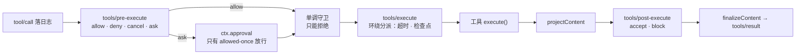

> 源码快照：deepseek-ai/deepseek-harness，tag `dsh-v0.2.0-rc.1`，commit `4878cdab`（2026-09-28）。文档行号以该快照为准，`文件:行号` 中的行号是物理行号（仓库规定"一段一物理行"，所以一行常是一整段）。
> 范围：根目录 `README / SAFETY / AGENTS / CONTRIBUTING`、`docs/` 顶层 20 余篇、`docs/subsystems/` 64 篇、`docs/cordis-*` 教程与 API、`docs/cookbook/`、`docs/user/`、`docs/postmortem/`、`docs/persistence-changes/`，以及 `packages/README`、`packages/AGENTS.md`。本文按主题而不是按文件组织，并用源码抽查了文档中的关键说法。

## 0. 结论先行

- **dsh 的文档是三个样本里最全的。** `docs/` 下约 572 个文件，中英双语同权配对，有总架构、子系统逐页说明、生成的事件 / 配置 / 工具 / 持久化目录、Cordis 教程、扩展 cookbook、事故复盘和持久化格式演进记录。Codex 没有全局架构文档，oh-my-pi 只有专题文档，dsh 两者都有。
- **文档是"地图"，不是"实现说明"。** 仓库的文档标准要求"一事一处"、只写当前状态、不写实现进度（`docs/AGENTS.md:15-47,66`），`architecture.md` 限制在 2400 词以内（`docs/AGENTS.md:58`）。所以 agent loop 的内部控制流、压缩算法、沙箱后端、hooks 桥接都只给出契约，细节要读源码，见 [DeepSeek Harness 架构设计](/personal-blog/articles/dsh-architecture/)。
- **类型块与源码机械等价，语义说明会漂移。** 子系统页的类型块由 `verify-type-equiv` 校验与源码字面一致（`docs/subsystems/README.zh.md:71`），但源码注释本身写错时文档会一起带偏；本次抽查发现的不一致集中在计数、默认值和事件列表上，汇总在第 12 节。
- **有两处默认行为文档写了，但位置分散，容易漏看**：默认组合的实际权限是 `workspace-write + ask`（不是插件 schema 的 `read-only`）；默认会把会话日志连续后缀随请求上传到 DeepSeek 端点（第 9 节）。

## 1. 文档构成与推荐阅读顺序

| 类别 | 位置 | 性质 |
|---|---|---|
| 仓库规则 | 根 `AGENTS.md`（182 行）、`packages/AGENTS.md`、`docs/AGENTS.md` | 事实上的"宪法"：布局、编码与架构约定、包规则、文档标准 |
| 总架构 | `docs/architecture.zh.md`、`agent-lifecycle.zh.md`、`tool-execution-pipeline.zh.md`、`cordis-primer.zh.md`、`glossary.zh.md` | 系统怎么拼起来、一次 turn 怎么走、工具管线顺序、术语 |
| 能力清单 | `docs/capability-seams.zh.md`（675 行）、`event-producer-consumer.zh.md` | 每个 `ctx.*` 服务的定义 / 提供 / 消费方；每个事件的分发模式与监听方 |
| 生成目录 | `persistence-catalog`（8751 行）、`config-catalog`（4503 行）、`tool-catalog`、`module-graph` | 查表用：持久事件与类型指纹、插件 `Config` 默认值、工具 schema、包依赖图 |
| 子系统页 | `docs/subsystems/*.zh.md`（64 篇） | 每个子系统的类型、服务方法、事件，末尾是生成的 Cordis API 小节 |
| 框架 | `docs/cordis-tutorial/`、`docs/cordis-api/` | Cordis 心智模型与 API |
| 扩展手册 | `docs/cookbook/` | 加工具、LLM 适配器、包、Remote API、设置卡片、会话格式版本 |
| 用户文档 | `docs/user/`（18 篇） | 7 篇 Web UI 指南 + 10 篇插件开发；CLI 细节在 `apps/cli/README*` |
| 事故复盘 | `docs/postmortem/`（4 篇） | 每篇对应一条现行约束 |
| 持久化演进 | `docs/persistence-changes/`、`session-format-status.zh.md` | 格式版本 V0–V4、兼容规则、逐根 digest 确认链 |
| 其他 | `api-gateway`、`deepseek-llm-api-wire-extensions`、`defensive-patterns`、`testing`、`development`、`rescope` | 网关、DeepSeek 专有请求字段、防御规则、测试分层、构建 |

### 推荐阅读顺序（以理解 agent loop 为目标）

1. `docs/architecture.zh.md`：一页纸讲清插件树、组合层、核心包、三个事件域和一次 turn 的十个步骤。
2. `docs/cordis-primer.zh.md` + `docs/glossary.zh.md`：五个 Cordis 概念、分发模式、作用域与 turn / step / Round 的定义。
3. `docs/agent-lifecycle.zh.md` + `docs/tool-execution-pipeline.zh.md`：两张时序 / 流程图，loop 的外部契约基本都在这里。
4. `docs/subsystems/core.zh.md`、`session.zh.md`、`tools.zh.md`、`approval.zh.md`、`sandbox.zh.md`：Agent 句柄、收件箱、日志与 surface、工具注册表、审批与沙箱的精确契约。
5. `docs/deepseek-llm-api-wire-extensions.zh.md` + `SAFETY.zh.md`：数据外发与安全边界。
6. `docs/capability-seams.zh.md` 末尾的服务表（580–673 行）和 `event-producer-consumer.zh.md`：需要查"谁提供、谁监听"时用。
7. `docs/cookbook/extension-cookbook.zh.md`：把"想扩展什么"映射到服务与事件。

**注意**：`capability-seams`、`event-producer-consumer` 的生成区和个别行在中文版里仍是英文；`module-graph` 是 1697 行的纯 Mermaid，只适合用工具解析。

---

## 2. 核心心智模型：一切皆插件

### 2.1 无特权内核

- 模型适配器、工具注册表、会话日志、agent loop 本身都是插件，都能从配置替换；扩展方式是"把插件挂到其他插件旁边"，注册都是副作用，插件卸载即撤销（`docs/architecture.zh.md:11-13`）。
- 核心包与服务键（`docs/architecture.zh.md:61-70`）：`core/session` → `ctx.sessions`（只追加日志）、`core/system-prompt` → `ctx.systemPrompt`、`core/tools` → `ctx.tools`、`core/agent` → `ctx.agents`（Agent 接口、注册表、`agent/*` 事件）、`core/agent-loop` → `ctx.agentLoop`（默认驱动器）、`core/scope`（作用域原语，库而非服务）、`llm/llm` → `ctx.llm`。
- **接口与驱动分离**：`agent-loop` 是公开 `Agent` 契约的唯一具体实现，扩展插件只依赖 `agent` 包的事件和服务，从不直接依赖 `agent-loop`，所以循环本身可以被换掉（`docs/subsystems/core.zh.md:20`；`docs/capability-seams.zh.md:644`）。
- **capability seam** = 服务定义 / 服务提供 / 消费三种角色；只有一个角色不算 seam，只在角色需要独立演进时才拆包（`AGENTS.md:138`；`docs/glossary.zh.md:9`）。服务定义是 Cordis `Service`，"绝不是 TypeScript `interface`"。

### 2.2 Cordis 的五个概念

`docs/cordis-primer.zh.md:9-13` 给出的五点，是读懂 dsh 其余文档的前提：

1. 插件是函数（可带 `inject` 与 `apply(ctx)`）或 `Service` 子类；
2. 上下文是服务容器，服务占据稳定的 `ctx.<key>`，按 key 查找而不是 import 实现；
3. `inject` 声明依赖，依赖就绪才启动，加载顺序由依赖表达；
4. 类型化事件通过声明合并注册，按 `emit / waterfall / parallel / serial / bail` 分发；
5. 注册是可逆副作用，经 `ctx.effect()` / `ctx.on()` 安装，重载与拆除时撤销。

分发模式是事件公开契约的一部分：只有 `parallel`、`serial` 会 await，`waterfall`、`serial`、`bail` 有返回值（`docs/cordis-primer.zh.md:21-27`）。**waterfall 就是环绕中间件**：监听器收到 `(...args, next)`，不调 `next()` 即短路；仓库规则要求非决策性监听器必须调 `next()`（`docs/cordis-primer.zh.md:35,39`；`AGENTS.md:135`）。每个事件用 `@mode` JSDoc 标注，生成目录与派发点交叉校验。

### 2.3 三个事件域

选事件域是"大多数改动的第一个决定"（`docs/architecture.zh.md:76-80`）：

| 域 | 例子 | 用途 |
|---|---|---|
| 会话事件 | `turn/*`、`step/*`、`user/message`、`assistant/message`、`tool/*` | 持久事实，写进日志 |
| Agent 事件 | `agent/pre-step`、`agent/request`、`agent/request-error`、`agent/turn-stopping`、`agent/assistant-stream` | 观察或拦截进行中的工作，不持久 |
| 能力事件 | `tools/*`、`fs/*`、`llm/stream`、`telemetry/*` | 给 seam 挂策略和适配器 |

SDK 用户要可回放的 transcript 应消费 `session/event`；`agent/*` 只是实时协调接口（`docs/agent-lifecycle.zh.md:91`）。

### 2.4 作用域

贡献要么是全局的，要么属于恰好一个作用域（`docs/glossary.zh.md:13-21`）。只有两层、扁平结构；**作用域注册不向下继承给子 agent**；`agent.ctx` 上的注册同时决定可见性和生命周期；同名作用域贡献遮蔽全局贡献；`tools.restrict` 过滤掉的工具"与不存在的工具无法区分"——不出现在提示词里，执行时也返回未知工具。

---

## 3. 组合：Profile → Bundle → Patch

- 运行中的 `dsh` 是一棵插件树，由启动时按序叠加的层组成（`docs/architecture.zh.md:17`）。
- **profile**：Harness home（默认 `~/.dsh`）中的具名组装，列出叠放的组合包，存放树外插件，保存用户层 `cordis.patch.yml`。随发行版交付 `web`、`headless`、`sdk`、`sdk-minimal`、`acp` 五个模板（`docs/architecture.zh.md:19`）。
- **bundle（组合包）**：带 `dsh.bundle.patch` 的 npm 包，插入的内容始终可被上层 patch（`docs/architecture.zh.md:21-23`）。`dsh-base` 是 web / headless / sdk / acp 共享的第一层（模型适配器、工具、持久化、沙箱与审批策略、设置、凭据、遥测），各应用再加一层；`dsh-sdk-minimal` 例外，自带完整配置树（`docs/architecture.zh.md:25`）。
- **叠加顺序**：空条目列表 → profile 列出的各组合包（按序）→ profile 的 `cordis.patch.yml` → home 级 `cordis.patch.yml` → `--patch` overlay。一条 patch 按 id 定位条目并**替换整个 config**，或插入新条目（`docs/architecture.zh.md:27`）。源码里在最后还会叠一层遥测关闭补丁（设置 `DSH_TELEMETRY_DISABLED` 时），文档没写。
- `dsh --profile web --dump-config` 打印实际配置树（`docs/architecture.zh.md:35-39`）。受支持的 Node 应用只能通过具名 profile 启动，`verify-application-entrypoints` 拒绝任何绕过 `dsh` 的入口（`docs/architecture.zh.md:45-47`）。
- **热重载**：YAML 决定是否启用；base 启用"只监视配置"的 HMR，headless / SDK / ACP 禁用（`docs/architecture.zh.md:29`）。修改组合包成员后必须重启，普通 patch 编辑可以热重载（`apps/cli/reference/README.zh.md:95`）。每个注册表都有 HMR 安全测试（`docs/testing.zh.md:9`）。
- **agent preset**：让某个会话拥有不同的能力集合；`ctx.agentPresets` 立即挂载 YAML 声明的预设，并保留被替换的版本直到最后一个使用者释放（`docs/architecture.zh.md:151`；`docs/capability-seams.zh.md:637`）。
- **配置原则**：部署相关的可调项必须是校验过的 `Config` 字段，`DEFAULT_*` 常量不算可配置；默认值在 `resolve()` 步骤显式给出；配置错误尽早大声失败（`AGENTS.md:140-142`）。`!!js` 表达式只允许用于插件 `config` 和条目的 `disabled`，按环境选择插件要用 overlay（`docs/cordis-primer.zh.md:45`）。

---

## 4. Agent 生命周期与执行循环

### 4.1 定义

- **step（步骤）** = 一次模型请求 + 它引发的工具执行；**turn（轮次）** = 零个或多个步骤，在领取首条输入前打开，在不再欠任何工作时关闭（`docs/architecture.zh.md:90`；`docs/glossary.zh.md:37-38`）。
- **Round** 是承载一个轮次的外层策略迭代（Goal Round、Ralph 尝试），计数器归策略所有（`docs/glossary.zh.md:39`）。

### 4.2 一次 turn 的十个步骤

`docs/architecture.zh.md:92-111` 与 `docs/agent-lifecycle.zh.md:10-83`（Mermaid 时序图）合起来：

1. `turn/start` → 领取待处理的 next-step 输入与一条排队消息；
2. 组装提示词片段与工具 schema（`system-prompt/assemble`），投影运行时上下文；
3. `agent/pre-step` waterfall：`reject`，或 `enter(messages, startsRequestSeries?)`；首批被拒或改写为空 → 关闭**不含步骤**的轮次；
4. `step/start` → `agent/request` waterfall → `prepareCall()` 解析实际路由；这两处取消时，系统提示词和用户消息都不提交（`docs/architecture.zh.md:117`）；
5. 同步准入：协调 `system/message`、追加 `user/message`、按需记录 `request/header` / `request/context`；
6. 从日志派生并冻结模型历史 → `llm/stream` waterfall 流式请求 → `agent/assistant-stream` 实时帧；
7. 成功写 `assistant/message`，失败写 `assistant/attempt`；
8. `tool/call*` → `tools/pre-execute` → `tools/execute` → `tools/post-execute` → `tool/result*`；
9. `step/end`；工具还欠一次请求，或有新的 next-step 输入 → 领取 → 下一个步骤；
10. 自然停止且 next-step 收件箱为空 → `agent/turn-stopping`（serial）→ `turn/end`。

### 4.3 Agent 句柄与收件箱

- 句柄方法（`docs/subsystems/core.zh.md:59-145`）：`send(message, target, wakeup)` 统一投递；`followup`（next-turn + 唤醒，独占一个轮次）、`steer`（最近的步骤边界；空闲时启动轮次）、`inject`（下次 pre-step 注入上下文，不唤醒）是固定别名。`cancel(cause, {keepInbox})` 默认清空排队与插话，"第一个原因胜出"。`whenIdle()` 表示整个 agent 静止，不代表某条消息已结算。`runMaintenance(task)` 在真正空闲时运行轮次之外的维护任务（手动压缩就走这里）。
- **收件箱是两条持久待处理列表**：`next-turn` 与 `next-step`，操作记为持久事件 `agent/inbox/spliced`；AgentLoop 的 `inbox` 投影让没有活跃 Agent 时也能读待处理输入（`docs/subsystems/core.zh.md:217-279`；`docs/architecture.zh.md:115`）。被拒步骤中已认领的消息"就此结束"，不会再作为 `user/message` 发出（`docs/subsystems/core.zh.md:866-881`）。
- `AgentStatus` 只有 `idle | running`；dispose 不是第三种状态（`docs/subsystems/core.zh.md:149-157`）。防御规则明确：不能把 `agent/status` 或 `whenIdle()` 当作某次 `followup()` 的结果（`docs/defensive-patterns.zh.md:17`）。

### 4.4 四个扩展点

| 扩展点 | 模式 | 时机与语义 | 默认监听方 |
|---|---|---|---|
| `agent/pre-step` | waterfall | 请求推导前唯一的链；可改写已认领批次或拒绝 | 16 个：压缩、计划模式、hooks、时间上下文、skill、重复调用提醒、goal round 等 |
| `agent/request` | waterfall | 组装与 `step/start` 之后、提交用户批次之前；只能换调用配置，不能改消息 | agent、webhook |
| `agent/request-error` | waterfall | 失败尝试已记录、轮次关闭前；返回 `{kind:'retry'}` 即接管恢复 | llm-retry、compaction-basic、compaction-image-offload |
| `agent/turn-stopping` | serial | 本可结束且 next-step 为空时；反对者用 `agent.steer()` 让机器再跑一步 | hooks-claude-code、hooks-codex、workspace-changes |

出处：`docs/subsystems/core.zh.md:322-344,957-1062`；`docs/event-producer-consumer.zh.md:22-26`。"turn 即将结束"的结果**由数据决定，监听器顺序不影响结果**；反方向（提前结束工具循环）靠工具结果带 `concludesTurn`。

### 4.5 停止、重试、中断

- **结束原因** `TurnEndReasonMap`：`completed / aborted / blocked / error / max-tokens / interrupted / forked`；任一步骤以 `max-tokens` 结束，整轮就记 `max-tokens`；`interrupted` 只由崩溃恢复合成，`forked` 只由 fork 种子合成（`docs/subsystems/session.zh.md:700-733`）。取消原因 `user | parent | hook | disposed`。
- **没有步数上限**：文档没有提到，源码里也没有（见 [DeepSeek Harness 架构设计](/personal-blog/articles/dsh-architecture/) 5.5 节）。
- **重试**在仍打开的步骤内进行，重新准备请求，不重复 pre-step 和用户消息（`docs/agent-lifecycle.zh.md:48-53`）。适配器"一次调用 = 一次提供方尝试"，禁用库自带重试；默认 normal 策略重试 5 次，另有无上限的 `always`；策略由提供方拥有，写在 llm-retry 下会直接报错（`docs/subsystems/llm-streaming.zh.md:303-312`；`docs/config-catalog.zh.md:1957-1965`）。流空闲 5 分钟映射为 `TIMEOUT`（`:304`）。
- **流中途取消**：已交付的文本 / 推理前缀定稿为 `assistant/message { interrupted: true }`，未分派的工具调用不出现（`docs/subsystems/session.zh.md:81-86`）。
- **崩溃恢复**：持久化层不截断、不修复中断轮次，只丢弃撕裂的物理尾部；resume 时由 agent-loop 计算补齐项（缺失的工具错误结果、未闭合的 `step/end`、合成的 `turn/end{interrupted}`），作为普通批次追加后再发布会话（`docs/subsystems/persistence.zh.md:110-114`）。

---

## 5. 工具执行管线

### 5.1 顺序

`docs/tool-execution-pipeline.zh.md:9` 与 `docs/subsystems/tools.zh.md:180-182,396-432`：

- **`tool/call` 在执行前记录**，UI 用 `presentCall(args)` 渲染待定卡片（`docs/tool-execution-pipeline.zh.md:13-14`）。
- **参数不可改写**：历史、审计、UI 和执行必须看到同一份参数（`docs/subsystems/tools.zh.md:428`）。未知工具返回 `UNKNOWN_TOOL`，调用失败但不终止轮次。
- **单调守卫**只能拒绝或弃权，没有 allow 结果；所有者策略不想被别人重排时注册为守卫（`docs/tool-execution-pipeline.zh.md:16,65`）。
- `tools/execute` 是唯一能替换 `exec.signal` 的视图，注册表会把替换后的信号与调用方信号融合（`docs/subsystems/tools.zh.md:180-182`）。
- post-execute 可 accept（可替换内容）/ block；spill 策略在这里把过大输出落盘（`docs/capability-seams.zh.md:665`）。流水线或结果快照抛异常 → 变成 `isError` 结果。
- 工具附带的 `additionalContexts` 在批次内先进先出，排在已记录的工具结果之后作为 `user/message` 注入（`docs/tool-execution-pipeline.zh.md:28`）。
- 只持久化 `content`、`error`、`meta`；执行期的规范值 `value` 不落盘，回放能重现展示但不能重建中间值（`docs/subsystems/tools.zh.md:392`）。

### 5.2 并行

时序图写明："按 executionMode 分类待执行调用；独占屏障 + 有界滚动池；启动前重新分类；pre 有序、execute 并发、post 与 `tool/result` 按模型顺序提交"（`docs/agent-lifecycle.zh.md:57-68`）。只有 `isConcurrencySafe(args)` 返回 `true` 才并行（`docs/subsystems/tools.zh.md:11-103`）。每步并发上限 `maxParallelToolCalls` 默认 10（调度器默认值），设为 1 即串行（`docs/config-catalog.zh.md:104-108,4010-4011`）。

### 5.3 PTC 模式

`ctx.tools` 的 `mode` 取 `native`（默认）/ `ptc` / `both`。`ptc` 下模型写 `run_code` 程序，在程序里经 `tools` 命名空间调用原生工具；子调用带父级 token、完整走一遍管线、记 `tool/ptc-dispatch`，拒绝视为有约束力的驳回，子调用并发上限默认 10（`docs/tool-execution-pipeline.zh.md:65`；`docs/config-catalog.zh.md:3997-4016`）。`ptc` 模式下模型直接调用原生工具名返回 `UNKNOWN_TOOL`（`docs/subsystems/tools.zh.md:209-218`）。

---

## 6. 安全与权限

### 6.1 两个独立旋钮 + 预设

- **沙箱模式** `read-only | workspace-write | danger-full-access`，**只管文件效果**，网络与进程可见性不在范围内；`danger-full-access` 直接 spawn 原命令（`docs/subsystems/sandbox.zh.md:11-28`）。
- **审批策略** `ask | never`；`never` 自动拒绝每个询问，面向 CI 和无人值守，在服务内部分发前强制，后插入的应答者也绕不过（`docs/subsystems/approval.zh.md:33-47,85`）。
- **权限预设**把两者捆成具名组合：`workspace-write`（+ ask）与 `danger-full-access`（+ never），`custom`、`auto` 为保留名（`docs/subsystems/permission-presets.zh.md:5-11`）。base 组合另外配置了 `read-only`（+ ask）。预设不拥有执行策略；当前值不匹配任何预设时派生为 `custom`。
- **实际交付默认是 `workspace-write + ask`**：插件 schema 默认 `read-only`，但 base 组合改写为 `DSH_PERMISSION_MODE ?? 'workspace-write'`（`packages/bundle/base/cordis.patch.yml:232`）。这点在 `apps/cli/reference/README.zh.md:123` 有说明，`docs/` 下没有。

### 6.2 审批

- `ApprovalOutcome = allowed-once | rejected | cancelled | unavailable`，闭合且 **fail-closed**：没有应答者、应答者抛异常或不合规都产生 `unavailable`（`docs/subsystems/approval.zh.md:21-29`）。**没有"本会话总是允许"**。
- 审批请求**刻意不带工具参数**，只有工具名、调用 id 和理由（`docs/subsystems/approval.zh.md:53-82`）。每次询问与决定记为仅日志的 `approval/asked` / `approval/decided` 审计事件，不进入模型历史。
- 模型可以带 `sandbox_permissions` + `justification` 请求一次性更宽松的重试，必须经 `ctx.approval` 批准（`docs/subsystems/shell.zh.md:144-169`）。

### 6.3 沙箱

- 后端：Linux bwrap / Landlock、macOS Seatbelt、Windows ACL 受限令牌；SSH 远端另有提供方（`docs/subsystems/sandbox.zh.md:5`）。`SandboxEnforcement` 区分 `full` 与 `partial`（旧 Landlock ABI、Windows ACL 都是部分强制）。
- 策略**逐调用**携带，不固定在提供方上；工作区根取自会话不可变的 cwd（`docs/subsystems/sandbox.zh.md:42-93`）。
- 受限模式没有可用后端时报 `SANDBOX_UNAVAILABLE`，"静默的无隔离透传永远不合法"（`docs/subsystems/sandbox.zh.md:156`；`docs/subsystems/shell.zh.md:169`）。被拦截的文件操作以 `[sandbox: file access denied under <mode> mode]` 标记返回，bash 工具描述直接告诉模型"请勿换一种方式重试"（`docs/tool-catalog.zh.md:605`）。
- 包级规则："决策必须在执行该操作的地方强制执行；schema 省略、提示词过滤、facade、监听器顺序都不算强制执行"（`packages/AGENTS.md:14`）。

### 6.4 其他防护与声明

- 子进程环境清洗匹配 `KEY / SECRET / TOKEN / PASSWORD` 的变量；临时与 spill 文件放 0700 私有目录、随机名、`0o600` 独占创建（`docs/defensive-patterns.zh.md:31`）。源码还清洗全部 `DSH_*` 变量，文档没写。
- `SAFETY.zh.md`：实验性开发者预览，未经安全审计；**沙箱、审批与权限控制只能降低风险，不保证隔离**，即使正确执行也保护不了已获准访问的资源（`SAFETY.zh.md:7,13`）。
- 计划模式与沙箱 / 审批正交，只是软性提示段落，不是安全机制（`docs/cookbook/extension-cookbook.zh.md:126`；`docs/subsystems/plan.zh.md`）。

---

## 7. 会话日志与上下文

### 7.1 日志是唯一真源

- `Session` 是类型化 `SessionEvent` 的只追加日志；LLM 历史从日志派生、不单独存储，回放就是重新派生（`docs/subsystems/session.zh.md:5`）。
- **模型可见 ⟺ 已记录**：进入模型请求的任何内容都必须能从日志重建；新增模型可见输入就需要新的会话事件（`AGENTS.md:136`；`docs/architecture.zh.md:131`）。运行时有一个不变量插件比对请求与 `deriveMessages()`，不一致报 "log-reconstruction desync"。
- **信封**：`seq`（连续，`= log.length`）、`time`、`data`、`ignorable?`。不认识且没标 `ignorable: true` 的事件，读者**必须拒绝整份日志**（`docs/subsystems/session.zh.md:252-290`；`AGENTS.md:133`）。
- 插件也可以合并扩展**仅日志**事件（`compaction/*`、`hook/*`、`approval/*`、`plan/mode`、`goal/change` 等），它们不进入模型历史；位于两个轮次之间也合法（`docs/subsystems/session.zh.md:11,737-739`）。

### 7.2 Surface：模型可见的那一层

- `SurfaceEventType` = `system/message | developer/message | user/message | assistant/message | tool/result` 五种（`docs/subsystems/session.zh.md:311-317`）。
- `SurfaceOp = 'append' | {op:'replace', startSeq, endSeq}`：replace 遮蔽一个闭区间，压缩摘要就是一条带 replace 的 `user/message`（`docs/subsystems/session.zh.md:320-340`；`docs/subsystems/compaction.zh.md:11-17`）。
- **系统提示词不在请求头里**，而是 surface 第 0 号节点 `system/message`：首步写入；变化时原地替换，或在 `systemPromptUpdate: 'in-history'` 路由下追加到历史后面，保护已缓存前缀（`docs/subsystems/system-prompt.zh.md:44`；`docs/subsystems/session.zh.md:181-204`）。
- 动态上下文（审批策略、沙箱模式、时间等）物化为**持久 user-role 快照**，只在完整快照变化或被压缩移除时才追加（`docs/subsystems/system-prompt.zh.md:74-88`）。

### 7.3 压缩

压缩是可选能力，不属于 loop 主干（`docs/subsystems/compaction.zh.md:5`）。压力压缩挂在 `agent/pre-step`，在请求推导前运行，先调可选的工具结果剪枝，再重新测量 token；上下文溢出恢复挂在 `agent/request-error`，只有 surface 真的被替换了才返回 retry（`:100`）。`compaction/start` 当"锁"用，崩溃时表现为有 start 无 end。图片过大有专门的 image offload 路径（`docs/subsystems/llm-streaming.zh.md:247-252`）。**摘要提示词、触发阈值、保留尾部策略文档都没写**。

### 7.4 大输出落盘

`dsh-spill-policy` 在 post-execute 把超过 `maxInlineTokens` 的结果替换为首尾内容 + spill 地址；保存失败则保留原内联结果，不把成功调用变成错误（`docs/subsystems/spill.zh.md:92`）。

---

## 8. 持久化与格式演进

### 8.1 物理层

- `ctx.sessionPersistence` 只暴露 `create / open / stat / list`，返回单会话句柄 `SessionHandle`（`read / append / flush / close`），承担单写者所有权（`docs/subsystems/persistence.zh.md:7-11`）。
- `append` 是 best-effort，**`flush` 是唯一持久性屏障**；`session/event` 进入有界的 write-behind 窗口，loop 不在轮次边界 await flush，逐请求检查点由 `dsh-session-checkpoint-policy` 负责（`docs/subsystems/persistence.zh.md:104-106`；`docs/subsystems/session.zh.md:36-41`）。
- JSONL 后端：逐会话逻辑 JSONL，默认是带校验和的连续 Zstandard frame，逐批 `fsync`，首次新写入前截断撕裂尾部（`docs/subsystems/persistence.zh.md:326-328`）。默认位置 `~/.dsh/sessions`。

### 8.2 格式版本 V0 → V4

| 版本 | 时间（2026） | 关键变化 |
|---|---|---|
| V0 | 08-10 起 | 宽松期：事件键改名（`compact/*` → `compaction/*`）、字段增删都没升版本 |
| V1 | 约 09-02 | 只存在于一个 PR 的中间树，**没有任何 tag 写 V1** |
| V2 | 09-04 | 删除 `assistant/chunk`，新增 `assistant/attempt`，`assistant/message` 内嵌 stream |
| V3 | 09-08 | 新增 `system/message`，系统提示词移出请求头；`tool/code-dispatch` 改名 `tool/ptc-dispatch` |
| V4 | 09-16 | 工具结果成为一等 `tool` 角色消息；新增 `developer/message`；`turn/end` 新增 `forked` |

出处：`docs/persistence-changes/releases/`、`historical-formats/`、`2026-09-16-session-format-v4.zh.md:90-104`。

几条规则值得记住：

- **已发布代际不可变**：已提交的 generation 路径绝不重命名、替换或删除；升级走相邻迁移链（N → N+1 各一个包），写入打开时在源文件旁发布新代际，源文件字节不变（`AGENTS.md:7`；`docs/cookbook/adding-a-session-format-version.zh.md:40-78`）。
- **alpha / RC 也确立兼容义务**，prerelease 标记不会让用户数据变得可丢弃（`docs/session-format-status.zh.md:24`）。
- 兼容规则表：可选新增、必选改可选、新增事件、更高的 `data.version` 属于 same-version；改 header 或信封必须升版本（`docs/persistence-changes/README.zh.md:50-59`）。
- 从 2026-09-11 起每个结构变更都要双语确认记录 + 逐根 digest 链，已接受记录只能追加后继（`docs/persistence-changes/README.zh.md:10,40`）。

---

## 9. LLM 接入与 DeepSeek 专有扩展

- `ctx.llm` 是适配器注册表，实现有 `llm-deepseek`、`llm-pi-ai`（第三方提供方）、`llm-replay`（测试）（`docs/capability-seams.zh.md:593`）。`LlmRuntime.stream()` 只通过终止型 finish 分片暴露失败，不抛异常（`docs/defensive-patterns.zh.md:13`）。
- 凭据：配置只存引用，值由提供方持有，每次请求解析，轮换后下一次请求即生效（`docs/subsystems/credentials.zh.md:5`）。
- **DeepSeek 专有扩展只存在于官方 DeepSeek 路由**，放在 `messages` / 系统提示词 / 工具 schema 之外，不增加模型 token，也不改变模型可见前缀；会发往已解析的 `baseURL`，包括中间网关（`docs/deepseek-llm-api-wire-extensions.zh.md:5-7`）。
  - HTTP 头：`x-deepseek-harness-user-id`（Harness home 的稳定匿名 UUID）、`-session-id`、`-compact`（`:24-29`）。
  - `dsh_plugin_packages`（**默认启用**）：每次请求带上存活插件包的 `(name, version)` 清单（`:43-72`）。
  - `dsh_session_log`（**默认启用**）：上传权威会话日志的连续后缀，每次不超过 8 MiB，2xx 后追加水位事件推进，**至少一次**交付——可能重复，不会缺口（`:76,113,139-156`）。
  - 暴露范围原文列得很清楚：工作目录、系统提示词、用户与 assistant 内容、失败尝试、工具参数与结果、压缩摘要、反馈等；API key 不在其中（`:160`）。
- 关闭方式散在别处：会话日志上传可以在设置里关（`apps/cli/reference/README.zh.md:129-131`）；遥测默认 `FEEDBACK_ONLY`，`DSH_TELEMETRY_MODE=DISABLED` 关闭（`docs/user/guide/network-proxy.zh.md:70`）。遥测导出地址和匿名 user id 只在 base 组合配置里能看到。

---

## 10. 编排与扩展

### 10.1 编排能力

| 能力 | 要点 | 出处 |
|---|---|---|
| subagent | 多个提供方按名称共存：进程内 spawn / fork、ACP、Codex、Claude Code、dsh-sdk；`toolFilter` 是"可见性而非权限"；可继续子 agent 用 `send_message` 通信，只允许直接父子之间 | `docs/subsystems/subagent.zh.md:5-150` |
| Agent Teams | 实验性；持久 mailbox + 任务 DAG，`writeScopes` 只是提示，**不是锁** | `docs/subsystems/agent-team.zh.md:26-74` |
| workflow | 模型编写、启动 subagent 的编排脚本，跑在 PTC 进程里；没有整体截止时间 | `docs/subsystems/workflow.zh.md:5-112` |
| goal / loop / schedule | 监听 `turn/end` 后 `followup()`；定时器触发时空闲则 followup、忙碌则 inject；schedule 投递可能重复 | `docs/cookbook/extension-cookbook.zh.md:111-112,131`；`docs/subsystems/schedule.zh.md:438` |
| plan 模式 | 软性提示段落；`exit_plan_mode` 始终注册，进出只改提示不改工具目录 | `docs/subsystems/plan.zh.md:5-35` |
| jobs | 后台任务，owner 的 agent dispose 时取消并等待 | `docs/subsystems/jobs.zh.md:24-68` |

### 10.2 扩展点速查

cookbook 与用户文档合起来列出约 42 个扩展点，按"想做什么"归纳：

| 想做什么 | 用什么 |
|---|---|
| 加工具 | `ctx.tools.register(defineTool({...}))`；原始 JSON Schema 工具（MCP）直接注册 `ToolDefinition` |
| 权限 / 审批策略 | `tools/pre-execute` 返回 `ask`；不可撤销的拒绝用 `ctx.tools.guard()` |
| 超时、重试、指标 | `tools/execute` 环绕 |
| 结果改写 / 审计 | `tools/post-execute` / `tools/result` |
| 过滤工具、渐进披露 | `ctx.tools.restrict()` |
| 新 LLM 提供方 | `ctx.llm.registerAdapter(routes, adapter)` |
| 改调用配置 | `agent/request` |
| 提示词片段、AGENTS.md、记忆、skill | `ctx.systemPrompt.section()`；按需内容 `agent.inject()` |
| hooks | `agent/pre-step`、`agent/request`、`tools/pre|post-execute`、`agent/turn-stopping`；桥接包 `hooks-claude-code`、`hooks-codex` |
| UI / 外部协议驱动 | 实时听 `agent/assistant-stream`，持久听 `session/event`；输入 `followup()` / `steer()` |
| Host ↔ Client API | `@Remote` 方法 + 生成的 codec |
| 可替换能力 | Service 定义包 + 提供方包 + 消费方包，在 `cordis.yml` 换提供方行 |
| 会话格式新版本 | 相邻迁移包 + 提升 `SESSION_FORMAT_VERSION` |

出处：`docs/cookbook/extension-cookbook.zh.md:9-136`、`adding-a-tool.zh.md`、`adding-an-llm-adapter.zh.md`、`adding-a-remote-api.zh.md`、`adding-a-session-format-version.zh.md`。

### 10.3 API 网关

Host 服务方法用 `@Remote` 标记才对 Client 开放；流式方法走多路复用的 `/api/remote.mux` WebSocket；codec 由 Typert 在构建期严格生成，从源码启动时退化为较弱的描述符，Client 拒绝挂载缺少严格 codec 的描述符（`docs/api-gateway.zh.md:9-139`）。会话 lookup 会**自动恢复冷会话**（`:129`）。`dsh web` 拒绝 `--host 0.0.0.0`（`docs/subsystems/web-server.zh.md:31-47`）。

---

## 11. 工程纪律：测试、防御规则与事故复盘

- **测试分层**（`docs/testing.zh.md:9-55`）：单元测试 + 每个注册表的 HMR 安全测试；`packages/*/*/src` **按文件 100% 覆盖率**；真实 API e2e（"我们是 DeepSeek，不要吝惜真实 API 测试"）；性能基准；录制会话快照；浏览器快照。只 mock LLM 适配器、网络和时钟。产品可见插件必须有经真实 Loader 启动的组合测试。
- **防御规则**（`docs/defensive-patterns.zh.md`）：正交结果独立上报；异步状态不是同步状态；dispose 必须完全停稳；分发器隔离回调异常；环境变量与可预测路径不暴露给不可信输出。
- **四篇事故复盘**，每篇沉淀一条现行约束：

| 编号 | 事故 | 留下的约束 |
|---|---|---|
| 0001 | ACP 连接即崩溃：多写了 `export default`，Loader 丢掉 `inject`；当时 100% 覆盖率全绿 | 至少一个测试必须走真实 Loader / export 路径 |
| 0002 | `disabled: !!js ...` 恒为 truthy，fs 工具被永久禁用；快照刷新把 `UNKNOWN_TOOL` 当成预期 | 配置表达式的求值位置要可静态校验；快照刷新不是正确性审查 |
| 0003 | agent 改完 GUI 去验收了另一个端口上的替代服务器 | 运行时身份事实（URL、模式）必须对模型可见；验收要从外部观察 |
| 0004 | Landlock 部分强制通知 + 任意非零退出被判成沙箱故障 | 进程归因需要多项独立证据；结构化错误要端到端保留 |

---

## 12. 文档与源码不一致之处

下表合并了本次抽查发现的问题（源码均以 `4878cdab` 为准）：

| # | 文档说法 | 源码 / 其他文档 | 判断 |
|---|---|---|---|
| 1 | 发布记录 `latestReleasedVersion: 3`，证据 tag `dsh-v0.1.5-alpha.1`（`docs/session-format-status.zh.md:45-46`） | `SESSION_FORMAT_VERSION = 4`（`packages/core/session/src/types.ts:89`）；`dsh-v0.1.7-alpha.1` 起的 tag 已写 V4 | 过时。按同文档 `:24` 的规则，V4 早已是已发布格式 |
| 2 | 扩展点表说 `agent/turn-stopping` 会"停止轮次"（`docs/architecture.zh.md:159`） | 源码 JSDoc：反对者用 `agent.steer()` 让机器再跑一步 | 措辞相反。它是"可以让轮次继续的检查点"，时序图的写法更准确 |
| 3 | 持久事件列表没有 `developer/message`（`docs/architecture.zh.md:113`）；core 页写"十三种核心事件"（`docs/subsystems/core.zh.md:358`） | 核心 `SessionEventMap` 有 14 个成员，含 `developer/message`（`types.ts:311`） | 遗漏 |
| 4 | surface 事件 JSDoc 只列 4 种（`docs/subsystems/session.zh.md:259-261`） | `SurfaceEventType` 实际 5 种（`types.ts:439-444`）；源码注释本身就漏了 | 类型等价检查只比字面，拦不住注释漂移 |
| 5 | 重试"会打开另一个带编号的轮次"（`docs/subsystems/llm-streaming.zh.md:303`） | `llm/retry` 带 `turn + step`，token 计量在同一 `(turn, step)` 上重开 | 表述有误：重试留在原步骤内 |
| 6 | 管线图把 sandbox 画在 `tools/pre-execute` 里（`docs/tool-execution-pipeline.zh.md:15`） | 没有任何沙箱包监听 `tools/pre-execute`；隔离发生在 shell 执行器内部，由 `ctx.sandbox` 改写 argv | 位置描述不准 |
| 7 | `tool-catalog` 的 bash / pwsh schema 不含 `sandbox_permissions` | 源码只在组合里有沙箱执行器时才公开这两个提权字段（`packages/shell/tool-bash/src/index.ts:225-240`） | 目录按无沙箱的默认组合生成，看不到提权重试入口 |
| 8 | 沙箱后端列为 bwrap、Landlock、Seatbelt（`packages/README.zh.md:47`） | 还有 `sandbox-windows-acl`；能力表又把它列为 `ctx.skills` 实现（`docs/capability-seams.zh.md:641`） | 不完整且易误读 |
| 9 | plan 页说"每个会话事件都位于轮次之内"，所以选择会待生效（`docs/subsystems/plan.zh.md:15`） | 没有开放轮次时 `set()` 立即追加并返回 `committed` | 同页前后矛盾，前提是已移除的旧模型 |
| 10 | GitHub 评审规则只接受 `deepseek-harness/deepseek-harness`（`docs/user/guide/github-review.zh.md:68`） | 示例 overlay 配置为 `deepseek-ai/deepseek-harness` | 照文档配置规则永不匹配 |
| 11 | patch 中插件路径必须是绝对路径（`docs/user/develop/basic/index.zh.md:53-56`） | 同系列 config 页用相对路径；发布页和 CLI 参考都说相对路径按 patch 文件目录解析 | 文档之间矛盾 |
| 12 | 复盘 0002 引用 `Entry._resolveConfig()` | 插值已移到 Loader 的 `internal/config` 监听器，该方法不存在 | 复盘引用陈旧（复盘本身描述当时状态，合理） |
| 13 | 子系统索引把 settings 描述为"分层解析、owner scope"（`docs/subsystems/README.zh.md:22`） | 页面正文是"投影 volatile Config 字段、经 configEditor 写 patch" | 索引与正文不符 |
| 14 | session 页多处引用 `snapshotEvents()`（`docs/subsystems/session.zh.md:622,761`） | 同页已标 `@deprecated`，"新调用被禁止" | 自相矛盾 |
| 15 | cookbook 包分组列表只列 11 个（`docs/cookbook/adding-a-package.zh.md:25`） | `packages/` 下有 50 多个分组 | 过时 |
| 16 | 子进程环境清洗只提 `KEY / SECRET / TOKEN / PASSWORD`（`docs/defensive-patterns.zh.md:31`） | 还清洗全部 `DSH_*` 变量 | 文档少写 |
| 17 | 子系统 README 声称覆盖全部子系统 | hooks 三个包没有子系统页；`llm/retry-started` 是持久核心事件，子系统文档里一次都没出现 | 覆盖缺口 |
| 18 | 沙箱策略插件默认 `read-only`（`docs/config-catalog.zh.md:2473`） | base 组合改为 `workspace-write`，另配 `read-only` 预设 | 两层默认值文档没说明（见 6.1 节） |

---

## 13. 文档没覆盖、必须读源码的部分

以下内容文档只给契约或一句话，本系列在 [DeepSeek Harness 架构设计](/personal-blog/articles/dsh-architecture/) 中按源码补齐：

1. **agent-loop 内部**：驱动器状态机、收件箱批次选择、`turn/step` 的实际推进、`interruptedTurnClosers` 算法、请求冻结与复用（`packages/core/agent-loop/src/*`）。
2. **继续与停止的完整判定**，以及"没有步数上限、没有预算"这一事实。
3. **重试的精确语义**：`llm/retry` 与 `llm/retry-started` 如何复用同一步骤。
4. **压缩策略**：阈值、保留尾部、摘要提示词、图片 offload 判定（`packages/compaction/*`）。
5. **沙箱后端实现**：bwrap / Landlock / Seatbelt / Windows ACL 的策略生成与探测（`packages/sandbox/*`）。
6. **hooks 桥接**：与 Claude Code / Codex 钩子协议的映射、阻断语义（`packages/hooks/*`）。
7. **系统提示词的实际内容**与片段顺序（`packages/core/system-prompt`、`packages/context/*`）。
8. **Loader 内部**：Entry diff、patch 整键覆盖、`isolate` realm（`vendor/loader/src/*`），文档只在 `vendor/README.md` 的变更清单里提到。
9. **各提供方实现**：`subprocess-local`、`jobs-local`、`storage-sqlite`、`session-query-sqlite` 的 FTS 索引等。

文档刻意不写实现状态和 TODO，"已知限制"主要在各包 README 的 `## Known Limitations and Deferred Work` 小节（`docs/AGENTS.md:66`；`packages/AGENTS.md:27-28`），要评估某个子系统成熟度时先看那里。
