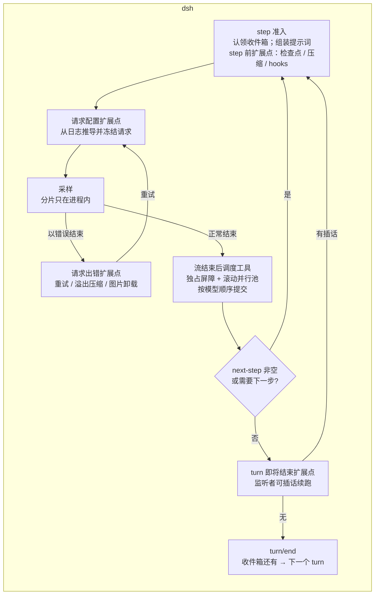

> 依据三篇架构文档的第一部分（语言无关的架构设计）：[DeepSeek Harness 架构设计](/personal-blog/articles/dsh-architecture/)，以及 [Codex 架构设计](/personal-blog/articles/codex-architecture/)、[oh-my-pi 架构设计](/personal-blog/articles/omp-architecture/)。快照：dsh `4878cdab`（0.2.0-rc.1），Codex `44fe510c`，oh-my-pi `df731d51`。
> 只比较设计语义，不比较各自的实现手段。

## 0. 核心结论

1. **loop 骨架仍然是同一个**：采样 → 收集工具调用 → 执行 → 有工具结果或有新输入就继续。dsh 没有推翻这个共识，它改变的是"骨架以外的东西放在哪里"。
2. **三者的差异可以用"策略放在哪"来概括**：
   - Codex 把策略写在 loop **内部**：turn 前、中途、turn 后三处压缩，采样层自带重试，编排器负责审批与升级重试。
   - oh-my-pi 把策略放在 loop **上层**：loop 无状态，会话层通过 turn 结束钩子做压缩，运行结束后做溢出恢复。
   - dsh 把策略放进**插件**：loop 只有四个扩展点，重试、压缩、续跑、拒绝全是插件；连 loop 本身也是一个可替换的插件。
3. **dsh 最独特的两点**：一是**日志是唯一真源**，连收件箱都是日志投影，每次请求都从日志推导并在发出前校验；二是**组合内核**，整个产品是一棵可热重载、每个注册都可撤销的插件树。
4. **dsh 在安全上走了第三条路**：像 Codex 一样有操作系统级沙箱且 fail-closed，但不做规则引擎、审批缓存和自动升级重试；默认"在沙箱里自由执行，越界时由模型申请提权"。
5. **dsh 与自家服务端协同设计**：系统提示词中途更新、对话中途增删工具这两个能力，需要 DeepSeek 端点配合；会话日志默认随请求同步给服务端。这是另外两个项目都没有的。

---

## 1. Loop 结构对照

| 维度 | Codex | oh-my-pi | dsh |
|---|---|---|---|
| 分层 | Op 分发 → 任务 → Turn 循环 → 采样 | 会话层 → Agent → Agent Loop | 入口 → 注册表 → AgentLoop 服务 → 驱动器 → turn → step → 尝试 |
| 状态归属 | 会话持有一切，loop 直接读写 | loop 无状态，配置每次调用前重读 | **只有日志持久**，驱动器只有瞬态；收件箱、重试计数都是投影 |
| 继续条件 | 模型需要继续 ∨ 有待并入输入 | 有工具续跑 ∨ 有待注入消息；退出前再查插话与续话 | 有工具调用且无"结束本 turn" ∨ next-step 非空 |
| 步数上限 | 架构文档未涉及 | 架构文档未涉及 | 源码确认不存在；预算也不在 loop 内 |
| 请求构造 | 每步冻结一份步上下文 | 每次调用前重读配置 | 每次尝试从日志推导，并由不变量插件校验"请求 == 推导结果" |
| 对外输出 | 协议事件 Thread / Turn / Item | 10 种事件组成的事件流 | 带作用域的 agent 事件 + 会话事件通知；流分片只在进程内 |
| 模型接入 | Responses 风格接口 | 统一流事件，几十家 provider | 自有流协议；默认 DeepSeek（Anthropic Messages 兼容），pi-ai 作为第二适配器 |

**结构性差异**：Codex 的压缩写在 loop 里，oh-my-pi 的压缩挂在 loop 的 turn 结束钩子上，dsh 的压缩挂在"step 前"和"请求出错"两个扩展点上。dsh 的 loop 完全不认识压缩，但压缩能在**每个 step 开始前**发生，所以同样覆盖了"turn 中途压缩"；它唯一没有的是"turn 结束后自动压缩"。

---

## 2. 关键问题的三种解法

### 2.1 工具并行与调度时机

| | Codex | oh-my-pi | dsh |
|---|---|---|---|
| 声明 | 工具声明能否并行 | 共享 / 独占，可按参数判断 | `isConcurrencySafe(args)`，接口支持按参数判断，但内置工具都返回常量 |
| 调度语义 | 读写锁 | 读写锁 | "独占屏障 + 有界滚动池"，与公平读写锁同构；每个调用启动前重新分类 |
| 什么在并行 | 整个工具流程 | 整个工具流程 | **只有工具体**；执行前钩子、审批、守卫按模型顺序串行 |
| 调度时机 | 条目一完成就派发（边流边执行） | 默认等消息结束；实验性推测执行只读调用 | **流结束、助手消息落日志之后** |
| 结果顺序 | 按派发顺序收割 | 按调用顺序 | 按模型顺序提交，屏障覆盖到执行后钩子完成 |
| 判断出错 | — | 按独占 | 按独占 |

dsh 放弃了边流边执行，换来最简单的日志顺序：先有完整助手消息，再有工具调用事件。它的审批和策略阶段严格串行，所以多个工具同时申请提权时，用户看到的顺序总是模型顺序。

### 2.2 插话

| | Codex | oh-my-pi | dsh |
|---|---|---|---|
| 入口 | 插话必须带期望的 turn ID | 插话 / 续话两个内存队列 | 一个 `send(目标队列, 是否唤醒)`，队列是日志投影 |
| 何时生效 | 下一次采样前；可选即时抢占流 | turn 边界；部分 provider 可流中注入 | **下一个 step 边界**，不打断流和工具 |
| 不丢消息 | 延迟并入 | 投递记账：未送达的放回队首 | 队列持久化、重启不丢；但**认领即消费**，turn 被取消时已认领的不归还 |
| 远程编辑 | — | — | 排队项可以远程编辑、删除、改为插话 |
| 取消后的新输入 | — | — | 唤醒闩锁：改投下一个 turn，驱动器空闲后重放 |

三者各有取舍：oh-my-pi 在"即时"和"零丢失"上投入最多；dsh 在"持久"和"可编辑"上投入最多，插话最保守。

### 2.3 中断与配对不变量

三者都把"每个工具调用恰好有一个结果"当作硬约束：

- Codex：取消时合成与正常输出同格式的"已中止"结果；流出错时先收割再返回。
- oh-my-pi：七条路径都合成结果，并打合成标记。
- dsh：调度器取消合成、step 失败补位、崩溃恢复、fork 种子**共用一套算法**，只是原因文案不同；并把"结果未知"和"未启动"区分开，告诉模型"结果未知时不要盲目重试"。另外截断和中断两种情况直接不让工具调用进入模型可见历史。

### 2.4 上下文与缓存

| | Codex | oh-my-pi | dsh |
|---|---|---|---|
| 原则 | 只追加、有界 | 冻结前缀 + 只追加 | 日志只追加；压缩用"替换"遮蔽原文，原文保留 |
| 系统提示词变化 | 不改写，环境变化以差异注入 | 静态在前、易变在尾 | **允许变**：第 0 号节点 + 历史中途追加新系统消息（需要服务端支持） |
| 工具集变化 | 延迟暴露 + 工具搜索 | 虚拟设备移出顶层；被撤工具原样重新声明 | 开发者消息表达增删（需要服务端支持），不改写工具数组 |
| 易变环境信息 | 世界状态 section 做 merge patch | 放在尾部 | 合并成一条"运行时上下文快照"用户消息，只在变化时追加 |
| 缓存断点 | 持久连接 + 缓存亲和键 | 依赖各 provider | **无显式断点**，完全依赖服务端自动前缀缓存，有端到端测试验证命中 |
| 缓存测试 | 上下文快照测试按前缀窗口分组 | — | "请求 == 日志推导"运行时不变量 + 缓存命中端到端测试 |

dsh 的思路与 Codex 相反：Codex 让客户端在任何服务端上都保持前缀稳定；dsh 让服务端提供"中途更新"语义，客户端因此可以自由变化提示词和工具。代价是这套保护只在声明了能力的模型上生效（默认目录里只有 `deepseek-flash`）。

### 2.5 压缩

| | Codex | oh-my-pi | dsh |
|---|---|---|---|
| 触发 | turn 前、中途、turn 后；换模型前 | 运行结束后；turn 中途经钩子；后台推测 | 每个 step 前（压力）；请求出错（溢出）；空闲时手动 |
| 方法 | 服务端压缩或本地摘要 | 方法链：远程 → 快照 → 交接文档 → 摇落 → 软摘要 | **先确定性裁剪大工具结果**，不够再 LLM 摘要；摘要必须比原文短 |
| 缓存 | 压缩请求与普通请求同形状 | — | 摘要调用复用对话前缀 |
| 原文 | 被替换 | 会话树上记一个压缩节点 | 被遮蔽，仍在日志里 |

### 2.6 重试

| | Codex | oh-my-pi | dsh |
|---|---|---|---|
| 位置 | 模型客户端内部 | 会话层 | 插件，挂在"请求出错"扩展点 |
| 次数 | 默认 5 次；连接失败可无限；降级 HTTPS | 指数退避加抖动，上限 8 秒 | 默认 5 次，500 ms 起、上限 10 s；另有"始终重试"模式 |
| 持久化 | 从历史重建请求 | — | 每次重试先写重试事件；计数是投影，重启可恢复 |
| 上下文溢出 | 交给压缩 | 交给压缩 | 同一扩展点上的压缩插件处理 |

### 2.7 安全

| | Codex | oh-my-pi | dsh |
|---|---|---|---|
| 隔离 | 操作系统级沙箱，表达不了就拒绝 | 无操作系统级沙箱 | 操作系统级沙箱（bwrap / Landlock / Seatbelt / Windows ACL），**只管文件写**，读取和网络不限；fail-closed |
| 规则 | 命令策略规则 | 工具等级 + 工具策略 + 用户策略 | **没有规则引擎** |
| 审批粒度 | 按策略；会话内审批缓存；"总是允许"写回规则 | 按工具等级；默认放行 | **只审批提权**，只有"允许一次"，无缓存 |
| 被拒后 | 编排器自动升级重试，复用审批 | — | 给模型提示，由模型决定是否申请提权重试 |
| 防试探 | 审查器熔断 | bash 危险模式强制提示 | 无熔断，只有重复调用提醒 |
| 自动审查 | Guardian | — | 实验性 auto 预设（LLM 按风险分级） |
| 参数改写 | hooks 可以改写 | 钩子在 `message_end` 前改写 | **禁止**改写，参数冻结 |

### 2.8 扩展

| | Codex | oh-my-pi | dsh |
|---|---|---|---|
| 扩展单位 | hooks、MCP、skills、plugins | 进程内扩展模块 | **一切都是插件行**，包括 loop 自身 |
| 撤销 | 重启 | — | 每个注册绑定清理动作，禁用即撤销 |
| 热重载 | — | — | 行级热重载；易变字段原地生效；预设按代次隔离 |
| 兼容外部生态 | — | — | 直接读取未修改的 Claude Code / Codex `hooks.json`，以及 `CLAUDE.md` |
| 外部 agent | — | — | codex、claude-code、任意 ACP agent 都可以作为子 agent 提供者 |

---

## 3. dsh 独有、值得借鉴的设计

1. **收件箱也是日志**：排队和插话持久化、可远程编辑、重启不丢。任何有"消息排队"的 agent 都可以借鉴这种做法，代价只是多一类日志事件。
2. **请求 == 日志推导，并在分发点校验**：把"可从日志完整重建请求"变成运行时断言，是比快照测试更早发现缓存破坏的手段。
3. **loop 只留扩展点**："step 前 / 请求配置 / 请求出错 / turn 即将结束"四个点覆盖了重试、压缩、hooks、目标驱动、检查点。自己写 loop 时，这四个点可以直接作为插件接口的起点。
4. **续跑只能通过插话表达**："turn 即将结束"的监听者不能直接说"继续"，只能往 next-step 放消息，于是续跑由数据决定、与监听者顺序无关。
5. **适配器异常统一成"以错误结束的流"**：loop 只有一条失败路径，重试决策完全外置。
6. **失败尝试也留痕但不进模型历史**：`assistant/attempt` 保存失败或中断的原始流，调试和回放都有依据。
7. **结果未知 vs 未启动**：崩溃或调度失败时明确告诉模型哪些调用"可能已经执行"，避免盲目重试造成重复副作用。
8. **先裁剪后摘要，摘要必须变短**：多数长会话的膨胀来自工具输出，确定性裁剪往往就够了。
9. **只在触及时发现嵌套的指令文件**：没有监视器，跟随 read / write / edit 的路径增量注入，且只追加。
10. **所有注册都可撤销 + 按代次隔离的预设**：热重载不影响进行中的会话，这是"运行中改写自己"的前提。
11. **所有协议驱动都是 agent 工厂的适配器**：SDK、ACP、Webhook、定时任务、子 agent 共用一个创建接口。

## 4. dsh 缺少、另外两者已有的

| 缺失 | 谁有 | 影响 |
|---|---|---|
| 规则引擎 / 命令策略 | Codex | 无法声明"这类命令总是允许 / 总是拒绝" |
| 审批缓存、"总是允许" | Codex | 重复提权反复打扰 |
| 被拒后自动升级重试 | Codex | 依赖模型遵守提示 |
| 拒绝熔断 | Codex | 被拒后可能反复试探 |
| 网络隔离 | Codex（网络代理） | 外发不受约束 |
| 边流边执行 | Codex；oh-my-pi（实验） | 多工具响应的总时长更长 |
| 投递记账 | oh-my-pi | 取消时已认领的插话会丢 |
| turn 后自动压缩、换模型前压缩 | Codex | 下一 turn 的第一个 step 前仍会检查，影响有限 |
| 流式规则、文本内工具调用方言 | oh-my-pi | 对不守规矩的模型兼容性较弱 |
| 秘密混淆 | oh-my-pi | 工具输出里的密钥会进入模型上下文 |

## 5. 更新后的"自己实现一个 agent loop"清单

在 Codex / oh-my-pi 对比文档那份清单的基础上，dsh 补充了三条：

1. **先定不变量**：每个工具调用恰好有一个结果；所有中断路径合成结果，并区分"结果未知"和"未启动"。
2. **继续条件写成一句**："有工具结果 ∨ 有待处理的输入"。
3. **工具并行用读写锁语义**，默认串行，判断出错退回串行；审批与策略阶段保持模型顺序。
4. **上下文只追加**；环境变化注入差异。
5. **插话要有投递确认**，或者至少把队列持久化。
6. **压缩是 loop 内的事件**，至少在每个 step 前检查一次。
7. **重试只在可重放时进行**，从持久化历史重建请求，重试本身也持久化。
8. **hook 的失败语义按路径区分**，写进文档。
9. **对外暴露事件流而不是回调**。
10. **给 prompt 前缀写测试**。
11. **（dsh）把"请求可从日志重建"做成运行时断言。**
12. **（dsh）loop 只留少数几个扩展点**，策略全部外置，便于替换和测试。
13. **（dsh）每个注册都绑定清理动作**，为热重载和子 agent 隔离打基础。
