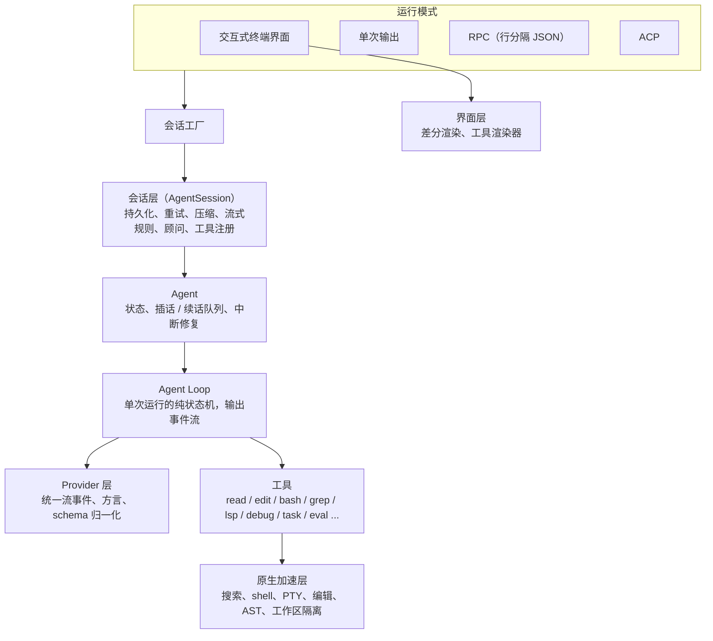
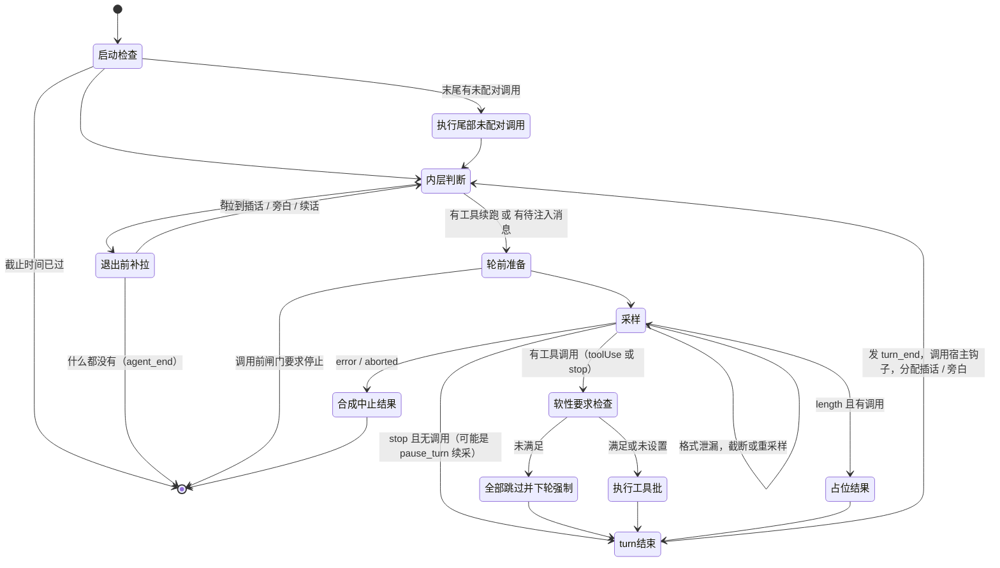

**本系列**：[00 资料索引](/personal-blog/articles/codex-omp-research-index/) · [01 Codex 自带文档总结](/personal-blog/articles/codex-bundled-docs/) · [02 oh-my-pi 自带文档总结](/personal-blog/articles/omp-bundled-docs/) · [03 Codex 架构设计](/personal-blog/articles/codex-architecture/) · **04 oh-my-pi 架构设计** · [05 两者对比与可借鉴点](/personal-blog/articles/codex-vs-omp/) · [交互式架构图](/personal-blog/diagrams/)

> 源码快照：[can1357/oh-my-pi](https://github.com/can1357/oh-my-pi/tree/df731d516c0c722f658312187ae84c6d23e216fb)，HEAD `df731d51`（2026-09-28）。路径相对仓库根目录，行号以该快照为准。
> 标注“（据文档）”的内容只来自 `docs/*.md`，没有在代码里逐行核对；其余均已对照源码。
>
> **阅读说明**：与 [03 Codex 架构设计](/personal-blog/articles/codex-architecture/) 相同，本文分两部分。
> - **第一部分：语言无关的架构设计**。只讲概念、组件、状态机、不变量和设计取舍。omp 的上层编排和原生加速层用的是两种不同的语言与运行时，凡是为了适配某种语言或运行时而写的代码（单线程调度下的让出、异步原语的组合方式、跨语言调用的包装细节等），这里只写它实现的**语义**，不解释语言层面的做法。
> - **第二部分：实现映射**。把第一部分的概念对应到源码位置，只列位置，供核对。
>
> 第一部分的章节按 arXiv 2609.00006《Harness Engineering》的七个子系统组织（D1–D7），再加上持久化、界面与原生层，可与 [03 Codex 架构设计](/personal-blog/articles/codex-architecture/) 逐节对照。

---

## 第一部分　语言无关的架构设计

### 1. 定位与设计目标

oh-my-pi 是 Can Bölük 基于 Mario Zechner 的 Pi fork 出来的终端 coding agent。上游 Pi 追求“最小 harness，功能靠扩展”；omp 反其道而行，把 IDE 能力直接做进 harness：基于快照标签的行号编辑、LSP、调试器、内嵌 shell、子代理隔离、记忆。

规模参考：loop 文件 3849 行（上游 Pi 同名文件约 794 行），Agent 2066 行，会话层 12454 行。loop 本身膨胀近 5 倍，多出来的几乎全是边界情况处理。

从源码中能归纳出的设计目标：

1. **兼容一切模型**：几十家 provider，外加各种“不守规矩”的模型（把内部格式 token 泄漏到文本里、原生工具调用不可靠、在“回合结束”信号里还夹带工具调用）。适配工作尽量放在 provider 层，loop 其余部分不感知。
2. **插话即时且不丢**：用户在 agent 工作时输入的消息要尽快生效，但不能杀掉正在执行、有副作用的工具，也不能在中断时丢失。
3. **loop 纯粹，策略在宿主**：loop 只负责一次运行的状态机，不持有状态、不持久化、不重试、不压缩。这些策略都在上层，通过钩子挂进来。
4. **缓存友好**：前缀冻结、历史只追加；能不改工具选择就不改。
5. **IDE 能力进 harness**：编辑、诊断、调试、隔离工作区都是一等工具。

### 2. 概念模型

| 概念 | 含义 |
|---|---|
| **Agent 运行**（run） | 从 `agent_start` 到 `agent_end` 的一次完整执行，包含多个 turn |
| **Turn** | 一次模型调用，加上它引出的工具执行 |
| **富消息 / LLM 消息** | loop 内部全程使用富消息（可以带界面专用消息、自定义消息）；只在调用模型的边界转换成 provider 认识的 user / assistant / toolResult |
| **Steering（插话）** | 打断式输入：在当前 turn 的边界注入 |
| **Follow-up（续话）** | 非打断式输入：agent 本来要停下时才注入，让运行“复活” |
| **Aside（旁白）** | 被动的附加信息，工作中途随下一轮带入，停止边界时和续话一起批量处理 |
| **工具并发声明** | 每个工具声明“共享”或“独占”，也可以根据参数动态决定 |
| **可中断工具** | 纯等待类工具（例如 `wait`），有插话时可以被硬中止 |
| **软性必需工具** | 宿主声明“下一步应该调用某个工具”，先提醒、后强制 |
| **会话树** | 会话文件是一棵只追加的树，节点除了消息，还有模型切换、压缩、分支摘要等 |
| **Capability** | 一切可被发现的东西（skills、规则、hooks、MCP 服务器、斜杠命令）的统一抽象 |

### 3. 组件视图

> **交互图**：[组件总览：会话层 → Agent → Agent Loop](/personal-blog/diagrams/codex-omp/omp-components.html)（架构图，点击节点可查看源码位置）



| 组件 | 负责 | 不负责 |
|---|---|---|
| Agent Loop | 组装请求、流式采样、调度工具、处理插话，输出事件流 | 不持有状态、不持久化、不重试、不压缩 |
| Agent | 持有消息等状态；把事件归约成状态；管理插话和续话队列；中断后修复记录 | 不知道会话文件、压缩、模型回退 |
| 会话层 | 持久化、重试与凭证轮换、自动压缩、流式规则、顾问、工具注册 | — |
| Provider 层 | 把几十家 API 统一成一套流事件；为不可靠的模型提供文本内工具调用方言 | 不知道工具的业务语义 |
| 原生加速层 | CPU 密集的工作和操作系统原语 | 不做编排 |

模块依赖严格单向：底层（原生层、协议、类型）→ 工具库与模型目录 → Provider 层 → Agent 内核 → 界面层 → coding agent。有一处与直觉不同：界面层不是叶子，它依赖 Agent 内核和 Provider 层，因为工具渲染器和模型浏览器放在界面层里。

### 4. D1　Agent Loop：三层结构

> **交互图**：[主循环状态机](/personal-blog/diagrams/codex-omp/omp-loop-lifecycle.html)（状态图，点击节点可查看源码位置）

| 层 | 职责 | 不负责 |
|---|---|---|
| Agent Loop | 单次运行的状态机 | 状态、持久化、重试 |
| Agent | 状态与队列 | 会话文件、压缩、模型回退 |
| 会话层 | 会话级策略 | — |

#### 4.1 loop 无状态，配置每次调用前重读

loop 的所有可变配置（当前模型、推理强度、插话来源、工具选择、截止时间等）都以“取值函数”的形式传入，**每次调用模型前重新读取**。所以运行中切换模型、改推理强度、改工作目录、轮换凭证，都在下一次模型调用时自然生效，不需要重启 loop。

#### 4.2 事件协议

loop 对外只输出 10 种事件：

```text
agent_start
turn_start
message_start / message_update / message_end
tool_execution_start / tool_execution_update / tool_execution_end
turn_end    { message, toolResults }
agent_end   { messages, [summary, coverage] }
```

事件流以 `agent_end` 结束，结果值是本次运行新增的消息。UI、持久化、遥测都只是这个事件流的订阅者。

#### 4.3 两个入口

- **带新消息启动**。
- **不加新消息继续**，用于重试和恢复。要求最后一条消息是 user 或 toolResult。唯一的例外是**末尾是一条带未配对工具调用的助手消息**：这出现在重试时宿主删掉了失败的工具结果、想重新执行这些调用。loop 会先执行它们，再调用模型。

#### 4.4 主循环：外层续话循环 + 内层工具/插话循环



**① 启动**

- 截止时间被转换成一个取消来源，和外部取消合并；之后每个检查点都检查是否超时。
- 启动时先拉一次插话（用户可能在等待期间已经输入了）。但如果运行已被取消就不拉，避免消息“搁浅”在一个马上要结束的运行里。
- 先执行末尾未配对的工具调用，排队的插话要等这批执行完再注入：在工具调用和工具结果之间插入消息，会违反 provider 的配对约束。

**② 每轮开头**

- **全局暂停闸门**：`/pause` 时主会话、进程内子代理、顾问全部停在 turn 边界；外部取消能释放闸门。
- **注入待注入消息**（插话、旁白、续话）。注意事件是**延后发出**的：消息先进上下文，但它们的 `message_start/end` 要等 provider 调用准备成功（或确定要开一个错误 turn）时才发。这样事件顺序与记录一致。
- 调用模型前，先让状态订阅者处理完已发生的事件，保证它们看到的状态与即将发出的请求一致。
- **工具选择指令每个逻辑 turn 只解析一次**。原因是读取工具选择的函数是“消费型”的（读一次推进一次），而格式泄漏重采样会重新进入同一个 turn，重复解析会把指令推进两次。
- **调用前闸门**可以要求停止，loop 会合成一条“闸门停止”的助手消息，干净地结束运行。

**③ 采样与格式泄漏**

部分模型会把内部格式的 token 泄漏到可见文本里。处理方式：

- 如果能从泄漏文本中恢复出工具调用，就截断并继续，跨 turn 最多 2 次；
- 否则中止并重采样，最多 2 次，重采样时温度加 0.05，刻意打破确定性。

**④ 按停止原因分流**

| 停止原因 | 处理 |
|---|---|
| error / aborted | 为每个工具调用合成“已中止”结果，结束运行。如果中止只针对某一个工具调用，错误只归到那个调用，其他调用保持中性 |
| toolUse，或 stop 但带工具调用 | 执行工具。stop（回合结束）带工具调用也要执行，因为某些模型的交错思考经常在回合结束信号下发出工具调用，这已对照线上 API 验证过 |
| length 且有调用 | **不执行**，因为末尾调用的参数可能被截断；配上占位结果（原因：length）后再跑一轮，让模型重发 |
| stop、无调用、且 provider 表示“暂停回合” | provider 结束了响应但没有结束回合，继续采样，最多 8 次 |

**⑤ 软性必需工具**

宿主可以声明“下一步必须调用某个工具”，但不想一上来就强制工具选择，因为改工具选择会让前缀缓存失效。流程：

1. 第一次只注入一条提醒消息；
2. 如果模型调用了别的工具，这些“绕路”调用**一律不执行**，配上“跳过”结果（“请先调用 X 再使用其他工具”），下一轮才强制工具选择；
3. 最多升级 3 次，防止无限强制。

判定很严格：必须“只调用了那个工具”，混着其他工具也算不合规。这样绕路工具在要求未满足时永远不会产生副作用。

**⑥ turn 结束与插话分配**

- **外部取消时不消费插话队列**。会话会先取消再继续，把队列交给新的运行。如果在这里消费，消息会落进历史，而紧接着的模型调用又立刻被取消，结果是“消息进了历史，agent 却没回应”。
- **流中插话（live steering）**：支持的 provider 可以在响应**流式进行中**把插话注入进去。注入成功时，下一轮的待注入消息只放这些消息，因为服务端是从这条插话继续生成的，别的消息排进来会对不上。
- **旁白的时机**：工作中途（还有工具续跑）把非打断性的旁白一起带入下一轮；在停止边界只带插话，旁白留给外层和续话一起批量处理，避免一条被动旁白额外触发一次模型调用。
- **turn 结束钩子**：每个 turn 结束时，loop 会**等待**宿主的 turn 结束钩子，并告诉它“后面是否还会继续”。会话层在这里挂了回退应用、循环守卫、预探路换模型、顾问增量审查，以及 **turn 中途压缩**（见 8.3）。loop 本身不认识“压缩”，但给了宿主一个在工具链中途安全改写上下文的时机。

**⑦ 退出前补拉**

调用“即将让出”钩子后，**再拉一次**插话。一条插话可能恰好落在停止边界的出队和让出之间，不补拉的话，它会一直滞留到用户下次手动输入。

#### 4.5 请求组装管线

```text
富消息序列
  → 宿主裁剪 / 注入（可选）
  → 转成 LLM 消息（过滤界面专用消息，自定义类型转成标准消息）
  → 按 provider 归一化消息
  → 冻结前缀 + 只追加日志，或工具归一化（意图字段注入、描述裁剪）
  → 最后一道 provider 级改写（可选）
  → [方言模式] 工具从请求中移除，改写进 system prompt；历史按方言重新编码
  → 记录本次发出的工具定义
```

几个设计点：

- **意图注入**：开启意图追踪时，给每个工具 schema 自动加一个“简要意图”字段，执行前再从参数里剥掉（上限 200 字符）。界面因此能显示“模型想干什么”，工具实现完全不感知。
- **冻结前缀 + 只追加日志**：system prompt 和工具定义冻结成固定的字节序列，历史只追加、不重新序列化。每轮只有新消息是缓存未命中。
- **按字节重新声明被撤掉的工具**：某些 provider 在撤掉工具后仍要求它在对话中“被声明过”。这里记住上次发出的原始定义，按字节原样重新声明，避免缓存失效或请求报错。

#### 4.6 流式采样

- **每次调用前重新解析**：模型（中途的上下文升级、重试回退要在下一次调用生效）、API key（凭证轮换）、元数据、服务等级、工作目录。
- **三个取消来源分开管理**：用户或外部取消、格式泄漏中止、“模型开始伪造工具结果”中止（方言模式下）。最后一种只取消 provider 请求，不触发 loop 的外部中止处理。
- **增量快照**：`message_update` 事件携带助手消息的快照，但只重新复制“正在流式输出的块”，不每次深拷贝整条消息。
- **预处理早于 `message_end`**：流结束时，先对最终消息做参数校验并运行“工具调用前”钩子，再发出 `message_end`。钩子改写的参数会写回工具调用本身，于是**历史、持久化、事件、provider 重放、并发调度、实际执行看到的都是同一份参数**。这就是文档里说的“message_end 屏障”，它在 loop 里，不在 Agent 里。
- **推测执行**（实验特性，默认关闭，并发上限默认 2）：某个工具调用的参数在流中一完成，就对**只读文件访问**这类可推测的调用提前执行。最终消息定稿后，用规范化参数的指纹对账：参数没变就复用结果，变了（例如被钩子改写）就丢弃。候选之间有依赖：只有父候选通过宿主校验后，子候选才能启动，防止子调用消费一个已被否决的父结果。

#### 4.7 工具批执行

**并发调度：读写锁语义，且保持调用顺序**

- 每个工具声明“共享”或“独占”，也可以是一个根据（钩子改写后的）参数动态判断的函数。判断出错时按独占处理，也就是更安全的串行。
- 调度规则：独占调用要等之前的所有调用结束；共享调用只需等之前最近的一个独占调用结束。效果与 Codex 的并行门相同，但保留了调用顺序。
- 结果按调用顺序产出。所有调用结束后有一次**尾部清扫**，给没有产出结果的调用补“跳过”结果。这是唯一的补位路径，避免重复计数。

**中断模型：区分“可中断”和“不可中断”**

| 信号 | 谁会收到 | 作用 |
|---|---|---|
| 外部取消（用户按 Esc） | 所有工具 | 真正中止 |
| 插话硬中止 / 对等消息硬中止 | 只有可中断工具（纯等待类） | 有插话或对等 agent 消息时立即中止 |
| 插话软信号 | 所有工具，**协作式** | 工具可以自行响应，例如可自动转后台的 bash 把自己转到后台，让消息尽快注入；忽略它总是安全的 |

核心原则：**不可中断的工具永远不跳过**。生成工具调用的开销已经付过了，工具本身很便宜；跳过只会让模型在插话之后重新发同一个调用。插话在批次边界注入，长任务可以靠软信号自己让路。

插话检测是**只看不取**的（只查看队列是否非空，不出队），真正出队只发生在 turn 边界。检测既支持事件驱动，也支持 250 ms 轮询。

**附加上下文**：工具或“工具调用前”钩子可以报告附加上下文，批次结束后作为一条开发者消息追加在工具结果**之后**，不会插在工具调用和结果之间。附加上下文只在工具真正成功后才投递，被拦截或失败时丢弃（据文档）。

#### 4.8 贯穿全局的不变量：工具调用与结果必须配对

几乎所有 provider 都要求每个工具调用有且只有一个结果。omp 在七处主动维护这条约束：

1. 流出错或被中止：为每个调用合成“已中止”结果；
2. length 截断：合成占位结果；
3. 软性要求未满足：合成“跳过”结果；
4. 批内中断：尾部清扫补“跳过”结果；
5. Agent 的中断恢复：只保留已完整收到的调用块，并为每个合成错误结果；
6. 会话重放：剥掉悬空的工具调用；
7. 服务端已执行的调用（部分 provider 在服务端执行工具）打上标记，本地跳过，避免重复执行和重复配对。

所有合成结果都带 `__synthetic` 标记。界面和遥测因此能区分“调用发出了但没有执行”和“本地工具执行失败”。这是有过教训的：曾经有 provider 的连接断开被误显示成本地工具失败。

### 5. Agent：状态与队列

> **交互图**：[插话：出队不等于送达](/personal-blog/diagrams/codex-omp/omp-steering-sequence.html)（时序图，点击节点可查看源码位置）

**状态**：system prompt、模型、推理档位、工具、消息序列、是否正在流式输出、当前流式消息、进行中的工具调用。Agent 消费 loop 的事件，先更新状态，再转发给订阅者。**过期运行的事件按运行实例过滤掉**：新运行开始后，旧运行迟到的事件不会污染状态。

**订阅者隔离**：订阅者抛出的异常只记日志，不向上传播。界面出错不会打断 loop。

**两个队列**：插话（打断式）和续话（非打断式），都支持“全部出队”或“一次一条”（默认一次一条）。插话入队时会唤醒等待流中插话的一方。

**投递记账（最巧妙的部分）：出队不等于送达**

- 每批出队的消息都被记账；只有当这条消息**真正进入记录**时，账目才前进。
- 运行结束时，把所有“出队了但没进入记录”的消息**放回队首**。
- 结果：用户中途按 Esc，已经输入但还没送达的消息一条都不丢。

**认领（claim）**：出队前的预处理（例如展开附件）在一个可单独取消的“认领”下进行。被认领的消息仍然能被“查看队列”看到，编辑器因此可以把它们恢复回输入框。已经流中注入的插话，也可以在取消前撤回到编辑器。

### 6. D2　LLM 集成

- **统一流事件**：开始；文本、思考、工具调用各有“开始 / 增量 / 结束”；再加图片结束、完成、错误。每个事件都带当前的部分消息。
- **统一包装**：所有调用都套同样几层：字形编解码、唯一的网络请求出口（统一 UA、证书、代理、调试转储，并打戳保证幂等）、**思考死循环守卫**（精确循环检测 + 三元组 Jaccard 相似度 + 词汇停滞检测）、思考标签泄漏修复（第一方端点跳过）。
- **文本内工具调用方言**：对原生工具调用不可靠的模型（支持 11 种方言），把工具从请求中移除，改为在 system prompt 里说明方言格式，历史也按方言重新编码。流式输出时从文本增量中解析出工具调用，还原成标准的工具调用块，loop 其余部分完全无感知。**一旦检测到模型开始自己伪造工具结果，立即中止生成**。
- **schema 归一化**：一个参数化的 schema 遍历器，按 provider 分派不同规则（严格模式、`oneOf` 改 `anyOf`、各家的方言限制等）。
- **重试**（据文档，代码见 turn 恢复模块）：只在还没有流出“不可重放的输出”（可见文本或工具调用）时才允许重试；退避为 `min(基数 × 2^(n-1), 8 秒)`，加 75%–100% 抖动；**上下文溢出不走重试，一律交给压缩**；支持凭证轮换和模型回退链。
- **上下文升级**：压缩之前先尝试切到窗口更大的模型直接重试，能换大窗口就不丢信息。

### 7. D3　工具

- **单一门控点**：所有内置工具在一个地方决定是否启用，同时处理成对引入（检查点 ↔ 回退、grep → AST grep、edit → AST edit）。思考、让出、目标这类工具对模型隐藏。
- **虚拟设备**：可挂载的内置工具、MCP 工具、扩展工具**从顶层工具列表里移除**，改为通过 `write xd://<工具>` 调用。它们的 schema 因此不出现在每次请求里，挂了大量 MCP 的会话也不会撑爆小窗口模型。
- **内嵌 shell**：bash 工具跑在一个内嵌的 shell 上：不继承环境变量、不读启动脚本、禁用 exec 和挂起；常用命令（cat、grep、rg、fd、sed、jq、rm 等）在进程内实现，不派生子进程，内部的 `scheme://` 地址也能直接解析。取消时向所有子孙进程发终止信号，留 2 秒宽限期。
- **LSP / 调试器**：编辑后自动格式化并回收诊断；调试器以 `debug` 工具暴露。
- **代码执行内核**：代码执行在隔离的执行单元里进行；Python 内核通过**带令牌的本机回环接口**回调 agent 自己的工具，所以代码单元格里可以直接调用 read 读取一个文件。

#### 7.1 Hashline 编辑

这是 omp 最出名的设计。常见描述是“每行一个哈希”，但实际实现是**每个文件快照一个标签 + 原始行号**：

- read / grep 输出文件时，段头带 `[路径#标签]`。标签是“去掉行尾空白后整个文件内容”的哈希取低 16 位，即 4 位十六进制。
- 模型用原始行号下操作：替换区间、在某行前后插入、替换某个语法块、剪切到寄存器和从寄存器粘贴、删除、移动。**行号永远是读取时的行号**，不随前面的修改漂移。
- 应用流程：
  1. 编辑存储为每个路径保留最多 4 个历史版本（全局 256 个路径、64 MiB 上限），以及**模型实际看到过的行号集合**；
  2. 当前文件哈希等于标签：直接应用。开启“已见行校验”时，锚定在模型没见过的行上会被拒绝，并把那些行展示给模型；
  3. 标签过期但旧快照还在：用行级 diff 把旧快照映射到当前文本，检查每个锚点的邻居是否以相同偏移移动，对重复行额外谨慎，全部一致才重新映射；
  4. 语法块操作借助语法树定位块边界。

好处：模型不必逐字复述旧代码，输出 token 少；没有“空白字符对不上导致找不到字符串”的循环；文件被并发修改时能自动修复锚点，不用重读；“没看过的行不能改”杜绝了靠猜的编辑。

对这种格式支持不好的模型族，会静默降级到“替换”模式，除非开启严格编辑模式。另有 `apply_patch`、`patch`、`replace`、`sloppy` 几种编辑模式。

### 8. D4　上下文与记忆

#### 8.1 缓存友好的上下文

见 4.5：冻结前缀 + 只追加日志、按字节重新声明被撤掉的工具、软性必需工具先提醒后强制。

#### 8.2 压缩方法链

默认按以下顺序尝试：

| 顺序 | 方法 | 做法 |
|---|---|---|
| 1 | 远程 | provider 原生的压缩接口 |
| 2 | 快照压缩 | 把历史**渲染成图片帧**，交给视觉模型读回；这一步本身不调用 LLM |
| 3 | 交接 | 生成一份交接文档，从文档继续 |
| 4 | 摇落 | 把体积大的工具输出替换成可回取的 `artifact://` 引用 |
| 5 | 软压缩 | 本地 LLM 摘要 |

压缩前先尝试**上下文升级**（见第 6 节）。

#### 8.3 触发时机

- **运行结束后**：溢出恢复、length 截断恢复、阈值维护；成功后“不加新消息继续”。
- **turn 中途**（默认开启；子代理强制开启，因为对子代理来说“一个任务就是一个 turn”）：会话层在 turn 结束钩子里判断。只有“后面还会继续”时才检查阈值；需要压缩时，压缩完**原地替换 loop 正在使用的消息序列**，loop 的下一次模型调用就直接使用压缩后的上下文，不需要中断或重启运行。
- **推测压缩**：上下文接近阈值时，在后台提前生成摘要；真正越过阈值时直接提交，把摘要的延迟藏起来（据文档）。

#### 8.4 失败分类

压缩判断会细分失败类型：是不是同一个模型、错误是否早于最近一次压缩、是请求体被拒还是按用量溢出、是否提到了媒体限制。如果错误提到媒体限制，就排除“快照压缩”，因为图片只会让字节超限的错误更糟。

### 9. D5　安全与权限

与 Codex 相比，omp **没有操作系统级沙箱**，安全模型是“审批 + 模式匹配 + 混淆”，默认信任度更高（据文档）。

- **审批三层输入**：工具声明的等级（读 / 写 / 执行，未声明按执行处理）、工具自身策略、用户策略。三种模式：总是询问（只自动放行读）、写（放行读和写）、完全放行（**默认**）。
- **bash 危险模式**（删除根目录、fork 炸弹、下载后执行等）强制提示；拒绝规则在完全放行模式下也生效。文档明确说明**模式匹配不是隔离**，代码执行内核里启动的 shell 不受 bash 规则约束。
- **密钥混淆**（默认关闭）：请求发出前，把密钥替换成确定性、可逆的占位符；执行工具前再还原到参数里；回放前再次混淆。模型永远看不到明文（据文档）。
- **扩展失败即拒绝**：扩展的工具调用处理器按顺序执行并带超时，**超时或出错一律视为“阻止”**（fail closed）。

### 10. D6　编排：子代理与顾问

- **子代理在同一进程内**：名字像“子进程”，实际是在同一进程里新建一个子会话。子会话不继承对话历史，审批强制为完全放行（父代理对 task 的审批就是授权边界）；必须调用一个隐藏的“让出”工具收尾，最多提醒 3 次，之后强制工具选择为“让出”（据文档）。
- **工作区隔离按平台选后端**，依次尝试：

  | 平台 | 顺序 |
  |---|---|
  | macOS | 文件系统克隆 → ZFS → 复制 |
  | Linux | btrfs 快照 → ZFS → reflink → overlayfs → 复制 |
  | Windows | ReFS 块克隆 → 投影文件系统 → 复制 |

  “复制”指 git worktree，失败再退回普通复制。合并结果统一以 git diff 产出，保证可以直接 `git apply`。
- **顾问**：有独立的 Agent 和工具会话，不共享文件快照、已见行和冲突状态；默认只有只读工具加“建议”工具，在 turn 结束钩子里做增量审查（据文档）。
- **全局暂停**：一次暂停，主会话、子代理、顾问都停在 turn 边界。

### 11. D7　扩展

- **统一的 capability 模型**：skills、规则、hooks、MCP 服务器、斜杠命令都是 capability，由按优先级排序的 provider 加载。内置的发现 provider 能直接导入 Claude、Codex、Cursor、Gemini、Cline、Windsurf、VS Code、OpenCode 的配置和 AGENTS.md。
- **扩展与主进程同权限，没有沙箱**；为此提供托管定时器兜住回调异常，会话关闭时自动清理（据文档）。
- **MCP 快速启动**：所有服务器并行连接；250 ms 快速启动闸门之后仍未就绪的服务器，先以缓存的“延迟工具”形式暴露，不阻塞第一轮。
- **skills 按需加载**：system prompt 里只列元数据，内容通过 `read skill://…` 按需读取。

#### 11.1 流式规则（TTSR，Time Traveling Stream Rules）

规则可以是正则、AST 条件或自然语言问题，**在流式增量上实时匹配**。命中需要打断的规则时：

1. 立即中止当前运行；如果是工具参数命中，中止原因只作用于那一个工具调用；
2. 50 ms 后调度重试（带重试令牌和 prompt 代数校验，防止过期的重试生效）；
3. 丢弃模式下截掉半截助手消息；
4. 追加一条隐藏的规则注入消息并持久化；
5. 不加新消息继续。

效果是把模型“倒带”到犯错之前，带着规则重来，这就是“time traveling”的由来。不需要打断的命中走温和路径：工具命中时在结果前加一段系统提醒，文本命中时排一条续话。自然语言规则在 `message_end` 之后由评判角色判定（据文档，阈值 p ≥ 0.7）。

### 12. 持久化：只追加的会话树

- 会话文件按工作目录分目录存放，一个会话一个行分隔 JSON 文件。
- **首行是固定 256 字节的标题槽**，重命名时原地覆写这一行，不重写整个文件。
- 之后是会话头和各种条目。每个条目有自己的 ID 和父 ID，外加一个可变的“叶指针”，所以整个文件是一棵**只追加的树**：
  - 分支 = 只移动叶指针；
  - 带摘要的分支 = 移动叶指针并追加一条分支摘要；
  - 另存为新会话 = 把根到叶的路径复制到新文件；
  - 可以往非活动分支写入再恢复叶指针，供生命周期比树导航更长的后台任务使用。
- 条目类型除了消息，还有模型切换、推理档位切换、压缩、分支摘要、重置边界、规则注入、凭证固定、模式切换等。**配置变更也是树上的节点**，所以切到任何分支都能还原当时的配置。
- **重放**：从叶走到根，应用最近的压缩或重置边界，并剥掉悬空的工具调用。
- 图片按内容哈希存进全局 blob 目录，消息里只存引用；会话文件只有出现助手消息之后才落盘（据文档）。
- **持久化严格按事件顺序串行写入，但不等待界面订阅者**。

### 13. 界面与原生层

#### 13.1 终端界面的差分渲染

- 每一帧分两部分：**历史区**（只追加，每批带单调递增的 ID，写一次后确认，除非窗口尺寸变化需要重放，否则永不重写）和**视口**（与上一帧逐行比较，只重写变化的行，每行显式定位光标）。
- 整次绘制包在终端的同步输出模式里，一次性呈现，不闪烁。
- 渲染请求合并；从不探测滚动位置；终端图片“传一次、多处放置”，受图片预算约束。

#### 13.2 原生加速层

- 负责 CPU 密集的工作（grep、glob、模糊搜索、AST、高亮、diff、token 计数、PDF/HTML 转换、快照压缩的渲染）和操作系统原语（PTY、进程树、剪贴板、文件锁、工作区隔离、进程内 Git/JJ）。
- 按 CPU 能力选择构建变体（支持新指令集的“现代”版与“基线”版），检测结果传给子进程复用（据文档）。
- 原生层的长任务支持超时和取消，取消信号能从编排层一直传到原生层。

#### 13.3 其他工程细节

- **RPC 模式**：标准输入输出上的行分隔 JSON；协议 v2 把超大帧拆块传输，背压时以 64 KiB 为单位溢写到临时文件。RPC 把“本次 prompt 已让出”和“会话已完全沉寂”拆成两个信号，解决后台任务回灌结果时宿主过早回收沙箱的问题（据文档）。
- **协作**：帧用 AES-256-GCM 加密，房间密钥只放在 URL fragment 里，中继只看到密文。
- **文件系统扫描缓存**：以规范化根路径 + 完整遍历选项为键，TTL 1 秒、最多 16 条、64 MiB；glob、模糊查找、AST 使用，grep 刻意不用。

### 14. 不变量汇总

| # | 不变量 | 靠什么保证 |
|---|---|---|
| 1 | 每个工具调用有且只有一个结果 | 七条合成路径 + 合成标记 |
| 2 | 所有下游看到同一份工具参数 | 钩子改写早于 `message_end`，改写结果写回调用本身 |
| 3 | 插话不落在工具调用和结果之间 | 插话只在 turn 边界出队；尾部未配对调用先执行；附加上下文追加在结果之后 |
| 4 | 用户输入不丢 | 出队 ≠ 送达的投递记账；取消时不消费队列；退出前补拉 |
| 5 | 有副作用的工具不会被插话杀掉 | 只有可中断工具收到硬中止，其余只收协作式软信号 |
| 6 | 前缀不被改写 | 冻结前缀 + 只追加日志；按字节重新声明工具；软性要求先提醒 |
| 7 | 运行中改配置下一次调用即生效 | loop 无状态，配置每次调用前重读 |
| 8 | 过期运行不污染状态 | 按运行实例过滤事件 |

### 15. 巧妙之处汇总

| # | 设计 | 解决的问题 |
|---|---|---|
| 1 | loop 无状态，配置每次调用前重读 | 运行中切模型、改推理强度、换凭证，下一次调用就生效 |
| 2 | 钩子改写早于 `message_end` | 历史、持久化、执行、重放看到同一份参数 |
| 3 | 读写锁语义的工具调度，保持顺序，判断出错时退回串行 | 并发安全，结果有序 |
| 4 | 可中断 / 不可中断 + 协作式软信号 | 插话及时注入，又不杀掉执行到一半的有副作用工具 |
| 5 | 出队 ≠ 送达的投递记账 | 中断时用户输入零丢失 |
| 6 | 所有异常路径都合成配对结果，并打合成标记 | 满足 provider 配对约束，界面能区分“没执行”和“执行失败” |
| 7 | 软性必需工具先提醒后强制 | 模型听话时不改工具选择，保住前缀缓存 |
| 8 | 冻结前缀 + 只追加日志 + 按字节重新声明被撤掉的工具 | 最大化前缀缓存命中 |
| 9 | Hashline：快照标签 + 原始行号 + diff 修复 + 已见行校验 | 省 token，消除空白导致的匹配失败，容忍并发修改 |
| 10 | 流式规则“倒带”重来 | 在生成阶段拦截坏模式，而不是事后纠正 |
| 11 | 虚拟设备 | 大量 MCP 工具不占每次请求的 schema 空间 |
| 12 | 文本内方言 + 伪造结果检测 | 原生工具调用差的模型也能稳定使用工具 |
| 13 | 压缩方法链，并先尝试上下文升级 | 能换大窗口就不丢信息 |
| 14 | turn 结束钩子 + 原地替换消息序列 | loop 不认识压缩，宿主仍能在工具链中途压缩 |
| 15 | 只追加的会话树 + 固定大小标题槽 | 分支是移动指针，重命名是原地覆写 |
| 16 | 工具选择指令每个逻辑 turn 只解析一次 | 重采样不会把“消费型”指令推进两次 |

---

## 第二部分　实现映射

只列位置，不展开实现。上层编排在 `packages/`，原生层在 `crates/`。

### A. Agent Loop 与 Agent

| 概念 | 源码位置 |
|---|---|
| 事件类型 | `packages/agent/src/types.ts:1199-1219` |
| 事件流 | `packages/agent/src/agent-loop.ts:698 createAgentStream` |
| 两个入口 | `agent-loop.ts:604 agentLoop`、`:666 agentLoopContinue`；尾部未配对判断 `:645` |
| turn 结束钩子 | `agent-loop.ts:737-759 emitTurnEnd` |
| 主循环 | `agent-loop.ts:1163-1777 runLoopBody`；启动 `:1175-1273`；每轮开头 `:1280-1398`；采样 `:1400-1491`；停止原因分流 `:1493-1662`；软性要求 `:1568-1613`；turn 结束与插话分配 `:1686-1733`；退出前补拉 `:1741-1762` |
| 重采样温度 | `agent-loop.ts:1987-1988` |
| 响应性让出点 | `packages/agent/src/utils/yield.ts`（`YIELD_INTERVAL_MS = 50`） |
| 暂停闸门 | `packages/agent/src/pause.ts` |
| 请求组装 | `agent-loop.ts:1867-1921 prepareProviderCall`；意图注入 `:900-983` |
| 冻结前缀 + 只追加日志 | `packages/agent/src/append-only-context.ts` |
| 流式采样 | `agent-loop.ts:1927-2528 streamAssistantResponse`；推测候选 `:2433` |
| 预处理 | `agent-loop.ts:2850 prepareToolCallDispatch` |
| 推测执行 | `packages/agent/src/speculative-execution.ts` |
| 工具批执行 | `agent-loop.ts:3031-3662 executeToolCalls`；中断信号 `:3067-3214`；不跳过原则 `:3257-3268`；调度 `:3594-3620` |
| Agent 状态与订阅 | `packages/agent/src/agent.ts:393-404`；事件归约 `:1682`；订阅者同步 `:1714-1721` |
| 队列与投递记账 | `agent.ts:934-1060`；放回队首 `:1003-1024` |
| 中断恢复 | `agent.ts:1869-1980` |

### B. 会话层、Provider、工具

| 概念 | 源码位置 |
|---|---|
| 会话层 | `packages/coding-agent/src/session/agent-session.ts`；turn 结束钩子注册 `:1716-1729` |
| turn 中途压缩 | `session/session-maintenance.ts:2575 maintainContextMidRun`；原地替换 `:2625-2628` |
| 上下文升级 | `session-maintenance.ts:3267` |
| 压缩方法顺序 | `session/compaction-methods.ts:44-50` |
| 重试 | `session/turn-recovery.ts:294 TurnRecovery` |
| 流式规则 | `session/ttsr-coordinator.ts:614-690` |
| 会话树与重放 | `session/session-context.ts:218 buildSessionContext`；标题槽 `session-title-slot.ts:111` |
| 统一流事件 | `packages/ai/src/types.ts:1473-1496` |
| 统一包装 | `packages/ai/src/stream.ts` |
| 方言 | `packages/ai/src/dialect/factory.ts` |
| schema 归一化 | `packages/ai/src/utils/schema/normalize.ts` |
| 工具门控与虚拟设备 | `packages/coding-agent/src/tools/index.ts:563-600`、`:628-816`、`:872-917` |
| 子代理 | `packages/coding-agent/src/task/executor.ts:4047` |
| 代码执行回调 | `packages/coding-agent/src/eval/py/tool-bridge.ts` |
| LSP 写穿 | `packages/coding-agent/src/lsp/writethrough.ts` |
| 编辑模式降级 | `packages/coding-agent/src/utils/edit-mode.ts:19-43` |
| capability | `packages/coding-agent/src/capability/index.ts`；`discovery/` |
| MCP 快速启动 | `packages/coding-agent/src/mcp/manager.ts:919` |
| 协作加密 | `packages/coding-agent/src/collab/crypto.ts` |
| 终端差分渲染 | `packages/tui/src/tui.ts` |

### C. 原生层

| 概念 | 源码位置 |
|---|---|
| Hashline 标签 | `crates/pi-edit/src/store.rs:70-80` |
| 应用流程 | `crates/pi-edit/src/modes/hashline/patcher.rs:188-263` |
| 过期标签修复 | `crates/pi-edit/src/modes/hashline/recovery.rs` |
| 工作区隔离 | `crates/pi-iso` |
| 内嵌 shell 与进程内命令 | `crates/pi-shell`、`crates/pi-builtins` |
| 取消与超时 | `crates/pi-natives/src/task.rs` |

### D. 源码阅读路线

1. `packages/agent/README.md`：事件流、插话 / 续话语义。
2. `packages/agent/src/agent-loop.ts`：`runLoopBody`（1163）→ `prepareProviderCall`（1867）→ `streamAssistantResponse`（1927）→ `prepareToolCallDispatch`（2850）→ `executeToolCalls`（3031）。
3. `packages/agent/src/agent.ts`：事件归约（1682）、队列与投递记账（934-1060）、中断恢复（1869-1980）。
4. `packages/coding-agent/src/session/agent-session.ts`，以及 `turn-recovery.ts`、`session-maintenance.ts`、`ttsr-coordinator.ts`。
5. `crates/pi-edit/src/store.rs`、`crates/pi-edit/src/modes/hashline/{patcher,recovery}.rs` 和 `crates/pi-edit/prompts/hashline.md`。
6. 对照 `docs/compaction.md`、`docs/session.md`、`docs/ttsr-injection-lifecycle.md`。
